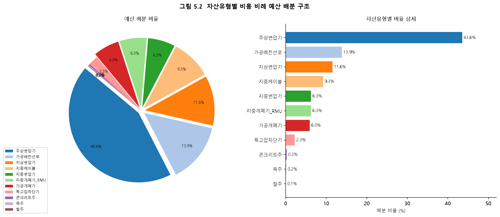
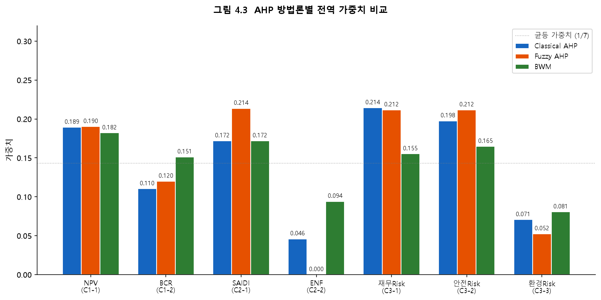
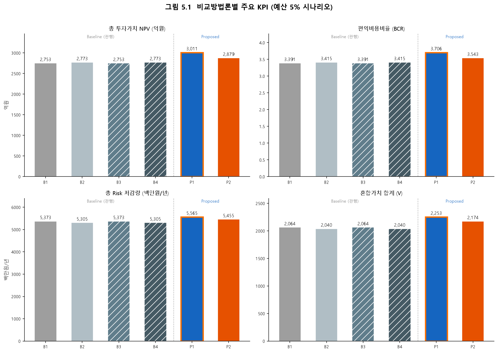
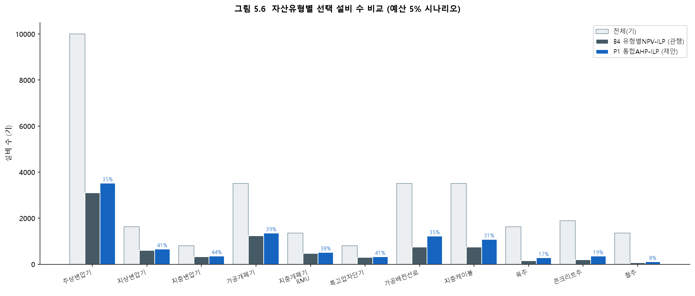
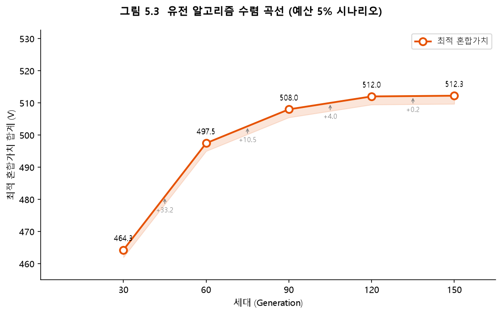
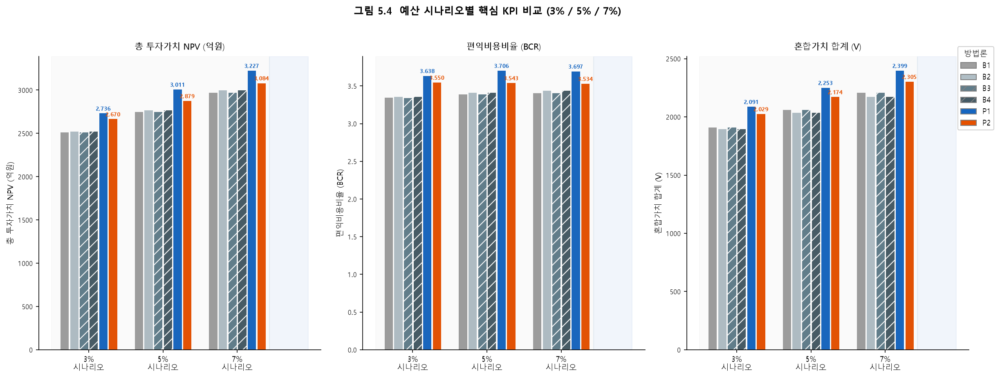
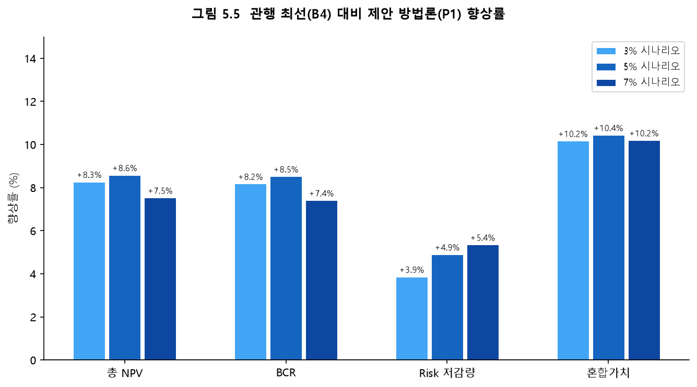

<!--
  국립목포대학교 대학원 박사학위논문 통합본
  본문 규격: 바탕체 11pt / 줄간격 200% / 여백 위35·아래25·좌35·우30·꼬리말15 mm
  제목: HY견명조 26pt
  ※ HWP/Word 변환 시 위 규격을 적용할 것
-->

---
<!-- ========== 표지 (양식1) ========== -->

<div align="center">

학위논문

# 배전설비 자산투자계획(AIP)을 위한<br>다기준 평가와 이종 자산군 포트폴리오<br>최적화 통합 모델

<!-- 논문제목: HY견명조 26pt -->

박사학위논문

<!-- 14pt -->

국립목포대학교 대학원

<!-- 16pt -->

전기공학과

<!-- 16pt -->

[성 명]

<!-- 16pt -->

20   년    월

<!-- 16pt -->

</div>

---
<!-- ========== 내표지 I (양식1) ========== -->

<div align="center">

# 배전설비 자산투자계획(AIP)을 위한<br>다기준 평가와 이종 자산군 포트폴리오<br>최적화 통합 모델

박사학위논문

국립목포대학교 대학원

전기공학과

[성 명]

20   년    월

</div>

---
<!-- ========== 내표지 II (양식2) — 심사위원 인준 ========== -->

<div align="center">

# 배전설비 자산투자계획(AIP)을 위한<br>다기준 평가와 이종 자산군 포트폴리오<br>최적화 통합 모델

이 논문을 공학 박사학위 논문으로 제출함

국립목포대학교 대학원 전기공학과

[성 명] (지도교수 : [지도교수명])

[성 명]의 공학 박사학위 논문을 인준함

심사위원장 　　　　　　 (인)

심사위원 　　　　　　　 (인)

심사위원 　　　　　　　 (인)

심사위원 　　　　　　　 (인)

심사위원 　　　　　　　 (인)

20   년    월

</div>

---
<!-- ========== 목차 ========== -->

# 목 차

**국문초록** ················································ ⅰ

**Abstract** ················································ ⅱ

**Ⅰ. 서론** ··················································· 1

　1.1 연구의 배경 ·············································· 1

　　1.1.1 전력산업 환경 변화와 자산관리의 등장 ··············· 1

　　1.1.2 의사결정 패러다임의 단계적 고도화 ················· 2

　　1.1.3 투자 의사결정 환경의 복잡성 ·························· 3

　　1.1.4 화폐화 리스크 기반 투자가치 평가의 부상 ·········· 4

　1.2 연구의 필요성 ············································ 5

　　1.2.1 단일 지표 편중과 현장의견 수렴 불가 문제 ·········· 5

　　1.2.2 자산군별 독립 예산 배분 관행과 포트폴리오 최적화 공백 ·· 6

　　1.2.3 다기준 의사결정 도입의 필요성과 국내 연구의 공백 ·· 8

　1.3 연구의 목적 및 범위 ······································ 9

　　1.3.1 연구의 목적 ·········································· 9

　　1.3.2 연구의 범위 및 대상 설비 ···························· 10

　1.4 논문의 구성 ·············································· 11

**Ⅱ. 이론적 배경** ············································· 12

　2.1 자산관리와 ISO 55000 ···································· 12

　　2.1.1 자산관리의 개념과 필요성 ···························· 12

　　2.1.2 ISO 55000 시리즈 체계 ································ 13

　2.2 상태평가(Health Index)와 고장영향평가 ·················· 14

　　2.2.1 설비 상태평가와 건전도 지수 ·························· 14

　　2.2.2 고장영향평가 ·········································· 15

　2.3 리스크 기반 자산관리(RBAM)와 화폐화 리스크 ·········· 16

　　2.3.1 리스크의 정의와 산출 ································· 16

　　2.3.2 화폐화 리스크와 이종 설비 비교 ······················ 17

　2.4 자산투자계획(AIP) ········································ 17

　　2.4.1 AIP의 개념과 목적 ··································· 17

　　2.4.2 AIP 프로세스 ········································· 18

　　2.4.3 규제 맥락에서의 AIP: RIIO 체계 ······················ 19

　2.5 공통 자산지수 방법론(CNAIM) ···························· 19

　　2.5.1 CNAIM의 개요 및 적용 범위 ·························· 19

　　2.5.2 고장확률(PoF) 산출 체계 ····························· 20

　　2.5.3 고장영향(CoF) 산출 체계 ····························· 21

　　2.5.4 화폐화 리스크와 투자 우선순위 ······················· 22

　2.6 다기준 의사결정(MCDM) 방법론 ·························· 22

　　2.6.1 계층분석법(AHP) ······································ 22

　　2.6.2 퍼지 AHP(Fuzzy AHP) ································ 27

　　2.6.3 델파이(Delphi) 기법 ·································· 30

　2.7 수리적 최적화 ············································· 31

　　2.7.1 0-1 정수선형계획법(ILP) ······························ 31

　　2.7.2 유전 알고리즘(Genetic Algorithm, GA) ················ 33

　　2.7.3 자산투자 포트폴리오 선택 문제로의 적용 ············· 35

**Ⅲ. 선행연구 분석 및 연구 차별화** ·························· 36

　3.1 전력설비 자산투자계획(AIP) 국내외 적용 사례 ··········· 36

　　3.1.1 해외 AIP 적용 사례 ·································· 36

　　3.1.2 국내 AIP 관련 동향 ·································· 37

　3.2 AHP·MCDM과 최적화 결합 사례 ·························· 38

　　3.2.1 AHP + 최적화 2단 구조 ······························· 38

　　3.2.2 전력설비 분야 MCDM + 최적화 결합 ················· 39

　　3.2.3 목표 계획법(Goal Programming)과의 비교 ············· 40

　3.3 다기준 의사결정 방법 비교 및 AHP 채택 정당성 ········· 40

　3.4 기존 단일지표 기반 AIP의 구조적 한계 ·················· 42

　　3.4.1 단일 차원 편중의 한계 ································ 42

　　3.4.2 자산군별 독립 예산 배분 관행 ························ 43

　　3.4.3 현장 실행 단계의 GAP 현상 ·························· 43

　　3.4.4 동일 투자가치 자산 간 우선순위 모호성 ·············· 44

　3.5 국내 투자가치 기반 다기준 의사결정 연구 부재 입증 ···· 44

　3.6 기존 연구의 한계 요약 및 본 연구의 차별화 ············· 45

**Ⅳ. 제안 방법론: 정량지표 + 현장의견 통합 모델** ·········· 46

　4.1 전체 방법론 설계 개요 및 2단 아키텍처 ················· 46

　　4.1.1 설계 목표 ············································· 46

　　4.1.2 전체 2단 아키텍처 ···································· 47

　4.2 평가기준 체계 설계 ······································· 48

　　4.2.1 기준 체계 개요 ········································ 48

　　4.2.2 경제효율성 기준 (C1) ································ 49

　　4.2.3 고객서비스 기준 (C2) ································ 50

　　4.2.4 Risk 저감 기준 (C3) ································· 51

　4.3 Stage 1-A: Classical AHP 기반 가중치 산출 ·············· 51

　4.4 Stage 1-B: Fuzzy AHP 기반 가중치 산출 ················· 55

　4.5 Stage 2-A: 0-1 ILP 기반 포트폴리오 최적화 ············· 59

　4.6 Stage 2-B: 유전 알고리즘(GA) 기반 포트폴리오 최적화 ·· 63

　4.7 3계층 비교 분석 프레임워크 ······························· 68

　4.8 합성 데이터셋 설계 ······································· 71

　4.9 방법론 구성 요소 간 관계 요약 ··························· 74

**Ⅴ. 시범적용 및 검증** ········································ 47

　5.1 시뮬레이션 설계 및 합성 데이터 가정 ···················· 47

　　5.1.1 합성 데이터 활용 배경 ································ 47

　　5.1.2 자산 규모 및 유형 가정 ······························· 48

　　5.1.3 CNAIM 파라미터 가정 ·································· 49

　　5.1.4 의무교체 기준 및 예산 시나리오 ······················· 49

　5.2 AHP 가중치 산출 결과 ···································· 50

　　5.2.1 전문가 패널 구성 ····································· 50

　　5.2.2 Classical AHP 결과 ··································· 51

　5.3 비교 방법론 설계 ·········································· 51

　5.4 최적화 결과 비교 (기준 시나리오: 5 %) ···················· 52

　5.5 예산 민감도 분석 ·········································· 54

　5.6 소결 ······················································· 55

**Ⅵ. 결론 및 향후 연구** ········································ 56

　6.1 연구 결과 요약 ············································· 56

　6.2 연구 기여 ·················································· 57

　　6.2.1 학술적 기여 ··········································· 57

　　6.2.2 실무적 기여 ··········································· 58

　6.3 한계 및 향후 연구 ·········································· 58

　　6.3.1 연구 한계 ············································· 58

　　6.3.2 향후 연구 방향 ········································ 59

　6.4 결언 ······················································· 60

**참고문헌** ················································ 61

**Abstract** ··············································· ⅱ

**부록** ··················································· [작성 예정]

---
<!-- ========== 국문초록 (양식4) ========== -->

# 국 문 초 록

<!-- 논문제목: 16pt -->
**배전설비 자산투자계획(AIP)을 위한 다기준 평가와 이종 자산군 포트폴리오 최적화 통합 모델**

<!-- 성명: 16pt -->
[성 명]

<!-- 소속: 11pt -->
국립목포대학교 대학원 전기공학과 (지도교수 : [지도교수명])

배전설비 자산투자계획(Asset Investment Planning, AIP)은 제한된 예산 하에서 노후 전력설비의 교체·수리·존치를 결정하는 핵심 의사결정 체계이다. 현행 AIP는 공통 자산지수 방법론(Common Network Asset Indices Methodology, CNAIM)이 산출하는 화폐화 리스크(Monetised Risk, MR) 단일 지표로 투자 우선순위를 결정하고, 자산군 단위로 예산을 독립 배정하는 Greedy 방식을 적용한다. 그러나 이 방식은 공급신뢰도 기여도·사회환경 영향·현장 운영제약 등 다차원적 평가요소가 배제되고, 이종 자산군 간 예산 비율 자체가 최적화되지 않는 구조적 한계를 내포한다.

본 연구는 두 가지 한계를 동시에 극복하는 2단 의사결정 아키텍처를 제안한다. 1단계(Stage 1)에서는 Classical AHP·Fuzzy AHP·BWM을 적용하여 경제효율성(C1: NPV·BCR), 고객서비스(C2: SAIDI·ENF저감), Risk저감(C3: 재무·안전·환경)의 3개 대기준·7개 하위기준에 대한 전역 가중치를 산출하고, 개별 설비의 혼합가치(Composite Value)를 계산한다. 가상 전문가 20명(5개 그룹)으로 구성된 패널이 Saaty 9점 척도 쌍대비교를 수행하였으며, 일관성 비율(CR ≤ 0.10)을 통해 판단의 신뢰성을 검증하였다. 2단계(Stage 2)에서는 산출된 혼합가치를 목적함수로 하는 0-1 정수선형계획법(Integer Linear Programming, ILP)과 유전 알고리즘(Genetic Algorithm, GA)을 각각 적용하여, 주상변압기·가공개폐기·지중케이블 등 11개 자산유형을 단일 최적화 공간에서 동시에 처리하는 투자 포트폴리오를 도출한다.

검증은 CNAIM v2.1 파라미터 체계 기반 합성 데이터셋(11개 자산유형, 26,758기)을 이용하여 6개 비교 방법론(B1~B4·P1~P2)과 3개 예산 시나리오(3%·5%·7%)를 적용한 비교 분석으로 수행한다. ① 기존 관행(자산군별 분리 Greedy·ILP, B1~B4)과 제안 방법(통합 AHP+ILP/GA, P1~P2)의 비교, ② 자산군별 독립 예산 배분과 이종 자산군 통합 최적화의 비교, ③ ILP와 GA의 해의 질·계산 효율성 비교를 통해 제안 체계의 우월성을 총NPV·BCR·Risk저감·혼합가치 지표로 정량 입증한다.

본 연구는 국내 전력설비 자산관리 분야에서 다기준 의사결정(MCDM)과 수리적 최적화를 결합하여 이종 자산군 투자 포트폴리오를 도출한 최초의 연구로서, 학술적 기여와 실무 적용 가능성을 동시에 제시한다.

**핵심어**: 자산투자계획(AIP), 계층분석법(AHP), 퍼지 AHP, 정수선형계획법(ILP), 유전 알고리즘(GA), 배전설비, 포트폴리오 최적화, CNAIM

---
# Ⅰ. 서론

## 1.1 연구의 배경

### 1.1.1 전력산업 환경 변화와 자산관리의 등장

전력회사는 수요자에게 안정적인 전력을 공급해야 하는 본원적 사명과, 한정된 재원으로 방대한 설비를 유지·관리해야 하는 현실적 제약을 동시에 안고 있다. 1990년대 이후 전력시장 개방과 민영화가 세계 각국으로 확산되면서 이 두 과제 사이의 긴장은 한층 두드러지게 되었다. 시장 경쟁이 심화되고 성과 기반 규제가 강화되는 환경 속에서 전력회사들은 투자 비용의 효율성을 입증해야 하는 새로운 압박에 직면하였고, 이를 배경으로 금융·제조 분야에서 발전한 자산관리(Asset Management) 개념이 전력 인프라 영역으로 도입되기 시작하였다.

자산관리는 설비의 기술적 상태와 경제적 가치를 통합적으로 고려하여 투자를 결정하는 방식으로, 비용 효율성과 설비 성능을 동시에 관리하려는 전력회사의 요구에 부합하는 접근이었다. 이를 국제 표준으로 체계화한 PAS(Publicly Available Specification) 55가 2004년 영국에서 발표되었고, 이를 계승·발전시킨 ISO 55000~55002 시리즈가 2014년 공표되면서 자산관리는 전력설비 운영의 국제적 기준으로 자리를 잡았다 [2]. ISO 31000 위험관리 표준이 함께 정비됨에 따라 투자 의사결정의 근거를 리스크 수치로 제시하는 접근 방식의 기반도 마련되었다.

---
**[그림 1.1] 자산관리 국제 표준화 흐름**

```
  2004년          2014년                  현재
┌─────────┐    ┌─────────────────────┐    ┌──────────────────────┐
│  PAS 55  │───▶│   ISO 55000 시리즈   │───▶│  각국 전력회사 도입   │
│(영국 BSI)│    │ 55000·55001·55002   │    │  (한국 포함)          │
└─────────┘    └─────────────────────┘    └──────────────────────┘
                       │
               ┌───────▼───────┐
               │  ISO 31000     │
               │  위험관리 표준  │
               └───────────────┘
```
*※ 그림은 본문 완성 후 공식 표준 기관 로고 제외 형식으로 교체 예정*

---

### 1.1.2 의사결정 패러다임의 단계적 고도화

전력설비 자산관리의 투자 의사결정 방식은 수십 년에 걸쳐 단계적으로 발전하여 왔다. 초창기에 지배적이었던 시간기반 정비(Time-Based Maintenance, TBM)는 설비의 실제 상태와 무관하게 일정 주기마다 정비를 수행하는 방식으로, 계획 수립이 단순하고 예측이 용이하다는 장점이 있었다. 그러나 아직 양호한 설비를 불필요하게 정비하거나, 반대로 열화가 이미 진행된 설비를 예정 주기가 되기까지 방치하는 비효율을 구조적으로 내포하고 있었다.

이에 대한 보완으로 도입된 상태기반 정비(Condition-Based Maintenance, CBM)는 운전 데이터와 진단 결과를 근거로 정비 시점을 결정하였고, 개별 설비 차원에서의 불필요한 정비를 상당 부분 줄일 수 있었다. 다만 CBM은 단위 설비의 현재 상태를 평가하는 데 초점을 두었기 때문에, 제한된 예산 안에서 복수의 설비를 대상으로 투자 우선순위를 결정하는 문제에 직접적인 해답을 제시하지는 못하였다.

고장확률(Probability of Failure, PoF)과 고장영향(Consequence of Failure, CoF)을 결합한 리스크 지표를 의사결정에 활용하는 리스크 기반 자산관리(Risk-Based Asset Management, RBAM)는 종류가 서로 다른 설비들을 단일 척도로 비교하는 것을 처음으로 가능하게 하였다. 자산투자계획(Asset Investment Planning, AIP)은 여기서 한 단계 더 나아가, 설비의 생애주기 전반에 걸쳐 교체·수리·존치 각 대안을 비용과 리스크의 관점에서 평가하고 이를 중장기 자본계획과 연계함으로써 자산관리를 전략적 의사결정 체계로 격상시켰다.

---
**[그림 1.2] 전력설비 자산관리 의사결정 패러다임의 발전**

```
 시간기반          상태기반        리스크기반         자산투자
 정비(TBM)        정비(CBM)       자산관리(RBAM)     계획(AIP)
┌──────────┐   ┌──────────┐   ┌──────────────┐   ┌────────────────┐
│ 주기적 정비│──▶│ 상태 진단 │──▶│ PoF × CoF    │──▶│ 생애주기 최적  │
│ (달력 기반)│   │ 기반 정비 │   │ 화폐화 리스크 │   │ 투자 포트폴리오│
└──────────┘   └──────────┘   └──────────────┘   └────────────────┘
  개별 설비       개별 설비       설비군 비교           전략적 투자계획
  ───────────────────────────────────────────────────────────────▶
                              의사결정 단위 및 복잡도 증가
```

---

### 1.1.3 투자 의사결정 환경의 복잡성

방법론의 발전과 별개로, 전력회사가 실제로 직면하는 투자 의사결정 환경은 갈수록 복잡해지는 방향으로 변화하고 있다.

외부 환경 측면에서는 투자 결정이 정부와 규제기관의 정책 기조에 깊이 연동되어 있다는 점이 부각되고 있다. 재생에너지 보급 확대와 탄소중립 정책은 계통 유연성에 대한 요구를 높이는 동시에 설비 투자의 불확실성을 키우고 있으며, 신기술 도입에 따른 비용 분담, 환경 규제, 수용성 문제 등도 의사결정을 어렵게 만드는 요인으로 작용한다. 내부적으로는 고도 성장기에 집중 설치된 설비들의 교체 시기가 일제히 도래하면서 대규모 투자 수요가 한꺼번에 형성되고 있고, 기술 인력의 고령화로 숙련 인력 확보마저 쉽지 않은 상황이다. 여기에 계통 신뢰도에 대한 사회적 기대 수준은 높아지는 데 반해, 설비 교체에 필요한 각종 인허가 절차는 장기화되는 경향을 보여 실행 가능한 투자 시간창이 실질적으로 좁아지고 있다.

결국 자산관리 담당자는 외부 정책 환경과 내부 자원 제약이 복합적으로 맞물린 구조 속에서 리스크, 성능, 비용 세 가지를 동시에 고려하는 판단을 내려야 하며, 이를 뒷받침하는 객관적이고 재현 가능한 의사결정 체계의 필요성은 어느 때보다 높아지고 있다.

### 1.1.4 화폐화 리스크 기반 투자가치 평가의 부상

국내 전력 환경도 이러한 변화에서 예외가 아니다. 전력수요가 성숙 단계에 접어들면서 신설 비중은 줄어드는 반면, 1970~1980년대에 집중 설치된 배전 설비들의 사용연수가 장기화되어 노후 설비 비율이 빠르게 높아지고 있다. 이 흐름 속에서 어떤 설비를 언제, 어떤 방식으로 교체할 것인가에 대한 체계적이고 정량적인 판단 기준의 필요성이 커지고 있다.

이러한 맥락에서 주목을 받는 방법론이 영국 에너지 규제기관인 Ofgem이 RIIO-ED2 규제체계의 일환으로 제정한 공통 자산지수 방법론(Common Network Asset Indices Methodology, CNAIM)이다. CNAIM은 설비의 고장확률과 고장영향을 화폐 단위로 환산한 화폐화 리스크(Monetised Risk)를 산출함으로써, 변압기·개폐기·선로처럼 물리적 특성이 서로 다른 설비들을 단일 척도로 비교할 수 있는 정량적 근거를 제공한다 [1]. 25개 자산군에 대한 표준화된 산출 절차를 갖춘 CNAIM은 영국 배전망 사업자(Distribution Network Operator, DNO) 전체에 의무 적용되고 있으며, 변압기 유지보수, 선로 교체 계획 등 다양한 분야에서 그 유효성이 보고되어 왔다 [3]. 투자 정당성을 화폐 단위로 제시한다는 점에서 이 접근 방식은 의사결정의 객관성과 추적 가능성을 높이는 데 기여하였다는 평가를 받는다.

---

## 1.2 연구의 필요성

### 1.2.1 단일 지표 편중과 현장의견 수렴 불가 문제

화폐화 리스크 기반 AIP는 종류가 다른 설비들을 동일한 척도로 비교하고 투자 판단의 근거를 수치로 제시한다는 점에서 기존 방식에 비해 분명한 진보를 이루었다. 그러나 이 방식을 실제 현장에 적용하는 과정에서는 단일 지표에 대한 의존에서 비롯되는 세 가지 한계가 반복적으로 나타난다.

첫째, 화폐화 리스크가 유사한 설비들 사이에서 우선순위를 가릴 방법이 없다. 동일한 기종과 사용연수를 가진 설비가 동일 계통에 다수 존재하는 경우, CNAIM이 산출하는 리스크 값은 서로 근소한 차이를 보이거나 동일한 값을 가지게 된다. 이때 단일 지표만으로는 어느 설비를 먼저 교체해야 하는지에 대한 근거가 없어지며, 결국 담당자의 경험이나 관행에 따라 판단이 이루어지는 상황이 된다.

둘째, 화폐화 리스크는 설비의 전기적·물리적 특성에서 도출되는 지표로, 현장 운영자가 보유한 현장 고유의 지식을 담아내지 못한다. 특정 설비에 대한 접근 곤란, 정전 작업이 허용되지 않는 시간대, 동시에 투입할 수 있는 작업 인원의 한계, 특정 지역의 민원 상황 등은 투자 실행 가능성에 직접적인 영향을 미치지만, 리스크 지표에는 반영될 통로가 없다. 이처럼 현장의 의견이 의사결정 구조에서 처음부터 배제된다는 점은 AIP 방식의 구조적 한계로 지적되어 왔다 [9].

두 가지 문제가 함께 작용하면, 본사에서 수립한 투자 계획과 현장에서 실제로 집행되는 투자 사이에 괴리가 발생한다. 리스크 상위 순위 설비의 공사가 인력 부재, 정전 불가, 접근 제약 등을 이유로 연기되고, 그 빈자리를 상대적으로 실행이 쉬운 하위 순위 설비가 채우는 패턴이 반복되다 보면 정작 위험도가 높은 설비는 교체 계획에서 지속적으로 밀려나는 결과로 이어진다.

---
**[그림 1.3] 단일 리스크 지표 기반 AIP에서 본사–현장 간 투자집행 격차 발생 메커니즘**

```
[본사 계획]                           [현장 집행]
  
  설비 A (Risk=100) ──▶ 1순위            ╳ 집행 불가 (접근 제약)
  설비 B (Risk= 90) ──▶ 2순위            ╳ 집행 불가 (정전 불허 시간대)
  설비 C (Risk= 85) ──▶ 3순위            ○ 집행 ──────────────────▶ 실집행 1순위
  설비 D (Risk= 60) ──▶ 4순위            ○ 집행 ──────────────────▶ 실집행 2순위
  ...                                    ↓
                              위험도 상위 설비가 지속 이월
                              → 리스크 누적 / 계획 신뢰도 저하
```

---

### 1.2.2 자산군별 독립 예산 배분 관행과 포트폴리오 최적화 공백

단일 지표 편중과 별개로, 기존 AIP 체계에는 예산 배분 방식에서 비롯되는 또 다른 구조적 공백이 존재한다.

국내외 주요 배전망 사업자는 투자 예산을 자산군 단위로 분리하여 관리하는 관행을 유지하고 있다. 영국 배전망 사업자 Electricity North West Ltd(ENWL)의 RIIO-ED1 규제 제출 자료에는 LV·HV 변압기 및 개폐기군에 21.1%, EHV 주변전소 설비에 17.3%, 철탑에 12.7% 등 자산군마다 독립된 예산 항목이 설정되어 있었다 [A]. 미국 에너지정보청(EIA)의 2023년 배전 투자 집계에서도 가공선로가 전체의 34.2%, 지중선로가 23.2%, 변압기가 14.7%, 변전소 설비가 12.0%를 각각 차지하는 것으로 나타났으며 [B], 호주 에너지규제청(AER) 역시 배전 교체지출(Repex)을 산정하는 공식 모델에서 전주·가공선·지중케이블·인입선·변압기·개폐기를 각각 독립된 예측 단위로 정의하고 있다 [C].

이 방식에서는 각 자산군이 사전에 배정된 예산 범위 안에서만 교체 대상을 선별하게 된다. 그 결과, 변압기군과 개폐기군, 선로군 사이에서 어떤 비율로 예산을 배분하는 것이 전체 리스크 저감이나 공급신뢰도 향상 관점에서 최적인가 하는 질문은 의사결정의 대상이 되지 않는다. 자산군 간 예산 비율은 과거의 관행이나 단순 합산 방식으로 결정되는 경우가 대부분이며, 수학적으로 최적임이 보장된 배분이 이루어지지는 않는다.

이 구조가 낳는 비최적성은 간단한 수치 예시로 확인할 수 있다. 동일한 총예산을 전제로, 자산군별 Greedy 방식에서는 각 군 내 리스크 상위 설비가 순차적으로 선택된다. 이에 비해 이종 자산군을 단일 공간에서 동시에 처리하는 정수계획(Integer Linear Programming, ILP) 방식은 자산군 경계를 가리지 않고 투자가치 총합을 극대화하는 조합을 도출할 수 있으므로, 동일 예산 하에서 더 높은 리스크 저감량을 달성하는 것이 수학적으로 보장된다. 이는 AIP의 투자 결정 단위를 "개별 설비의 순위"에서 "이종 자산군을 아우르는 포트폴리오"로 전환해야 할 필요성을 제기한다.

---
**[그림 1.4] 자산군별 독립 배분 방식과 통합 포트폴리오 최적화 방식 비교**

```
< 현행 방식: 자산군별 독립 배분 >

    전체 예산 B
    ┌─────────────────────────────────┐
    │                                 │
    ▼ B_변압기      ▼ B_개폐기    ▼ B_선로
  ┌──────┐       ┌──────┐      ┌──────┐
  │ 변압기│       │ 개폐기│      │ 선  로│
  │ Greedy│       │ Greedy│     │ Greedy│
  └──────┘       └──────┘      └──────┘
  (군 내 최적)   (군 내 최적)  (군 내 최적)
                                 ≠ 전체 최적

< 제안 방식: 통합 포트폴리오 최적화 >

    전체 예산 B
    ┌─────────────────────────────────┐
    │                                 │
    ▼
  ┌──────────────────────────────────┐
  │   이종 자산군 통합 ILP 최적화      │
  │   max ΣSⱼxⱼ  s.t. ΣCⱼxⱼ ≤ B   │
  │  (변압기 + 개폐기 + 선로 동시)    │
  └──────────────────────────────────┘
  → 전체 최적 포트폴리오 X*
```

---

### 1.2.3 다기준 의사결정 도입의 필요성과 국내 연구의 공백

앞서 제기한 두 가지 한계, 즉 단일 지표 편중 문제와 자산군별 독립 배분의 비최적성을 함께 해소하기 위해서는 정량 지표와 현장 전문가의 판단을 하나의 의사결정 체계 안에서 통합하고, 이를 수리적 최적화와 연결하는 방법론이 필요하다.

다기준 의사결정(Multi-Criteria Decision Making, MCDM) 기법은 서로 성격이 다른 평가 기준들을 동시에 처리하고, 전문가 판단의 일관성을 검증하면서 정량적 가중치를 산출하는 방법론으로, 이러한 요구에 부합하는 수단으로 평가받는다 [4], [6]. 특히 계층분석법(Analytic Hierarchy Process, AHP)은 쌍대비교를 통해 전문가의 상대적 판단을 수치화하고 일관성 지수(Consistency Ratio, CR)로 신뢰성을 검증할 수 있어, 에너지·인프라 분야의 의사결정 문제에 널리 적용되어 왔다 [4]. 이의 확장인 퍼지 AHP(Fuzzy AHP)는 전문가 판단에 내재된 모호성과 불확실성을 삼각퍼지수(Triangular Fuzzy Number, TFN)로 처리함으로써 AHP의 한계를 보완한다 [5].

해외에서는 이미 MCDM 기법을 전력설비 투자 평가에 결합한 연구 [6], 리스크 프레임워크와 수리 최적화를 연계한 연구 [9], [10], 다기준 평가와 정수계획을 통합한 연구 [11] 등이 꾸준히 보고되고 있다. 반면 국내에서는 CNAIM 화폐화 리스크를 기반으로 다기준 평가를 수행하고 이를 이종 자산군의 포트폴리오 최적화와 결합한 연구는 아직 보고된 바 없다. 전력설비 자산관리에 MCDM과 수리 최적화를 함께 적용하여 현장의견을 구조적으로 반영하는 투자 의사결정 체계의 연구가 국내에서 정립되지 않은 상황이며, 이 점이 본 연구의 직접적인 연구 동기이다.

---

## 1.3 연구의 목적 및 범위

### 1.3.1 연구의 목적

본 연구의 목적은 화폐화 리스크 단일 지표에 대한 의존과 자산군별 독립 예산 배분이라는 기존 AIP의 두 가지 구조적 한계를 동시에 극복하는, 다기준 평가와 이종 자산군 포트폴리오 최적화를 통합한 전략적 전력설비 투자 의사결정 체계를 개발하는 것이다.

이를 위해 우선 경제효율성(NPV·BCR), 고객서비스(SAIDI·ENF저감), Risk저감(재무·안전·환경)의 3개 대기준·7개 하위기준 평가체계를 설계한다. 특히 현장 전문가의 의견이 기준 가중치 산출(AHP 쌍대비교), 현장 제약 기준의 정량화, 최적화 단계의 실행 제약이라는 세 계층을 통해 모델에 구조적으로 반영되도록 하는 것이 이 과정의 핵심이다.

가중치 산출 방법으로는 Classical AHP와 퍼지 AHP 두 방법을 모두 적용하여 그 결과를 비교한다. Classical AHP는 전문가 쌍대비교에 기반한 기준선 방법으로, 퍼지 AHP는 전문가 판단의 모호성과 불확실성을 삼각퍼지수로 처리하는 방법으로 각각 활용한다. 두 방법 간의 가중치 차이와 투자 순위 변화를 데이터로 비교함으로써, 본 연구 맥락에서 더 적합한 방법을 근거 있게 제안한다 [4], [5].

산출된 다기준 종합점수를 바탕으로 하는 최적화 단계에서는 0-1 정수선형계획(Integer Linear Programming, ILP)과 유전 알고리즘(Genetic Algorithm, GA)을 각각 적용하고, 해의 질과 계산 효율성을 비교한다. 최종적으로는 기존 CNAIM 리스크 기반 Greedy 방식 및 자산군별 독립 배분 방식과의 3층 비교 분석을 통해, 제안 체계의 우월성을 총 리스크 저감량·공급신뢰도 개선·예산 활용률 지표로 수치 입증한다.

### 1.3.2 연구의 범위 및 대상 설비

본 연구의 분석 대상은 CNAIM이 정의하는 배전설비 자산군 중 주상변압기·지상변압기, 가공개폐기·지중개폐기, 배전선로를 포함하는 주요 이종 자산군이다. 단일 자산군만을 다루는 기존 연구와 달리, 물리적 특성과 비용 구조가 서로 다른 설비들을 하나의 최적화 공간 안에서 동시에 처리하는 것이 본 연구 범위의 특징이다.

검증에 활용하는 데이터는 CNAIM v2.1의 파라미터 체계를 기반으로 생성한 합성 데이터셋이다. 합성 데이터는 실 데이터로는 인위적으로 재현하기 어려운 동일 리스크 설비군의 구성과 파라미터 전 구간에 걸친 통제 실험을 가능하게 하며, 결과의 완전한 재현성을 보장한다. 본 연구의 기여가 고장확률 예측 정확도가 아닌 의사결정 체계 자체에 있다는 점에서, 합성 데이터 활용은 방법론 작동 원리를 검증하기 위한 통제 실험으로서 정당성을 갖는다. 다만 실계통 데이터와의 외적 타당성 검증은 향후 연구 과제로 남긴다.

---
**[그림 1.5] 본 연구의 전체 흐름도**

```
┌─────────────────────────────────────────────────────────────────┐
│                        입력 데이터                               │
│   CNAIM v2.1 기반 합성 데이터셋 (다종 배전설비: 변압기·개폐기·선로)│
└──────────────────────────┬──────────────────────────────────────┘
                           │
            ┌──────────────▼──────────────┐
            │    [경량 Delphi: 1~2라운드]   │
            │    평가기준·계층 구조 확정      │
            └──────────────┬──────────────┘
                           │
         ┌─────────────────▼──────────────────┐
         │           Stage 1: 가중치 산출        │
         │  ┌─────────────────────────────┐   │
         │  │ Classical AHP ↔ Fuzzy AHP   │   │
         │  │ (전문가 쌍대비교, CR 검정)    │   │
         │  │ → 자산별 종합점수 Sⱼ 산출    │   │
         │  └─────────────────────────────┘   │
         └──────────────┬──────────────────────┘
                        │
         ┌──────────────▼──────────────────────┐
         │          Stage 2: 포트폴리오 최적화   │
         │  ┌─────────────┐ ┌───────────────┐  │
         │  │  ILP (정확해) │ │  GA (발견적해) │  │
         │  │  max ΣSⱼxⱼ  │ │  동일 목적함수 │  │
         │  └─────────────┘ └───────────────┘  │
         └──────────────┬──────────────────────┘
                        │
         ┌──────────────▼──────────────────────┐
         │              비교 분석 (3층)          │
         │  ① Baseline(Greedy) vs Proposed(ILP)│
         │  ② 통합 포트폴리오 vs 자산군별 배분   │
         │  ③ ILP vs GA (해의 질·계산 효율성)   │
         └─────────────────────────────────────┘
```

---

## 1.4 논문의 구성

본 논문은 총 6개의 장으로 구성된다.

제Ⅱ장 이론적 배경에서는 ISO 55000 자산관리 체계, 상태평가와 고장영향평가, RBAM과 AIP, CNAIM 방법론을 차례로 정리하고, AHP·퍼지 AHP를 중심으로 한 다기준 의사결정 기법의 이론적 토대를 기술한다. 아울러 0-1 정수선형계획(ILP)과 유전 알고리즘(GA)의 자산 포트폴리오 선택 문제로의 적용 방법을 서술한다.

제Ⅲ장 선행연구 분석 및 연구 차별화에서는 국내외 AIP 적용 사례와 다기준 의사결정·최적화 결합 연구를 검토한다. 이를 바탕으로 단일 지표 기반 AIP의 구조적 한계와 자산군별 독립 예산 배분 관행의 비최적성을 규명하고, 국내에 투자가치 기반 다기준 포트폴리오 연구가 부재함을 입증하여 본 연구의 차별성을 구체화한다.

제Ⅳ장 제안 방법론에서는 2단계 아키텍처와 현장의견 3계층 통합 구조를 제시한다. AHP와 퍼지 AHP의 비교를 통한 가중치 산출 절차, 0-1 ILP 및 GA 기반 포트폴리오 최적화 모델의 정식화, 그리고 민감도 및 강건성 평가 설계를 포함한다.

제Ⅴ장 시범적용 및 검증에서는 CNAIM 기반 다종 배전설비 합성 데이터셋을 이용하여 세 가지 비교 분석을 수행한다. CNAIM 리스크 기반 Greedy 방식(Baseline)과 제안 모델의 총 리스크 저감량·공급신뢰도 개선 효과를 비교하고, 통합 포트폴리오 최적화와 자산군별 독립 배분 방식의 포트폴리오 구성 차이를 분석하며, ILP와 GA의 해의 질 및 계산 효율성을 비교한다. 민감도 분석을 통해 결과의 강건성도 추가로 검증한다.

제Ⅵ장 결론 및 향후 연구에서는 연구 결과를 요약하고, 학문적·실무적 기여와 한계를 논하며 향후 연구 방향을 제시한다.

---
# Ⅱ. 이론적 배경

## 2.1 자산관리와 ISO 55000

### 2.1.1 자산관리의 개념과 필요성

자산관리(Asset Management)란 자산으로부터 가치를 실현하기 위한 조직의 조율된 활동을 의미한다 [2]. 여기서 '가치'는 재무적 수익에 국한되지 않으며, 성능 달성, 리스크 저감, 사회적 책임 이행 등 조직이 추구하는 다양한 목표를 포함하는 개념이다. 이 정의에서 중요한 것은 자산 그 자체가 아니라 자산이 생성하는 가치에 초점을 맞춘다는 점으로, 설비의 물리적 상태 관리에서 출발하여 조직 전략과 연계된 투자 의사결정으로 관리의 범위를 확장한다는 관점의 전환을 내포하고 있다.

전력설비에 자산관리 개념이 도입된 것은 1990년대 이후 전력시장 자유화와 성과 기반 규제가 확산되면서부터이다. 이전까지 설비 관리는 주로 물리적 상태와 정비 주기에 의존하는 방식이었으나, 투자 효율성과 비용 투명성에 대한 외부의 요구가 높아지면서 경제적 가치와 리스크를 종합적으로 고려하는 체계의 필요성이 부각되었다. 이에 따라 설비 투자 의사결정은 단순한 기술적 판단의 영역에서 재무·전략적 의사결정의 영역으로 성격이 변화하였다.

### 2.1.2 ISO 55000 시리즈 체계

ISO 55000 시리즈는 자산관리의 국제 표준으로, 2014년 공표된 이래 전 세계 인프라 운영 기관에 널리 적용되고 있다 [2]. 이 시리즈는 세 개의 표준으로 구성된다.

ISO 55000은 자산관리의 개요, 원칙, 용어를 정의하며 전체 시리즈의 토대를 이룬다. ISO 55001은 자산관리 시스템에 대한 요구사항을 규정하는 핵심 표준으로, 조직이 자산관리 시스템을 구축·실행·유지·개선하는 데 필요한 요건을 담고 있다. ISO 55002는 ISO 55001의 적용 지침으로, 요구사항을 실제 운영에 적용하는 방법을 설명한다.

ISO 55001이 규정하는 자산관리 시스템의 핵심 요소는 조직의 전략적 자산관리 계획(Strategic Asset Management Plan, SAMP)과 이를 실행하는 자산관리 계획(Asset Management Plan, AMP)이다. SAMP는 조직의 목표와 자산관리 목표를 연계하는 최상위 계획으로, 중장기 투자 방향과 성과 지표를 포함하며, AMP는 이를 개별 자산군 수준에서 구체화한 실행 계획이다. 본 연구에서 다루는 자산투자계획(AIP)은 이 AMP의 핵심 구성 요소에 해당한다.

---
**[그림 2.1] ISO 55000 시리즈 구성 및 자산관리 시스템 체계**

```
  ISO 55000           ISO 55001              ISO 55002
  (개요·원칙·용어)    (요구사항)             (적용 지침)
       │                  │                       │
       └──────────────────┼───────────────────────┘
                          │
              ┌───────────▼────────────┐
              │   자산관리 시스템(AMS)  │
              │                        │
              │  ┌───────────────────┐ │
              │  │  SAMP             │ │
              │  │  (전략적 자산관리  │ │
              │  │   계획)            │ │
              │  └────────┬──────────┘ │
              │           │            │
              │  ┌────────▼──────────┐ │
              │  │  AMP              │ │
              │  │  (자산관리 계획)   │ │
              │  │   ├─ AIP (투자계획)│ │
              │  │   ├─ 운영 계획    │ │
              │  │   └─ 유지보수 계획│ │
              │  └───────────────────┘ │
              └────────────────────────┘
```

---

## 2.2 상태평가(Health Index)와 고장영향평가

### 2.2.1 설비 상태평가와 건전도 지수

설비의 현재 상태를 정량적으로 나타내는 대표적인 지표가 건전도 지수(Health Index, HI)이다. HI는 설비의 사용연수, 부하 이력, 절연 열화, 외관 손상 등 다양한 상태 인자를 종합하여 0에서 10 사이의 단일 수치로 표현하며, 값이 클수록 설비 상태가 양호함을 나타낸다. 일반적으로 HI 7 이상은 양호, 4~7은 주의, 4 미만은 불량 또는 교체 검토 대상으로 분류된다 [3].

HI를 산출하는 방법론은 기관마다 다소 차이가 있으나, 기본 원리는 각 상태 인자에 가중치를 부여하고 이를 합산하는 가중합 방식이 주로 사용된다. 영국 CNAIM에서는 설비 유형별로 세분화된 상태 인자 체계와 점수 매핑 테이블을 제공하여 평가자 간 일관성을 확보하고 있으며, 각 인자의 가중치는 전문가 의견과 현장 데이터를 기반으로 사전에 결정된다. HI 산출의 일반적인 구조는 다음과 같다.

$$HI = \sum_{k=1}^{K} w_k \cdot s_k$$

여기서 $w_k$는 $k$번째 상태 인자의 가중치이고, $s_k$는 해당 인자의 점수이며, $K$는 상태 인자의 총 개수이다. 가중치는 $\sum_{k=1}^{K} w_k = 1$을 만족하도록 정규화된다.

### 2.2.2 고장영향평가

고장영향(Consequence of Failure, CoF)은 특정 설비가 고장났을 때 발생하는 결과의 심각성을 정량화한 지표이다. CoF는 단순한 수리·교체 비용에 그치지 않고, 정전으로 인한 경제적 손실, 안전 사고 위험, 환경 피해 가능성 등을 포함하는 종합적인 개념으로, 일반적으로 다음 네 가지 범주로 구분된다 [1].

재무적 영향(Financial CoF)은 설비 수리 또는 교체에 직접 소요되는 비용으로, 자재비와 인건비, 공사비 등이 포함된다. 계통 영향(Network CoF)은 고장으로 인해 공급이 차단되는 전력량과 정전 지속 시간에 따른 손실 비용으로, 평균 정전 지속 시간(SAIDI)과 수용가 단위 정전비용을 곱하여 산출된다. 안전 영향(Safety CoF)은 고장이 작업자나 일반 공중에게 미칠 수 있는 위해 가능성을 화폐 단위로 환산한 것으로, 중요 시설 인근이나 인구 밀집 지역에 설치된 설비일수록 높게 산정된다. 환경 영향(Environmental CoF)은 SF6 가스 누출이나 절연유 유출 등 환경 사고 발생 시의 처리 비용과 규제 제재를 반영한다.

$$CoF = CoF_{fin} + CoF_{net} + CoF_{saf} + CoF_{env}$$

---

## 2.3 리스크 기반 자산관리(RBAM)와 화폐화 리스크

### 2.3.1 리스크의 정의와 산출

리스크 기반 자산관리(Risk-Based Asset Management, RBAM)에서 리스크는 고장확률(Probability of Failure, PoF)과 고장영향(CoF)의 곱으로 정의된다 [3].

$$Risk = PoF \times CoF$$

PoF는 특정 기간 내에 설비가 고장을 일으킬 확률로, 앞서 산출된 HI로부터 유도된다. HI와 PoF 사이의 관계는 일반적으로 비선형적이며, HI가 낮아질수록 PoF가 급격히 증가하는 S자형 곡선으로 표현된다. 이 관계를 수식으로 나타내면 다음과 같다.

$$PoF = \frac{1}{1 + e^{\alpha \cdot (HI - \beta)}}$$

여기서 $\alpha$는 곡선의 기울기를 결정하는 형상 파라미터이고, $\beta$는 PoF가 0.5가 되는 HI 값(변곡점)이다. 파라미터 값은 자산군별로 현장 데이터와 전문가 의견을 바탕으로 보정된다.

### 2.3.2 화폐화 리스크와 이종 설비 비교

RBAM의 중요한 기여 중 하나는 리스크를 화폐 단위로 표현하는 화폐화 리스크(Monetised Risk)의 도입이다. CoF를 화폐 단위로 산출하면 리스크($PoF \times CoF$) 역시 화폐 단위를 가지게 되며, 이를 통해 물리적 특성이 서로 다른 설비들을 단일 척도로 비교하는 것이 가능해진다.

예를 들어, 154kV 변압기와 22.9kV 가공선로는 설비의 크기, 비용, 고장 형태가 전혀 다르지만 각각의 화폐화 리스크를 산출하면 동일한 기준으로 투자 우선순위를 비교할 수 있다. 화폐화 리스크가 높을수록 단위 투자당 리스크 저감 효과가 크기 때문에, 이 값의 크기 순서대로 교체를 진행하는 것이 합리적인 투자 전략이 된다.

$$Monetised\ Risk_j = PoF_j \times CoF_j \quad [\text{원}/\text{년}]$$

이 방식은 투자 정당성을 화폐 단위의 수치로 제시함으로써 경영진과 규제기관에 대한 설명 가능성을 높인다는 실무적 장점도 가진다.

---
**[그림 2.2] HI에 따른 PoF 변화 (S형 곡선) 및 화폐화 리스크 개념**

```
 PoF
  1.0│                              ╭──────────────
     │                          ╭──╯
  0.5│──────────────────────╮──╯◀─── 변곡점(β)
     │                 ╭────╯
  0.0│────────────────╯
     └──────────────────────────────────────── HI
     0          4(β)          7         10
     ┆(불량)     ┆(주의)       ┆(양호)
```

---

## 2.4 자산투자계획(Asset Investment Planning, AIP)

### 2.4.1 AIP의 개념과 목적

자산투자계획(Asset Investment Planning, AIP)은 설비의 생애주기 전반에 걸쳐 교체·수리·존치·업그레이드 등의 투자 대안을 비용과 리스크의 관점에서 평가하고, 조직의 자원 제약 하에서 최적의 투자 포트폴리오를 결정하는 체계적인 의사결정 프로세스이다. 단기적인 설비 교체 판단에 머무르지 않고 5~10년 단위의 중장기 자본계획과 연계된다는 점에서 앞 절에서 서술한 RBAM과 구별된다.

AIP의 핵심 질문은 세 가지로 요약된다. 어떤 설비에 투자해야 하는가(What), 언제 투자해야 하는가(When), 어떤 방식으로 투자해야 하는가(How)가 그것이다. 이 세 가지 질문에 답하기 위해 AIP는 설비별 리스크 정보를 바탕으로 투자 우선순위를 산출하고, 예산과 자원 제약을 반영하여 실행 가능한 투자 계획을 수립한다.

### 2.4.2 AIP 프로세스

AIP의 일반적인 프로세스는 다음과 같은 단계로 구성된다 [1], [3].

첫 번째 단계는 자산 현황 파악으로, 대상 설비 목록과 각 설비의 기술 정보, 상태 데이터, 운전 이력을 수집한다. 두 번째 단계는 리스크 평가로, 앞서 서술한 PoF·CoF 산출 체계를 적용하여 설비별 화폐화 리스크를 계산한다. 세 번째 단계는 투자 대안 분석으로, 각 설비에 대해 교체·수리·존치·자산 최적화(refurbishment) 등의 대안을 비교 평가한다. 네 번째 단계는 포트폴리오 최적화로, 예산, 인력, 공사 기간 등의 자원 제약 하에서 투자 대안들의 조합을 최적화한다. 마지막으로 계획 수립 및 실행 단계에서 확정된 포트폴리오를 바탕으로 연도별 실행 계획이 수립된다.

### 2.4.3 규제 맥락에서의 AIP: RIIO 체계

영국에서는 Ofgem이 도입한 RIIO(Revenue = Incentives + Innovation + Outputs) 규제 체계가 AIP의 실행 맥락을 형성한다. RIIO-ED2(2023~2028) 체계 하에서 영국 배전망 사업자들은 투자 계획의 타당성을 화폐화 리스크 저감 효과로 입증해야 하며, 이를 위한 표준화된 방법론이 CNAIM이다 [1]. 국내에서는 이에 상응하는 규제 체계가 아직 정립되어 있지 않으나, 전력 설비의 노후화가 심화되고 투자 효율성에 대한 요구가 높아짐에 따라 유사한 방향의 제도 정비가 논의되고 있다.

---
**[그림 2.3] AIP 프로세스 흐름도**

```
┌───────────────────────────────────────────────────────────────┐
│                     AIP 프로세스                               │
│                                                               │
│  ① 자산 현황   ②  리스크    ③ 투자 대안   ④ 포트폴리오  ⑤ 계획  │
│    파악     ──▶   평가    ──▶   분석    ──▶   최적화  ──▶ 수립  │
│                                                               │
│  · 설비목록    · PoF 산출   · 교체       · 예산 제약   · 연도별  │
│  · 상태 데이터 · CoF 산출   · 수리       · 인력 제약   · 실행계획│
│  · 운전 이력   · 리스크 합산· 존치       · 공기 제약              │
│                            · Refurb    · 의무교체              │
└───────────────────────────────────────────────────────────────┘
         ▲                                         │
         └─────────── 모니터링·피드백 ──────────────┘
```

---

## 2.5 공통 자산지수 방법론(CNAIM)

### 2.5.1 CNAIM의 개요 및 적용 범위

공통 자산지수 방법론(Common Network Asset Indices Methodology, CNAIM)은 영국 Ofgem이 배전망 사업자(DNO)의 자산 투자 의사결정을 지원하기 위해 개발한 표준화된 리스크 평가 방법론이다 [1]. 2017년 초판 발행 이후 현재 v2.1까지 개정되었으며, 영국 14개 DNO 전체에 의무 적용된다.

CNAIM의 적용 대상은 변압기, 개폐기, 케이블, 가공선로, 발전소 연계 설비 등 25개 자산군으로 구성된다. 각 자산군은 고유한 상태 인자 체계와 파라미터를 가지며, 이를 통해 서로 다른 종류의 설비에 대해 일관된 방법으로 PoF, CoF, 화폐화 리스크를 산출할 수 있다. RIIO-ED2 규제 체계에서는 CNAIM 기반의 화폐화 리스크 저감량이 망 자산 리스크 지표(Network Asset Risk Metric, NARM)의 핵심 측정 기준으로 사용된다 [1].

### 2.5.2 고장확률(PoF) 산출 체계

CNAIM의 PoF 산출은 크게 설비 건전도 점수(Equipment Health Score, EHS) 산출과 EHS에서 PoF로의 변환, 두 단계로 구성된다.

**건전도 점수 산출**

EHS는 설비의 상태를 나타내는 여러 인자의 가중합으로 산출된다. 각 자산군에 대해 CNAIM은 주요 인자(Primary Factor)와 보조 인자(Secondary Factor)를 구분하여 정의하고 있다. 주요 인자는 사용연수, 절연 상태, 부하율, 운전 환경 등 설비 열화에 직접적인 영향을 미치는 요소들이며, 보조 인자는 이력 정보, 이전 결함 유무 등 보완적 정보를 반영한다.

$$EHS = \sum_{i=1}^{N} w_i \cdot f_i(x_i)$$

여기서 $w_i$는 $i$번째 인자의 가중치, $f_i(x_i)$는 $i$번째 인자 측정값 $x_i$를 점수로 변환하는 함수이다. 각 인자의 측정값은 CNAIM이 제공하는 조건 등급표(Condition Grade Table)를 참조하여 표준화된 점수로 변환된다.

**EHS에서 PoF로의 변환**

변환된 EHS는 자산군별로 결정된 변환 함수를 통해 연간 PoF로 변환된다. CNAIM에서 이 변환 함수는 와이블(Weibull) 분포에 기반한 형태를 취하며, 건전한 설비의 낮은 고장확률에서 시작하여 상태 악화에 따라 급격히 증가하는 특성을 반영한다.

$$PoF = \lambda_0 \cdot e^{\gamma \cdot (10 - EHS)}$$

여기서 $\lambda_0$는 완전히 새로운 설비의 기저 고장률, $\gamma$는 상태 악화에 따른 고장률 증가 속도를 나타내는 파라미터이다. 두 파라미터는 자산군별로 영국 DNO의 현장 데이터와 전문가 의견을 바탕으로 보정된 값이 CNAIM에 내장되어 있다.

### 2.5.3 고장영향(CoF) 산출 체계

CNAIM의 CoF 산출은 앞서 2.2절에서 서술한 네 가지 범주(재무적, 계통, 안전, 환경)를 각각 화폐 단위로 산출하고 합산하는 방식으로 이루어진다 [1].

계통 영향 CoF의 경우, 정전으로 영향을 받는 수용가 수, 평균 정전 지속 시간, 고객 단위 정전비용(Value of Lost Load, VoLL)을 곱하여 산출한다.

$$CoF_{net} = N_{cust} \times SAIDI_{est} \times VoLL$$

여기서 $N_{cust}$는 해당 설비 고장 시 영향을 받는 수용가 수이며, $SAIDI_{est}$는 설비 유형별 예상 평균 정전 지속 시간, $VoLL$은 국가 또는 규제기관이 정한 부하 단위 정전비용이다. 국내에 CNAIM을 적용하는 경우, $VoLL$은 한국전력의 정전 피해 조사 결과 등을 참조하여 보정하는 것이 필요하다.

### 2.5.4 화폐화 리스크와 투자 우선순위

설비 $j$의 화폐화 리스크(Monetised Risk, MR)는 앞서 산출된 PoF와 CoF의 곱으로 결정된다.

$$MR_j = PoF_j \times CoF_j \quad [\text{원}/\text{년}]$$

교체 투자가 이루어졌을 때의 리스크 저감량은 현재 리스크와 교체 후 잔존 리스크의 차이로 정의된다.

$$\Delta MR_j = MR_j^{before} - MR_j^{after}$$

기존 CNAIM 기반 AIP의 기준선(Baseline) 방식에서는 이 $\Delta MR_j$ 값을 내림차순으로 정렬하고, 예산이 소진될 때까지 상위 설비부터 순차적으로 선택하는 Greedy 알고리즘을 적용한다. 본 연구에서는 이 방식을 비교 기준으로 설정하고, 다기준 평가와 정수계획 최적화를 결합한 제안 방법론과의 성과를 비교한다.

---
**[표 2.1] CNAIM 적용 주요 자산군 및 상태 인자 예시**

| 자산군 | 대표 상태 인자 | CoF 주요 구성 요소 |
|--------|--------------|-----------------|
| 배전용 변압기(주상) | 사용연수, 절연유 상태, 부하율, 냉각 상태 | 교체비용, 계통 CoF(공급 고객수), 환경(유출) |
| 가공개폐기 | 사용연수, 개폐 횟수, 접점 상태, 부식도 | 교체비용, 계통 CoF, 안전(감전 위험) |
| 지중케이블(HV) | 사용연수, 절연 저항, 접속함 상태 | 교체비용, 계통 CoF, 환경(유출) |
| 배전선로(가공) | 전선 사용연수, 전주 상태, 이도 | 교체비용, 계통 CoF, 안전(단선 위험) |
| 지중개폐기 | 사용연수, SF6 압력, 개폐 이력 | 교체비용, 계통 CoF, 환경(SF6 누출) |

---

## 2.6 다기준 의사결정(MCDM) 방법론

### 2.6.1 계층분석법(AHP)

#### (1) AHP의 개요

계층분석법(Analytic Hierarchy Process, AHP)은 Saaty(1980)가 개발한 다기준 의사결정 방법론으로, 복잡한 의사결정 문제를 목표–기준–대안의 계층 구조로 분해하고 각 계층에서의 쌍대비교(pairwise comparison)를 통해 가중치를 산출한다 [4]. AHP는 판단의 일관성을 수치로 검증할 수 있다는 점과, 정량적 데이터와 정성적 판단을 동일한 틀 안에서 처리할 수 있다는 점에서 에너지·인프라 분야의 의사결정 문제에 폭넓게 활용되어 왔다.

#### (2) 계층 구조 설계

AHP에서 의사결정 문제는 일반적으로 3계층으로 구성된다. 최상위 계층은 달성하고자 하는 목표(Goal)이며, 중간 계층은 목표 달성을 평가하기 위한 기준(Criteria), 최하위 계층은 평가 대상인 대안(Alternatives)이다. 본 연구에서는 목표를 '설비 투자 우선순위 결정', 대기준을 경제효율성(C1)·고객서비스(C2)·Risk저감(C3)의 3개, 각 대기준 아래 7개 하위기준(NPV·BCR·SAIDI저감·ENF저감·재무Risk·안전Risk·환경Risk)으로 구성된 2계층 기준 체계, 대안을 개별 투자 후보 설비로 설정한다.

---
**[그림 2.4] 본 연구의 AHP 계층 구조**

```
                       [목표]
            전력설비 투자 우선순위 결정
                          │
        ┌─────────────────┼──────────────────┐
        │                 │                  │
   [C1 경제효율성]  [C2 고객서비스]   [C3 Risk저감]
        │                 │                  │
   ┌────┴────┐       ┌────┴────┐     ┌───────┼───────┐
   ▼         ▼       ▼         ▼     ▼       ▼       ▼
[C1-1]   [C1-2]  [C2-1]   [C2-2] [C3-1] [C3-2] [C3-3]
 NPV      BCR   SAIDI저감 ENF저감 재무R  안전R  환경R

    [대안] 설비 1, 설비 2, …, 설비 N
     (11개 자산유형 26,758기 — 쌍대비교 생략, 정량 산출)
```

---

#### (3) 쌍대비교 행렬 구성

$n$개의 기준이 있을 때, 기준 $i$와 기준 $j$의 상대적 중요도를 Saaty의 1~9 척도로 비교하여 쌍대비교 행렬 $A$를 구성한다.

$$A = \begin{bmatrix} a_{11} & a_{12} & \cdots & a_{1n} \\ a_{21} & a_{22} & \cdots & a_{2n} \\ \vdots & \vdots & \ddots & \vdots \\ a_{n1} & a_{n2} & \cdots & a_{nn} \end{bmatrix}$$

여기서 $a_{ij}$는 기준 $i$가 기준 $j$에 비해 얼마나 중요한가를 나타내는 값으로, $a_{ii} = 1$이고 $a_{ji} = 1/a_{ij}$의 역수 조건을 만족한다.

---
**[표 2.2] Saaty의 쌍대비교 척도**

| 척도 | 의미 |
|------|------|
| 1 | 두 기준이 동등하게 중요함 |
| 3 | 한 기준이 다른 기준보다 약간 중요함 |
| 5 | 한 기준이 다른 기준보다 상당히 중요함 |
| 7 | 한 기준이 다른 기준보다 매우 중요함 |
| 9 | 한 기준이 다른 기준보다 절대적으로 중요함 |
| 2, 4, 6, 8 | 위 척도의 중간값 |

---

#### (4) 가중치 산출

가중치 벡터 $\mathbf{w} = (w_1, w_2, \ldots, w_n)^T$는 행렬 $A$의 최대 고유벡터(principal eigenvector)를 정규화하여 구한다. 실용적인 근사 방법으로는 기하평균법이 주로 사용된다.

$$w_i = \frac{\left(\prod_{j=1}^{n} a_{ij}\right)^{1/n}}{\sum_{k=1}^{n}\left(\prod_{j=1}^{n} a_{kj}\right)^{1/n}}$$

이렇게 산출된 가중치는 $\sum_{i=1}^{n} w_i = 1$을 만족한다.

#### (5) 일관성 검정

쌍대비교 행렬의 논리적 일관성을 검증하기 위해 일관성 비율(Consistency Ratio, CR)을 산출한다.

$$CI = \frac{\lambda_{max} - n}{n - 1}$$

$$CR = \frac{CI}{RI}$$

여기서 $\lambda_{max}$는 행렬 $A$의 최대 고유값이며, $RI$는 동일 크기의 무작위 행렬에서 기대되는 일관성 지수(Random Index)이다. Saaty는 $CR \leq 0.1$을 일관성 있는 판단의 기준으로 제시하였으며, 이 조건을 초과하는 경우 전문가에게 재평가를 요청한다 [4].

---
**[표 2.3] 행렬 크기별 무작위 일관성 지수(RI)**

| $n$ | 1 | 2 | 3 | 4 | 5 | 6 | 7 | 8 | 9 | 10 |
|-----|---|---|---|---|---|---|---|---|---|---|
| $RI$ | 0.00 | 0.00 | 0.58 | 0.90 | 1.12 | 1.24 | 1.32 | 1.41 | 1.45 | 1.49 |

---

#### (6) 종합점수 산출

대안 $j$의 종합점수 $S_j$는 각 기준에 대한 대안의 값(정규화)에 해당 기준의 가중치를 곱하여 합산한다.

$$S_j = \sum_{i=1}^{n} w_i \cdot v_{ij}$$

여기서 $v_{ij}$는 기준 $i$에 대한 대안 $j$의 정규화된 성과값이다.

### 2.6.2 퍼지 AHP(Fuzzy AHP)

#### (1) Fuzzy AHP의 도입 배경

Classical AHP는 전문가의 판단을 하나의 크리스프(crisp) 숫자로 표현하지만, 실제 전문가 판단에는 모호성과 불확실성이 내재되어 있다. "A가 B보다 중요하다"는 판단은 단일 척도값이 아닌 어느 범위의 값으로 표현하는 것이 더 현실적일 수 있다. 퍼지 AHP(Fuzzy AHP)는 이러한 한계를 보완하기 위해 기존 AHP의 쌍대비교 값을 삼각퍼지수(Triangular Fuzzy Number, TFN)로 대체한 방법론이다 [5].

#### (2) 삼각퍼지수(TFN)

TFN $\tilde{a} = (l, m, u)$는 세 개의 파라미터로 정의된다. $l$은 하한값, $m$은 최빈값(가장 가능성 높은 값), $u$는 상한값으로, 전문가의 판단이 $l$에서 $u$ 사이에 분포하며 $m$에서 가장 가능성이 높음을 나타낸다. 멤버십 함수는 다음과 같이 정의된다.

$$\mu_{\tilde{a}}(x) = \begin{cases} \dfrac{x-l}{m-l} & l \leq x \leq m \\ \dfrac{u-x}{u-m} & m < x \leq u \\ 0 & \text{otherwise} \end{cases}$$

---
**[그림 2.5] TFN의 멤버십 함수**

```
 μ(x)
  1.0│              ╱╲
     │            ╱  ╲
     │          ╱    ╲
  0.0│─────────╱──────╲──────────  x
              l    m    u
```

---

#### (3) 퍼지 가중치 산출 및 비퍼지화

복수의 전문가로부터 수집한 퍼지 쌍대비교값은 기하평균법으로 집계한다.

$$\tilde{a}_{ij} = \left(\prod_{e=1}^{E} \tilde{a}_{ij}^{(e)}\right)^{1/E}$$

여기서 $E$는 전문가 수이며, TFN 간의 곱셈은 각 파라미터별로 독립적으로 적용한다. 집계된 퍼지 쌍대비교 행렬에서 Chang(1996)의 범위 분석법(Extent Analysis Method) 또는 기하평균에 기반한 방법으로 퍼지 가중치 $\tilde{w}_i = (l_i^w, m_i^w, u_i^w)$를 산출한다 [5].

퍼지 가중치를 크리스프 값으로 변환하는 비퍼지화(defuzzification)에는 무게중심법(centroid method)이 일반적으로 사용된다.

$$w_i^{crisp} = \frac{l_i^w + m_i^w + u_i^w}{3}$$

비퍼지화된 가중치는 정규화 과정을 거쳐 최종 기준 가중치로 확정된다.

#### (4) Classical AHP와 Fuzzy AHP의 비교

두 방법의 핵심 차이는 불확실성 처리 방식에 있다. Classical AHP는 전문가 판단을 단일값으로 확정하기 때문에 절차가 단순하고 적용이 용이하나, 판단의 모호성이 결과에 반영되지 않는다는 한계가 있다. 반면 Fuzzy AHP는 불확실성을 명시적으로 처리할 수 있지만, 비퍼지화 방법의 선택에 따라 결과가 달라질 수 있고, 전문가에게 TFN 형태의 판단을 요구하는 것이 어색할 수 있다는 점이 단점으로 지적된다 [5]. 본 연구는 두 방법을 모두 적용하고 결과를 비교하여, 전력설비 투자 의사결정 맥락에서 보다 적합한 방법을 데이터에 근거하여 제시한다.

### 2.6.3 델파이(Delphi) 기법

#### (1) 개요 및 역할

델파이 기법은 특정 주제에 대한 전문가 집단의 의견을 구조화된 반복 설문을 통해 수렴하는 의사결정 지원 도구이다. 단일 라운드 설문이 아닌 여러 라운드에 걸쳐 익명으로 의견을 교환하고 수정함으로써 특정 참여자의 영향력이 과도하게 작용하는 것을 방지하고 집단 합의를 도출한다 [7].

본 연구에서 델파이 기법은 독립된 연구 방법론이 아니라, AHP 쌍대비교에 앞서 **평가기준과 계층 구조를 확정하는 사전 도구**로 활용된다. 전문가들 사이에서 평가기준의 정의와 범위에 대한 합의가 이루어진 이후에 비로소 AHP 쌍대비교의 신뢰성을 확보할 수 있기 때문이다.

#### (2) 운영 방식

본 연구에서의 델파이 운영은 1~2라운드의 경량 구조로 진행한다. 1라운드에서는 문헌 검토와 예비 연구를 바탕으로 도출된 평가기준 후보 목록을 전문가 패널(5~9명)에게 제시하고, 각 기준의 적절성, 명확성, 추가·삭제 의견을 수집한다. 2라운드에서는 1라운드 결과를 익명으로 공유하고 전문가 의견이 수렴되지 않은 항목에 대해 재확인을 구한다. 의견 수렴 기준으로는 사분위 범위(IQR)와 변동계수(CV)를 활용한다.

---

## 2.7 수리적 최적화

### 2.7.1 0-1 정수선형계획법(ILP)

#### (1) 배경 및 자산 선택 문제로의 적용

0-1 정수선형계획법(0-1 Integer Linear Programming, ILP)은 결정 변수가 0 또는 1의 이진값만을 취하는 최적화 기법으로, "선택 여부"를 결정하는 문제를 다루는 데 적합하다. 자산 투자 의사결정에서 각 설비에 대해 "교체 실시(1)"와 "교체 미실시(0)" 중 하나를 결정하는 것은 전형적인 0-1 최적화 문제이며, 배낭 문제(knapsack problem)의 일반화된 형태로 볼 수 있다.

Gurobi, CPLEX, PuLP(Python) 등의 상용·공개 솔버를 통해 수백~수천 개 변수 규모의 문제를 수분 내에 최적해로 풀 수 있어, 실용적인 적용이 가능하다.

#### (2) 최적화 모델 정식화

본 연구에서 제안하는 투자 포트폴리오 최적화 모델은 다음과 같이 정식화된다.

**결정 변수:**

$$x_j \in \{0, 1\}, \quad j = 1, 2, \ldots, n$$

$x_j = 1$은 설비 $j$를 교체 대상으로 선택함을, $x_j = 0$은 선택하지 않음을 나타낸다.

**목적함수:**

$$\text{maximize} \quad Z = \sum_{j=1}^{n} S_j \cdot x_j$$

$S_j$는 2.6절에서 산출된 다기준 종합점수이다. 목적함수는 선택된 설비들의 종합점수 합계를 최대화함으로써 다기준 투자가치 총합을 극대화하는 포트폴리오를 도출한다.

**제약 조건:**

① 예산 제약:
$$\sum_{j=1}^{n} C_j \cdot x_j \leq B$$

$C_j$는 설비 $j$의 교체 비용, $B$는 가용 총예산이다.

② 총 정전시간 제약:
$$\sum_{j=1}^{n} T_j \cdot x_j \leq T_{max}$$

$T_j$는 설비 $j$ 교체 시 필요한 예상 정전 시간, $T_{max}$는 계획 기간 내 허용 가능한 총 정전 시간이다.

③ 인력 제약:
$$\sum_{j=1}^{n} W_j \cdot x_j \leq W_{max}$$

$W_j$는 설비 $j$ 교체에 필요한 연인원, $W_{max}$는 가용 총 연인원이다.

④ 의무교체 제약:
$$x_m = 1, \quad \forall m \in \mathcal{M}$$

$\mathcal{M}$은 법적·규제적 사유로 반드시 교체해야 하는 설비 집합이다.

⑤ 이진 변수 조건:
$$x_j \in \{0, 1\}, \quad \forall j$$

#### (3) 모델의 의의

이 모델의 핵심은 자산군의 경계를 구분하지 않고 모든 이종 설비를 단일 최적화 공간 안에서 동시에 처리한다는 점이다. 자산군별로 예산을 사전 배정하고 각 군 내에서 Greedy 선택을 수행하는 기존 관행과 달리, 이 모델은 변압기·개폐기·선로 등 서로 다른 자산군의 설비들이 동일한 제약 하에서 동등한 기준으로 경쟁하여 최적 조합이 결정된다.

### 2.7.2 유전 알고리즘(Genetic Algorithm, GA)

#### (1) 개요

유전 알고리즘(Genetic Algorithm, GA)은 다윈의 자연 선택 이론에서 착안한 발견적 탐색 알고리즘으로, 진화 연산(Evolutionary Computation)의 대표적인 방법이다 [8]. GA는 정확한 최적해를 보장하지는 않으나, ILP로 풀기 어려운 대규모 비선형 문제에서도 합리적인 수준의 해를 빠르게 탐색할 수 있어 실용적인 대안으로 활용된다.

본 연구에서 GA는 ILP와 동일한 목적함수와 제약 조건을 사용하여 포트폴리오를 탐색하며, 소규모 문제에서는 ILP 최적해와 비교하여 해의 질을 검증하고, 대규모 문제에서는 계산 효율성을 비교하는 목적으로 활용된다.

#### (2) 알고리즘 구성

**염색체 인코딩:** 길이 $n$의 이진 문자열로 표현한다. 위치 $j$의 값이 1이면 설비 $j$를 선택함을, 0이면 선택하지 않음을 나타낸다.

$$\text{Chromosome} = [x_1, x_2, \ldots, x_n], \quad x_j \in \{0, 1\}$$

**적합도 함수:** 제약 위반에 대한 벌점을 포함하는 형태로 정의한다.

$$Fitness = \sum_{j=1}^{n} S_j \cdot x_j - P \cdot \max\left(0,\ \sum_{j=1}^{n} C_j \cdot x_j - B\right) - \ldots$$

$P$는 벌점 계수로, 충분히 큰 값을 설정하여 제약 위반 해가 선택되지 않도록 한다.

**연산자:**
- 선택(Selection): 토너먼트 선택 또는 룰렛 휠 선택
- 교차(Crossover): 단일점 교차(Single-point crossover)
- 돌연변이(Mutation): 비트 반전 방식, 확률 $p_m$ 적용

#### (3) GA 수행 절차

```
[GA 의사코드]
1. 초기 모집단 생성 (크기 P, 무작위 이진 염색체)
2. 반복 (세대 수 G까지):
   a. 각 염색체의 적합도 계산
   b. 선택: 적합도 높은 개체를 부모로 선택
   c. 교차: 교차율 Pc로 자식 염색체 생성
   d. 돌연변이: 돌연변이율 Pm으로 비트 반전
   e. 의무교체 설비 강제 적용 (x_m = 1)
3. 최적 염색체 반환
```

### 2.7.3 자산투자 포트폴리오 선택 문제로의 적용

설비 투자 포트폴리오 선택 문제는 재무 분야의 포트폴리오 최적화 문제와 유사한 구조를 가지나, 전력설비 특유의 특성이 반영되어야 한다. 재무 포트폴리오에서 수익률이 최대화 대상이라면, 설비 포트폴리오에서는 다기준 종합점수(또는 리스크 저감량)가 그에 해당한다. 또한 예산이라는 단일 제약 외에 정전시간, 인력, 의무교체라는 전력설비 고유의 현장 제약이 추가되며, 이는 단순한 배낭 문제를 다차원 제약 최적화 문제로 확장한다.

---
**[그림 2.6] ILP와 GA의 비교 개요**

```
              ┌─────────────────────────────────┐
              │   투자 포트폴리오 최적화 문제      │
              │   max ΣSⱼxⱼ  s.t. 다중 제약    │
              └──────────────┬──────────────────┘
                             │
              ┌──────────────┴──────────────┐
              │                             │
     ┌────────▼────────┐          ┌─────────▼────────┐
     │   ILP (정확해)   │          │   GA (발견적해)   │
     │                 │          │                  │
     │ · 전역 최적 보장 │          │ · 최적 보장 없음  │
     │ · 소규모 고속    │          │ · 대규모 적용 가능│
     │   (n≤500 이내)  │          │ · 파라미터 튜닝   │
     │ · Python PuLP   │          │   필요            │
     │   CBC/Gurobi    │          │ · Python DEAP    │
     └─────────────────┘          └──────────────────┘
              │                             │
              └──────────────┬──────────────┘
                             │
                    비교 분석 (Ⅴ장)
                    · 해의 질 (목적함수 값)
                    · 계산 시간
                    · 규모 확장성
```

---

본 장에서는 본 연구의 방법론적 토대를 이루는 자산관리 국제 표준, 설비 상태·고장영향 평가, RBAM과 화폐화 리스크, AIP 프로세스, CNAIM의 PoF·CoF 산출 체계, AHP와 퍼지 AHP를 중심으로 한 MCDM 방법론, 그리고 ILP와 GA 기반 포트폴리오 최적화의 이론적 토대를 정리하였다. 다음 장에서는 이상의 이론을 바탕으로 관련 선행연구를 검토하고 본 연구의 차별성을 규명한다.

---
# Ⅲ. 선행연구 분석 및 연구 차별화

## 3.1 전력설비 자산투자계획(AIP) 국내외 적용 사례

### 3.1.1 해외 AIP 적용 사례

영국에서는 Ofgem의 RIIO 규제 체계를 바탕으로 배전망 사업자(DNO) 전체에 CNAIM 기반 AIP가 의무 적용되고 있다. Ofgem(2021)이 제정한 CNAIM v2.1은 변압기, 개폐기, 가공선로, 지중케이블 등 25개 자산군에 대해 표준화된 고장확률(PoF)·고장영향(CoF) 산출 체계를 규정하며, 이를 통해 산출된 화폐화 리스크가 DNO의 투자 정당성 근거로 활용된다 [8]. 특히 RIIO-ED2(2023~2028) 체계에서는 망 자산 리스크 지표(Network Asset Risk Metric, NARM)가 핵심 성과 지표로 도입되어, 투자를 통한 리스크 저감량이 직접 성과로 측정된다.

Electricity North West Ltd(ENWL)는 RIIO-ED1 규제 사업계획서에서 총 £629.5백만의 교체 지출을 LV·HV 변압기 및 개폐기군(21.1%), EHV 주변전소 설비(17.3%), 철탑(12.7%) 등 10개 자산군으로 분류하여 제출하였으며, 각 자산군에 대한 CNAIM 기반 리스크 평가 결과가 투자 규모 결정의 주요 근거로 사용되었다 [A]. 이 사례는 현행 AIP 체계에서 자산군별 예산이 독립적으로 결정되는 실무 관행을 보여주는 대표적 사례로 볼 수 있다.

호주 에너지규제청(AER)은 배전 교체지출(Repex) 예측을 위한 공식 모델에서 전주, 가공 전선, 지중케이블, 인입선, 변압기, 개폐기의 6개 자산군을 독립된 예측 단위로 정의하고 있다 [C]. 미국 에너지정보청(EIA) 역시 2023년 배전 자본 투자 실적($50.9B)을 가공선로(34.2%), 지중선로(23.2%), 변압기(14.7%), 변전소 설비(12.0%) 등 자산군별로 집계하여 보고하고 있다 [B]. 이처럼 주요 선진국에서는 투자 예산이 자산군 단위로 분류·관리되는 구조가 공통적으로 나타난다.

미국의 경우 EPRI(Electric Power Research Institute)가 전력설비 자산관리를 위한 종합 로드맵과 위험 기반 의사결정 프레임워크를 제시하고 있으며, Black & Veatch 등 컨설팅 기관과 협력하여 $20억 규모의 그리드 현대화 투자 계획 수립을 지원한 사례가 보고되어 있다. 또한 Copperleaf, IFS 등 상용 AIP 솔루션이 전 세계 전력회사에 보급되어 있으나, 이들 솔루션 역시 CNAIM 기반 단일 리스크 우선순위를 핵심 엔진으로 채택하고 있다.

### 3.1.2 국내 AIP 관련 동향

국내에서는 한국전력공사(KEPCO)를 중심으로 설비 건전도 평가(Health Index) 및 리스크 평가기술 개발이 진행되어 왔다. 이온유(2021)는 배전용 변압기의 통계적 수명평가 기법을 개발하여 Weibull 분포 기반 고장률 분석과 HI 산출 체계를 정립하였으며, 이홍석(2020)은 배전용 변압기 자산관리시스템의 리스크 평가기술을 개발하여 PoF·CoF 기반 리스크 매트릭스 구축 방법을 제안하였다. 이들 연구는 국내 배전설비에 리스크 기반 자산관리 개념을 적용한 선행 연구로서 의의가 있다.

그러나 이들 연구는 특정 자산군(주로 변압기)을 대상으로 하는 PoF·CoF 산출 기법 개발에 초점을 맞추고 있으며, 다기준 평가와 수리적 최적화를 결합하여 이종 자산군을 통합한 투자 포트폴리오를 도출하는 AIP 체계로는 발전하지 않았다. RISS, KCI, DBpia 데이터베이스를 검색한 결과, 국내에서 다기준 의사결정(MCDM)과 정수계획(ILP) 또는 유전 알고리즘(GA)을 결합하여 이종 배전설비 투자 포트폴리오를 최적화한 연구는 현재까지 보고된 바 없다.

---

## 3.2 AHP·MCDM과 최적화 결합 사례

### 3.2.1 AHP + 최적화 2단 구조

AHP를 통해 산출된 기준 가중치를 최적화 목적함수에 반영하는 2단 구조(AHP → 가중치 → 최적화)는 프로젝트 포트폴리오 선택 분야에서 이미 확립된 패러다임이다. Vargas(2010)는 AHP로 도출한 가중치를 0-1 ILP의 목적함수에 직접 통합하는 방법론을 체계화하였으며, 이 구조는 이후 다양한 도메인에서 참조 표준으로 활용되었다. Lee & Kim(2000) 역시 정보시스템 프로젝트 선택에 AHP와 ILP를 결합하여, 단순 순위 기반 선택보다 전체 포트폴리오 가치를 높일 수 있음을 실증하였다.

Vaezi et al.(2019)은 주식 포트폴리오 선택에 구간값 배낭 문제(interval-valued knapsack problem)를 적용하여 정수 결정 변수와 불확실 수익률을 동시에 처리하는 방법론을 제안하였다 [5]. 자산 투자 의사결정을 조합 최적화 문제로 정형화한 이 연구는 배전설비 포트폴리오 선택 문제와 구조적으로 동일한 틀을 제공한다. 배전망 유지보수 자원 배분에 배낭 문제를 직접 적용한 사례도 보고된 바 있으며, 예산 제약 하에서 총 리스크 저감량을 최대화하는 배분 방식이 기존 균등 배분 대비 우수한 성과를 보임을 확인하였다.

### 3.2.2 전력설비 분야 MCDM + 최적화 결합

Varshney et al.(2024)은 전력계통 자동발전제어(AGC) 문제에서 퍼지 AHP(Fuzzy AHP)로 목적함수의 가중치를 산출한 뒤 Jaya 최적화 알고리즘(JOA)으로 최적 제어 파라미터를 탐색하는 방법을 제안하였다 [2]. 이 연구는 FAHP가 단독으로 쓰이는 것이 아니라 최적화 기법과 결합될 때 전력계통 의사결정의 실용성이 높아짐을 보여주었다. Guo et al.(2025)은 변압기 유지보수 전략 결정에 FAHP와 위험우선순위수(RPN)를 통합하여 유지보수 비용을 40~60% 절감하는 효과를 보고하였다 [1]. 이 연구에서 FAHP는 전문가 주관 가중치(80%)와 CRITIC·Entropy 기반 객관 가중치(20%)를 혼합하는 방식으로 활용되어, 순수 주관에 치우치지 않는 균형 있는 가중치 산출이 가능함을 입증하였다.

Biard et al.(2025)은 건설 분야 자산관리 프로젝트 우선순위 결정에 AHP와 가중합 방법(Weighted Sum Method, WSM)을 결합한 모델을 제안하였다. 이 연구에서는 AHP와 BWM(Best-Worst Method)의 비교를 통해 전문가 판단의 일관성과 신뢰성 측면에서 AHP가 보다 안정적인 결과를 제공함을 확인하였으며, 수리적 최적화를 명시적으로 적용하지 않은 점과 단일 자산군을 대상으로 한 점이 한계로 지적된다.

AHP/ANP를 태양열 발전소 투자 선택에 적용한 연구에서는 기술·경제·환경·사회 기준 간의 상호영향을 반영하기 위해 ANP를 채택하고, 태양광 발전소 입지 결정에 적용한 결과를 보고하였다 [7]. 이 연구는 기준 간 독립성 가정의 충족 여부가 방법론 선택에 있어 핵심 판단 기준이 됨을 명시하고 있다.

### 3.2.3 목표 계획법(Goal Programming)과의 비교

일부 연구에서는 AHP 가중치를 목표 계획법(Goal Programming, GP)과 결합하여 다목적 최적화를 수행하는 방식도 제안되고 있다. AHP + GP 자산배분 연구에서는 AHP로 기준 가중치를 산출한 후 GP로 투자 목표와 실적 간 편차를 최소화하는 포트폴리오를 도출하였다 [12]. 그러나 GP는 사전에 목표값(target)을 설정해야 하며, 전력설비처럼 이종 자산군이 혼재하는 상황에서는 자산군마다 목표값을 별도로 정의해야 하는 어려움이 있다. 이 점에서 단일 목적함수(다기준 종합점수 합계 최대화)와 명시적 이진 제약을 사용하는 0-1 ILP가 본 연구의 문제 구조에 더 적합하다.

---

## 3.3 다기준 의사결정 방법 비교 및 AHP 채택 정당성

배전설비 투자 의사결정에 적용할 수 있는 MCDM 방법론으로는 AHP 외에도 TOPSIS, VIKOR, ELECTRE, DEA 등이 있다. 각 방법론의 특성과 본 연구 적용 적합성을 아래에서 비교한다.

**TOPSIS(Technique for Order Preference by Similarity to Ideal Solution)**는 이상해와의 거리 비율로 대안을 순위화하는 방법으로, 계산이 단순하고 적용이 용이하다. 그러나 기준 간 가중치를 사전에 주어진 값으로 입력받기 때문에 전문가의 주관적 판단을 가중치 산출 과정에 구조적으로 반영하기 어렵다. 또한 일관성 검증 절차가 없어 전문가 판단의 신뢰성을 확인할 수 없다.

**VIKOR(VIseKriterijumska Optimizacija I Kompromisno Resenje)**는 기준 간 충돌을 최소화하는 타협해(compromise solution)를 도출하는 방법이다. 대안 수가 적고 기준 간 충돌이 명확한 전략적 의사결정에 적합하나, 본 연구처럼 수십~수백 기의 설비를 동시에 평가하고 이진 선택(교체/유지)을 결정하는 문제에는 직접 적용이 어렵다.

**DEA(Data Envelopment Analysis)**는 다수 투입·산출 항목의 효율성 비율을 기준으로 상대적 성과를 평가하는 방법이다. 그러나 DEA는 전문가 판단이 개입하지 않아 현장의견을 구조적으로 통합하기 어렵고, 이진 선택 문제에 직접 적용되지 않는다.

**AHP**는 쌍대비교에 기반한 가중치 산출과 일관성 비율(CR) 검증을 통해 전문가 판단의 타당성을 수치로 검증할 수 있으며, 정량·정성 기준을 동일한 틀 안에서 처리할 수 있다 [4]. 계층적 분해 구조는 전력설비 투자 의사결정처럼 복잡한 문제를 단계적으로 구조화하기에 적합하며, 가중치 산출 과정이 투명하여 결과에 대한 설명책임(accountability)을 확보할 수 있다. 또한 Fuzzy AHP는 전문가 판단에 내재된 불확실성을 삼각퍼지수로 처리하여 Classical AHP의 모호성 미반영 문제를 보완한다 [5].

이러한 이유로 전력설비 유지보수 및 자산관리 분야의 선행연구들도 MCDM 방법론으로 AHP 또는 FAHP를 가장 빈번하게 채택하고 있으며 [1], [2], [4], 본 연구에서도 AHP와 Fuzzy AHP를 가중치 산출의 핵심 방법론으로 선정하는 것이 타당하다.

---
**[표 3.1] 주요 MCDM 방법론 비교**

| 방법론 | 가중치 산출 | 일관성 검증 | 전문가 판단 통합 | 이진 선택 적합성 | 본 연구 적용 |
|--------|-----------|-----------|----------------|----------------|------------|
| AHP | 쌍대비교 기반 | CR ≤ 0.1 | ✅ 구조적 반영 | ✅ (종합점수 산출) | ✅ 채택 |
| Fuzzy AHP | TFN 쌍대비교 | CR 적용 가능 | ✅ 모호성 반영 | ✅ (종합점수 산출) | ✅ 채택 |
| TOPSIS | 외부 입력 | ❌ 없음 | △ 간접적 | ✅ | ❌ |
| VIKOR | 외부 입력 | ❌ 없음 | △ 간접적 | ❌ 타협해 도출 | ❌ |
| DEA | 자동 계산 | ❌ 없음 | ❌ | ❌ | ❌ |

---

## 3.4 기존 단일지표 기반 AIP의 구조적 한계

### 3.4.1 단일 차원 편중의 한계

CNAIM 기반 AIP는 화폐화 리스크($PoF \times CoF$)라는 단일 지표로 투자 우선순위를 결정한다. 이 방식의 구조적 한계는 설비 간 비교에 사용하는 정보가 CNAIM이 정의한 차원에 국한된다는 데 있다. CNAIM의 CoF는 재무적 영향, 계통 영향, 안전 영향, 환경 영향의 합산으로 구성되어 있어 일부 다차원적 요소를 포함하고 있으나, 배전계통 운영에서 실제로 고려되는 공급신뢰도 기여도의 차이, 사회적 민감 지역에 대한 가중, 현장 운영자의 정성적 판단 등은 CNAIM의 파라미터 체계에 포함되지 않는다. Rajora et al.(2022)은 전력 배전설비 자산관리에서 기계학습 기법 12종을 검토한 리뷰 연구에서, 단일 리스크 지표에만 의존하는 AIP 방식이 현장 운영 가변성을 반영하지 못하는 한계를 지적하였다 [6].

### 3.4.2 자산군별 독립 예산 배분 관행

현행 AIP 체계에서 나타나는 또 다른 구조적 특징은 투자 예산이 자산군 단위로 사전에 배정되는 방식이다. 3.1절에서 살펴본 ENWL RIIO-ED1 사례 [A], 미국 EIA 2023년 실적 [B], 호주 AER Repex 모델 [C]에서 공통적으로 확인되듯이, 영국·미국·호주 세 나라의 주요 배전망 사업자 모두 투자 예산을 자산군별로 분류하여 관리한다.

이 방식의 한계는 자산군 간 예산 비율이 수학적 최적화의 결과가 아니라는 점이다. 변압기군에 20%, 개폐기군에 15%, 선로군에 25%의 예산을 배정하기로 결정하는 과정은 CNAIM 리스크 계산 결과로부터 자동으로 도출되지 않으며, 이전 연도 실적이나 경험적 비율, 혹은 규제 제출 편의에 따라 결정되는 경우가 많다. 이 경우 전체 예산 관점에서 최적의 투자 조합이 도출되지 않을 수 있다. 예를 들어, 변압기군 예산 배정분이 소진된 상황에서 추가로 리스크 저감 효과가 큰 변압기가 남아 있어도 해당 예산으로 교체하지 못하고, 상대적으로 리스크가 낮은 다른 자산군의 설비가 대신 선택되는 상황이 발생할 수 있다.

### 3.4.3 현장 실행 단계의 GAP 현상

CNAIM 리스크 정렬 기반 우선순위와 현장 집행 결과 사이의 괴리는 복수의 문헌에서 지적되어 온 실무 문제이다 [9]. 정전이 불가한 시간대나 지역, 작업 인원 부족, 접근로 제한 등 현장 고유의 조건은 CNAIM 리스크 산출에 반영되지 않는다. 그 결과 리스크 상위 설비임에도 현장 여건으로 인해 교체가 지연되고, 집행이 용이한 하위 순위 설비가 우선 교체되는 역전 현상이 반복된다.

Maletič et al.(2025)은 헬스케어 기관의 자산관리시스템 도입 장벽을 Delphi-AHP로 분석한 연구에서, 인력 제약, 업무 과부하, 리더십 결핍을 3대 핵심 장벽으로 규명하였다 [4]. 이 결과는 헬스케어에 국한되지 않으며, 동일한 인력·운영 제약 구조를 가진 전력설비 자산관리에도 직접적인 시사점을 제공한다. 현장 제약을 의사결정 구조에 통합하지 않는 한, 계획과 집행 사이의 GAP은 구조적으로 해소되기 어렵다.

### 3.4.4 동일 투자가치 자산 간 우선순위 모호성

CNAIM 리스크 기반 정렬에서 화폐화 리스크 값이 같거나 근사한 설비가 복수로 존재하는 경우, 단일 지표만으로는 이들 사이의 우선순위를 결정할 수 없다. 실제 배전계통에서는 동일 기종, 동일 사양, 유사한 사용연수의 설비가 다수 존재하므로 이러한 상황이 빈번하게 발생한다. 담당자는 CNAIM이 제공하지 않는 추가 기준, 예를 들어 해당 설비가 위치한 지역의 민원 발생 이력, 인근 중요 시설과의 거리, 과거 고장 이력 등을 암묵적으로 고려하여 최종 판단을 내리게 된다. 이 과정에서 개인의 경험과 판단에 대한 의존이 높아지고, 의사결정의 일관성과 재현성이 저하된다.

---

## 3.5 국내 투자가치 기반 다기준 의사결정 연구 부재 입증

국내 배전설비 자산관리 분야의 선행연구는 크게 HI·PoF 산출 기법 개발, CNAIM 적용 방법론 연구, 통계적 수명평가 연구의 세 유형으로 분류된다. 이온유(2021)와 이홍석(2020)의 연구가 이 흐름의 대표적 성과이며, 두 연구 모두 배전용 변압기를 단일 자산군으로 설정하고 리스크 평가 알고리즘 개발에 집중하였다.

---
**[표 3.2] 국내 배전설비 자산관리 선행연구 현황**

| 연구자(연도) | 대상 | 방법론 | 연구 범위 | 본 연구와의 차이 |
|------------|------|--------|---------|----------------|
| 이홍석(2020) | 배전용 변압기 | PoF+CoF 리스크 매트릭스 | 단일 자산군 리스크 평가 | MCDM·최적화 없음 |
| 이온유(2021) | 배전용 변압기 | Weibull 통계적 수명평가 | 수명 및 고장률 분석 | 투자 포트폴리오 없음 |

---

RISS, KCI, DBpia 학술 데이터베이스에서 "자산투자계획", "AHP 배전", "다기준 투자우선순위 배전설비", "ILP 자산관리 전력" 등의 키워드로 검색한 결과, 다기준 의사결정과 수리적 최적화를 결합하여 이종 배전설비 투자 포트폴리오를 도출한 국내 학술 연구는 확인되지 않았다. 단순 리스크 지표 기반 투자 순위 결정 연구와 달리, MCDM으로 다차원 평가기준을 통합하고 이를 ILP 또는 GA와 연계하여 전체 예산 하에서 최적 포트폴리오를 도출하는 연구는 국내에 선례가 없는 것으로 파악된다.

이에 비해 해외에서는 2.4절에서 검토한 바와 같이 AHP+ILP, Fuzzy AHP+최적화, 배낭 문제 기반 유지보수 자원 배분 등 다양한 결합 방법론 연구가 축적되어 있으며, 전력설비 AIP에 특화된 Copperleaf, Utiligize 등의 상용 솔루션도 다기준 평가 기능을 탑재하고 있다. 국내 전력회사의 자산 노후화가 가속화되고 있는 현 시점에서, 이러한 연구 공백을 채우는 것은 학술적으로나 실무적으로 모두 시급한 과제이다.

---

## 3.6 기존 연구의 한계 요약 및 본 연구의 차별화

앞의 검토 결과를 종합하면, 기존 연구는 다음 세 가지 측면에서 한계를 보인다. 첫째, 단일 자산군에 집중하여 이종 자산군 간 동시 비교와 통합 최적화를 수행하지 않았다. 둘째, 화폐화 리스크 단일 지표에 의존하여 공급신뢰도, 사회·환경 영향, 현장 운영 제약을 투자 결정에 반영하지 못하였다. 셋째, 수리적 최적화를 통해 자산군 경계를 가리지 않는 전체 예산 하의 포트폴리오 최적화를 시도하지 않았다.

본 연구는 이 세 가지 한계를 직접적으로 해소하는 방향으로 설계되었다. 구체적으로는 주상변압기·가공개폐기·지중케이블 등 11개 이종 자산유형을 단일 최적화 공간에서 동시에 처리하고, 경제효율성·고객서비스·Risk저감의 3대기준·7하위기준 평가체계를 Classical AHP·Fuzzy AHP·BWM으로 통합하며, 의무교체 제약을 반영한 0-1 ILP와 GA로 최적 투자 포트폴리오를 도출한다.

---
**[표 3.3] 선행연구와 본 연구의 비교**

| 항목 | 이홍석(2020) | 이온유(2021) | Guo et al.(2025) | Vaezi et al.(2019) | 본 연구 |
|------|------------|------------|-----------------|-------------------|--------|
| 대상 자산군 | 변압기 (단일) | 변압기 (단일) | 변압기 (단일) | 주식 포트폴리오 | **이종 배전설비 (다종)** |
| 평가 기준 | PoF·CoF | 통계 수명 | FAHP+RPN | 수익·위험 | **3대기준·7하위기준 (NPV·BCR·SAIDI·ENF·재무R·안전R·환경R)** |
| 가중치 방법 | 없음 | 없음 | FAHP | 없음 | **Classical AHP + Fuzzy AHP 비교** |
| 최적화 | 없음 | 없음 | 없음 | Knapsack | **ILP + GA 비교** |
| 현장의견 통합 | 없음 | 없음 | 부분적 | 없음 | **3계층 구조 통합** |
| 포트폴리오 | 없음 | 없음 | 없음 | ✅ | **✅ 이종 자산군 통합** |
| 국내 연구 | ✅ | ✅ | ❌(해외) | ❌(해외) | **✅ 국내 최초** |

---

이상의 선행연구 검토를 통해, 단일 리스크 지표 기반의 개별 자산 순위 결정에서 벗어나 다기준 평가와 이종 자산군 포트폴리오 최적화를 통합하는 체계가 국내외 선행연구에서 아직 다루어지지 않은 연구 공백임을 확인하였다. 다음 장에서는 이 공백을 채우기 위한 제안 방법론의 구체적인 설계를 제시한다.

---
# Ⅳ. 제안 방법론: 정량지표 + 현장의견 통합 모델

## 4.1 전체 방법론 설계 개요 및 2단 아키텍처

### 4.1.1 설계 목표

본 연구는 CNAIM 기반 단일지표 우선순위 결정 방식이 가진 세 가지 구조적 한계, 즉 단일 차원 편중·자산군별 독립 예산 배분·현장 GAP를 동시에 극복하는 의사결정 체계를 설계한다. 이를 위해 다기준 평가(Stage 1)와 최적화(Stage 2)를 연결하는 2단 아키텍처를 제안하며, 전문가 판단과 현장 제약을 각각의 단계에 구조적으로 통합한다.

설계의 핵심 원칙은 세 가지이다.

- **통합성**: 이종 자산군(주상변압기·지상변압기·가공개폐기·지중개폐기·배전선로)을 단일 의사결정 공간에서 동시에 처리한다.
- **투명성**: AHP의 쌍대비교 행렬과 일관성 비율(CR), ILP의 수식화된 제약 조건을 통해 의사결정 근거를 추적 가능하게 한다.
- **실행 가능성**: 현장 정전 제약, 인력 제약, 의무 교체 조건을 최적화 제약식에 직접 반영하여 도출된 포트폴리오가 현장에서 실제로 집행 가능하도록 한다.

### 4.1.2 전체 2단 아키텍처

제안 방법론의 전체 흐름은 그림 4.1에 나타낸다.

```
┌─────────────────────────────────────────────────────────────────┐
│                      입력 데이터                                 │
│  ┌──────────────┐   ┌──────────────┐   ┌─────────────────────┐ │
│  │ CNAIM 설비   │   │ 전문가 설문  │   │ 현장 운영 조건      │ │
│  │ 건전도 데이터 │   │ (쌍대비교)   │   │ (예산·인력·정전제약)│ │
│  └──────┬───────┘   └──────┬───────┘   └──────────┬──────────┘ │
└─────────┼─────────────────┼──────────────────────┼────────────┘
          │                 │                      │
          ▼                 ▼                      │
┌─────────────────────────────────────────┐       │
│        STAGE 1: 다기준 평가             │       │
│                                         │       │
│  ┌─────────────────────────────────┐    │       │
│  │  Classical AHP                  │    │       │
│  │  - 기준 가중치 w_i 산출         │    │       │
│  │  - CR ≤ 0.1 검증                │    │       │
│  └─────────────┬───────────────────┘    │       │
│                │                        │       │
│  ┌─────────────▼───────────────────┐    │       │
│  │  Fuzzy AHP                      │    │       │
│  │  - TFN 쌍대비교                 │    │       │
│  │  - 퍼지 가중치 → 비퍼지화       │    │       │
│  └─────────────┬───────────────────┘    │       │
│                │                        │       │
│  ┌─────────────▼───────────────────┐    │       │
│  │  자산별 혼합가치 V_j 산출        │    │       │
│  │  V_j = Σ w_i · s_ij (7기준)    │    │       │
│  └─────────────┬───────────────────┘    │       │
└────────────────┼────────────────────────┘       │
                 │                                 │
                 ▼                                 ▼
┌─────────────────────────────────────────────────────────────────┐
│        STAGE 2: 포트폴리오 최적화                               │
│                                                                 │
│  목적함수: max Σ V_j · x_j                                     │
│  (x_j ∈ {0,1}, V_j: 7기준 혼합가치)                           │
│                                                                 │
│  제약조건:  ① Σ C_j · x_j ≤ B        (예산 제약)             │
│             ② Σ T_j · x_j ≤ T_max    (정전시간 제약)          │
│             ③ Σ L_j · x_j ≤ L_max    (인력 제약)              │
│             ④ x_k = 1, ∀k ∈ M        (의무 교체)              │
│                                                                 │
│  ┌─────────────────┐       ┌──────────────────────────────┐   │
│  │  0-1 ILP        │  vs   │  GA (유전 알고리즘)           │   │
│  │  (정확 해법)    │       │  (발견적 해법)               │   │
│  └────────┬────────┘       └────────────┬─────────────────┘   │
└───────────┼────────────────────────────┼────────────────────────┘
            │                            │
            ▼                            ▼
┌─────────────────────────────────────────────────────────────────┐
│                   3계층 비교 분석                               │
│  층1: Baseline(CNAIM Greedy) vs Proposed(AHP+ILP)              │
│  층2: 통합 포트폴리오 vs 자산군별 개별 배분                     │
│  층3: ILP vs GA                                                 │
└─────────────────────────────────────────────────────────────────┘
```
**그림 4.1 제안 방법론 전체 2단 아키텍처**

---

## 4.2 평가기준 체계 설계

### 4.2.1 기준 체계 개요

투자 우선순위 결정을 위한 평가기준 체계는 **3개 대기준, 7개 하위기준의 2계층 구조**로 설계한다. 기준 도출 과정은 그림 4.2에 나타낸다.

```
[기준 도출 과정]

 문헌 검토                Delphi 1라운드                Delphi 2라운드
 (CNAIM v2.1,  ────────▶  후보 기준 목록  ────────────▶  최종 3대기준
  RIIO-ED2,              (15~20개 후보)                  7하위기준 확정
  선행연구 12편)
```
**그림 4.2 평가기준 도출 과정**

대기준은 경제효율성(C1)·고객서비스(C2)·Risk저감(C3)의 3개이며, 각 대기준 아래 7개 하위기준이 정의된다. 표 4.1에 체계를 정리한다.

---
**[표 4.1] 평가기준 체계 (3대기준 · 7하위기준)**

| 대기준 | 가중치 방향 | 하위기준 | 기호 | 성격 | 측정 단위 | 출처 |
|--------|-----------|---------|------|------|----------|------|
| C1 경제효율성 | 경제적 가치 극대화 | 투자 순현재가치 | C1-1 | 정량·객관 | 억원 | 재무 모델 |
| | | 비용편익비 | C1-2 | 정량·객관 | 무차원 | 재무 모델 |
| C2 고객서비스 | 정전 영향 최소화 | SAIDI 저감 기여 | C2-1 | 정량·반객관 | 분/년 | IEEE Std 1366 |
| | | ENF 저감 (정전고객수) | C2-2 | 정량·반객관 | 건수/년 | CNAIM v2.1 |
| C3 Risk저감 | 복합 위험 저감 | 재무 Risk 저감 | C3-1 | 정량·객관 | 천원/년 | CNAIM v2.1 |
| | | 안전 Risk 저감 | C3-2 | 정량·객관 | 천원/년 | CNAIM v2.1 |
| | | 환경 Risk 저감 | C3-3 | 정량·객관 | 천원/년 | CNAIM v2.1 |

---

전역 가중치 $w_i$ ($i = 1, \ldots, 7$)는 대기준 가중치와 하위기준 지역 가중치의 곱으로 결정된다.

$$w_i = W_{parent(i)} \times w_i^{local}$$

여기서 $W_{parent(i)}$는 하위기준 $i$가 속한 대기준의 가중치, $w_i^{local}$은 해당 대기준 내 하위기준 간 쌍대비교로 산출된 지역 가중치이다.

### 4.2.2 경제효율성 기준 (C1)

경제효율성(C1)은 설비 교체 투자의 재무적 가치를 평가하는 대기준으로, C1-1(NPV)과 C1-2(BCR) 두 하위기준으로 구성된다.

**C1-1: 투자 순현재가치(Net Present Value, NPV)**

교체로 얻는 Risk 저감 편익의 현재가치에서 교체 비용을 차감한 값이다.

$$NPV_j = \sum_{t=1}^{T} \frac{\Delta MR_{j,t}}{(1+r)^t} - C_j$$

여기서 $\Delta MR_{j,t}$는 연도 $t$에서의 Risk 저감량, $r$은 할인율(5%), $C_j$는 교체 비용이다.

**C1-2: 비용편익비(Benefit-Cost Ratio, BCR)**

총 편익의 현재가치를 교체 비용으로 나눈 값으로, BCR > 1이면 투자가 경제적으로 타당하다.

$$BCR_j = \frac{\sum_{t=1}^{T} \Delta MR_{j,t}/(1+r)^t}{C_j}$$

두 하위기준 점수는 Min-Max 정규화로 0~1 구간으로 변환한다.

### 4.2.3 고객서비스 기준 (C2)

고객서비스(C2)는 설비 교체가 공급신뢰도 향상에 기여하는 정도를 평가하는 대기준으로, C2-1(SAIDI저감)과 C2-2(ENF저감) 두 하위기준으로 구성된다.

**C2-1: SAIDI 저감 기여도**

설비 고장 시 영향받는 고객 수와 복구 시간을 기반으로 산출한다.

$$SAIDI_{contrib,j} = \frac{N_j \cdot D_j}{N_{total}} \times PoF_j \quad [\text{분/년}]$$

여기서 $N_j$는 영향 고객 수, $D_j$는 평균 복구 시간(MTTR), $N_{total}$은 전체 고객 수이다.

**C2-2: ENF 저감 (정전 고객 수)**

연간 정전 고객 수(ENF: Expected Number of Failures × 영향고객수) 저감 기여도이다.

$$ENF_j = N_j \times PoF_j \quad [\text{고객·건/년}]$$

### 4.2.4 Risk 저감 기준 (C3)

Risk저감(C3)은 CNAIM 화폐화 리스크의 저감량을 재무·안전·환경 세 차원으로 분리 평가하는 대기준이다.

설비 $j$의 화폐화 리스크는 $MR_j = PoF_j \times CoF_j$로 산출되며, CoF는 세 구성요소로 분해된다.

$$CoF_j = CoF_{fin,j} + CoF_{saf,j} + CoF_{env,j}$$

**C3-1: 재무 Risk 저감 (Financial Risk Reduction)**

$$\Delta MR_{fin,j} = PoF_j \times CoF_{fin,j} \quad [\text{천원/년}]$$

재무적 고장영향(교체·수리 비용, 공급 손실 비용)에 고장확률을 곱한 값이다.

**C3-2: 안전 Risk 저감 (Safety Risk Reduction)**

$$\Delta MR_{saf,j} = PoF_j \times CoF_{saf,j} \quad [\text{천원/년}]$$

작업자 및 공중 안전 위해 가능성을 화폐 단위로 환산한 값이다.

**C3-3: 환경 Risk 저감 (Environmental Risk Reduction)**

$$\Delta MR_{env,j} = PoF_j \times CoF_{env,j} \quad [\text{천원/년}]$$

SF6 누출·절연유 유출 등 환경 사고 대응 비용 및 규제 제재를 반영한 값이다.

세 하위기준 점수는 모두 Min-Max 정규화로 0~1 구간으로 변환한다.

---

## 4.3 Stage 1-A: Classical AHP 기반 가중치 산출

### 4.3.1 계층구조 설계

AHP(Analytic Hierarchy Process) 적용을 위해 의사결정 문제를 3단 계층 구조로 분해한다. 그림 4.3에 계층 구조를 나타낸다.

```
                         [목표]
              배전설비 투자 우선순위 결정
                           │
          ┌────────────────┼──────────────────┐
          ▼                ▼                  ▼
    [C1 경제효율성]   [C2 고객서비스]    [C3 Risk저감]
          │                │                  │
    ┌─────┴─────┐    ┌─────┴─────┐   ┌───────┼───────┐
    ▼           ▼    ▼           ▼   ▼       ▼       ▼
  [C1-1]    [C1-2] [C2-1]   [C2-2] [C3-1] [C3-2] [C3-3]
  NPV       BCR   SAIDI저감  ENF저감 재무R  안전R  환경R

          ┌──────────────────────────────────┐
          │ [대안] 설비 1, 설비 2, …, 설비 N │
          │  (11개 자산유형 26,758기 전체)    │
          └──────────────────────────────────┘
```
**그림 4.3 AHP 계층 구조 (3대기준 · 7하위기준)**

3단 계층 구조를 채택한다. 대기준(C1~C3) 간 쌍대비교로 대기준 가중치를, 각 대기준 내 하위기준 간 쌍대비교로 지역 가중치를 산출하며, 이를 곱하여 전역 가중치 7개를 확정한다. 대안(설비)의 기준별 점수는 4.2절에서 정의된 정량 산출식으로 직접 계산하여 대안 쌍대비교를 생략한다(설비 수가 수만 기에 달해 쌍대비교 불가).

### 4.3.2 전문가 쌍대비교 설문 설계

전문가 패널은 전력설비 자산관리 실무 경험 5년 이상의 전문가로 구성한다(본 연구: 가상 20명, 5개 그룹). 쌍대비교는 두 단계로 수행한다. 첫째, 대기준 3개(C1·C2·C3) 간 쌍대비교($\binom{3}{2}=3$회), 둘째, 각 대기준 내 하위기준 간 쌍대비교(C1: 1회, C2: 1회, C3: 3회). Saaty(1980)의 9점 척도를 사용한다.

---
**[표 4.4] Saaty 9점 척도**

| 척도값 | 의미 |
|-------|------|
| 1 | 두 기준이 동등하게 중요 |
| 3 | 어느 한 기준이 약간 더 중요 |
| 5 | 어느 한 기준이 상당히 더 중요 |
| 7 | 어느 한 기준이 매우 중요 |
| 9 | 어느 한 기준이 절대적으로 중요 |
| 2, 4, 6, 8 | 인접 척도 중간값 |

---

대기준 3개($n=3$)에 대한 쌍대비교 행렬 $A^{(0)}$는 식 (4.1)과 같다.

$$A^{(0)} = \begin{pmatrix} 1 & a_{12} & a_{13} \\ 1/a_{12} & 1 & a_{23} \\ 1/a_{13} & 1/a_{23} & 1 \end{pmatrix} \quad \cdots (4.1)$$

여기서 $a_{ij}$는 대기준 $i$가 대기준 $j$에 비해 상대적으로 중요한 정도이며, 쌍대비교 횟수는 $\binom{3}{2} = 3$회이다. 각 대기준 내 하위기준 간 쌍대비교 행렬 $A^{(C1)}, A^{(C2)}, A^{(C3)}$도 동일 방식으로 구성한다. C3의 경우 3개 하위기준이므로 쌍대비교 3회가 추가된다.

복수 전문가의 판단을 집계할 때는 기하평균(geometric mean)을 사용한다.

$$\bar{a}_{ij} = \left(\prod_{e=1}^{E} a_{ij}^{(e)}\right)^{1/E}$$

여기서 $E$는 전문가 수이다.

### 4.3.3 가중치 산출 및 일관성 검증

**가중치 산출**

기준별 가중치는 행렬 $A$의 열 정규화(column normalization) 후 행 평균을 취하는 방법으로 근사 산출한다. 이 방법은 주 고유벡터(principal eigenvector) 방법과 유사한 결과를 제공하면서 계산이 단순하다.

1. 각 열의 합 $c_j = \sum_{i=1}^n a_{ij}$ 계산
2. 정규화 행렬 $\hat{a}_{ij} = a_{ij}/c_j$ 산출
3. 가중치 $w_i = \frac{1}{n}\sum_{j=1}^n \hat{a}_{ij}$ 계산

**일관성 검증**

판단의 일관성은 일관성 지수(Consistency Index, CI)와 일관성 비율(Consistency Ratio, CR)로 검증한다.

$$\lambda_{max} = \frac{1}{n}\sum_{j=1}^n \frac{(Aw)_j}{w_j} \quad \cdots (4.2)$$

$$CI = \frac{\lambda_{max} - n}{n - 1} \quad \cdots (4.3)$$

$$CR = \frac{CI}{RI} \leq 0.10 \quad \cdots (4.4)$$

여기서 $n$은 쌍대비교 대상 기준 수이다. 대기준 비교($n=3$)에서는 $RI = 0.58$, C3 하위기준 비교($n=3$)에서도 $RI = 0.58$, C1·C2 하위기준 비교($n=2$)에서는 $RI = 0.00$을 적용한다. 각 행렬에 대해 독립적으로 CR ≤ 0.10 여부를 검증한다.

$CR > 0.10$인 전문가의 설문은 재검토를 요청하며, 재검토 후에도 기준을 충족하지 못하면 해당 응답을 집계에서 제외한다.

### 4.3.4 자산별 다기준 종합점수 산출

전역 가중치 벡터 $\mathbf{w} = (w_1, w_2, \ldots, w_7)$와 자산 $j$의 하위기준별 점수 벡터 $\mathbf{s}_j = (s_{j1}, s_{j2}, \ldots, s_{j7})$가 결정되면, 자산 $j$의 혼합가치(Composite Value) $V_j$는 가중합으로 산출한다.

$$V_j = \sum_{i=1}^{7} w_i \cdot s_{ij} \quad \cdots (4.5)$$

여기서 $w_i$는 대기준 가중치와 하위기준 지역 가중치의 곱으로 정의된 전역 가중치($\sum_{i=1}^{7} w_i = 1$)이며, 하위기준별 점수 $s_{ij}$는 모두 0~1 구간으로 정규화된 값이다. 7개 하위기준 모두 Min-Max 정규화를 적용한다.

$$s_{ij} = \frac{x_{ij} - x_{i,min}}{x_{i,max} - x_{i,min}} \quad \cdots (4.6)$$

ILP 목적함수는 $V_j$를 기반으로 하며, Stage 2에서 $\max \sum_j V_j \cdot x_j$를 최적화한다.

---

## 4.4 Stage 1-B: Fuzzy AHP 기반 가중치 산출

### 4.4.1 삼각퍼지수 변환

Fuzzy AHP(Fuzzy Analytic Hierarchy Process)는 전문가 판단의 불확실성을 삼각퍼지수(Triangular Fuzzy Number, TFN)로 표현한다. TFN은 $\tilde{a} = (l, m, u)$로 표기하며, 여기서 $l$은 하한, $m$은 최빈값(mode), $u$는 상한이다.

TFN의 소속함수(membership function)는 다음과 같이 정의된다.

$$\mu_{\tilde{a}}(x) = \begin{cases} (x-l)/(m-l) & l \leq x \leq m \\ (u-x)/(u-m) & m < x \leq u \\ 0 & \text{otherwise} \end{cases} \quad \cdots (4.7)$$

Saaty 척도의 9점 정수값을 TFN으로 변환하는 대응표를 표 4.5에 나타낸다.

---
**[표 4.5] Saaty 9점 척도의 TFN 변환**

| 언어적 표현 | 정수 척도 | TFN (l, m, u) |
|------------|---------|--------------|
| 동등하게 중요 | 1 | (1, 1, 1) |
| 약간 더 중요 | 3 | (2, 3, 4) |
| 상당히 더 중요 | 5 | (4, 5, 6) |
| 매우 중요 | 7 | (6, 7, 8) |
| 절대적으로 중요 | 9 | (8, 9, 10) |
| 인접 중간값 | 2, 4, 6, 8 | (x-1, x, x+1) |

---

역수 TFN은 $\tilde{a}^{-1} = (1/u, 1/m, 1/l)$로 계산한다.

### 4.4.2 퍼지 쌍대비교 행렬 집계

전문가 $e$의 TFN 판단 $\tilde{a}_{ij}^{(e)} = (l_{ij}^{(e)}, m_{ij}^{(e)}, u_{ij}^{(e)})$를 기하평균으로 집계한다.

$$\tilde{\bar{a}}_{ij} = \left(\bar{l}_{ij},\, \bar{m}_{ij},\, \bar{u}_{ij}\right)$$

$$\bar{l}_{ij} = \left(\prod_{e=1}^E l_{ij}^{(e)}\right)^{1/E}, \quad \bar{m}_{ij} = \left(\prod_{e=1}^E m_{ij}^{(e)}\right)^{1/E}, \quad \bar{u}_{ij} = \left(\prod_{e=1}^E u_{ij}^{(e)}\right)^{1/E} \quad \cdots (4.8)$$

이 방법은 Chang(1996)의 범위 분석(extent analysis) 방법과 함께 가장 널리 사용되는 Fuzzy AHP 집계 방식이다.

### 4.4.3 퍼지 가중치 산출

기준 $i$의 퍼지 기하평균 벡터 $\tilde{r}_i$를 먼저 계산한다.

$$\tilde{r}_i = \left(\prod_{j=1}^n \tilde{a}_{ij}\right)^{1/n} = \left[\left(\prod_{j=1}^n l_{ij}\right)^{1/n},\, \left(\prod_{j=1}^n m_{ij}\right)^{1/n},\, \left(\prod_{j=1}^n u_{ij}\right)^{1/n}\right] \quad \cdots (4.9)$$

퍼지 가중치 $\tilde{w}_i$는 다음과 같이 정규화하여 산출한다.

$$\tilde{w}_i = \tilde{r}_i \otimes \left(\sum_{k=1}^n \tilde{r}_k\right)^{-1} \quad \cdots (4.10)$$

퍼지 수의 합과 역수 연산은 TFN 산술 규칙을 따른다.

$$\tilde{A} + \tilde{B} = (l_A+l_B,\; m_A+m_B,\; u_A+u_B)$$
$$\tilde{A}^{-1} \approx (1/u_A,\; 1/m_A,\; 1/l_A)$$

### 4.4.4 비퍼지화(Defuzzification)

퍼지 가중치 $\tilde{w}_i = (l_i, m_i, u_i)$를 단일값(crisp value)으로 변환하기 위해 무게중심법(centroid method, 이하 COG)을 사용한다.

$$w_i^{crisp} = \frac{l_i + m_i + u_i}{3} \quad \cdots (4.11)$$

비퍼지화 후 $\sum w_i^{crisp}$가 1이 되도록 재정규화한다.

$$w_i = \frac{w_i^{crisp}}{\sum_{k=1}^n w_k^{crisp}} \quad \cdots (4.12)$$

이 가중치를 식 (4.5)에 대입하여 Fuzzy AHP 기반 종합점수 $S_j^{FAHP}$를 산출한다.

### 4.4.5 Classical AHP와 Fuzzy AHP 비교

Classical AHP와 Fuzzy AHP로 도출된 가중치 및 종합점수를 비교하여 두 방법 간 순위 변동을 분석한다. 비교 지표는 스피어만 순위 상관계수(Spearman's rank correlation coefficient)이다.

$$\rho = 1 - \frac{6\sum d_j^2}{N(N^2-1)} \quad \cdots (4.13)$$

여기서 $d_j$는 자산 $j$의 Classical AHP 순위와 Fuzzy AHP 순위의 차이, $N$은 전체 자산 수이다. $\rho \geq 0.80$이면 두 방법의 순위 결과가 유사하다고 판단한다.

---

## 4.5 Stage 2-A: 0-1 정수선형계획법(ILP) 기반 포트폴리오 최적화

### 4.5.1 문제 정형화

배전설비 투자 포트폴리오 최적화 문제를 0-1 정수선형계획(0-1 Integer Linear Programming, ILP) 모형으로 정형화한다. 이 문제는 예산 제약 하에서 총 투자가치(다기준 종합점수 합)를 최대화하는 이진 선택 문제이다.

**의사결정 변수**

$$x_j \in \{0, 1\}, \quad j = 1, 2, \ldots, N \quad \cdots (4.14)$$

$x_j = 1$이면 설비 $j$를 금년도 투자 대상으로 선택, $x_j = 0$이면 제외한다.

**목적함수**

$$\text{maximize} \quad Z = \sum_{j=1}^{N} V_j \cdot x_j \quad \cdots (4.15)$$

여기서 $V_j = \sum_{i=1}^{7} w_i \cdot s_{ij}$는 Stage 1에서 산출된 설비 $j$의 7기준 혼합가치이다.

### 4.5.2 제약조건

**제약 ①: 예산 제약(Budget Constraint)**

$$\sum_{j=1}^{N} C_j \cdot x_j \leq B \quad \cdots (4.16)$$

여기서 $C_j$는 설비 $j$의 교체 공사비(재료비 + 인건비 + 부대비용), $B$는 당해 연도 가용 예산이다.

**제약 ②: 정전시간 제약(Outage Time Constraint)**

$$\sum_{j=1}^{N} T_j \cdot x_j \leq T_{max} \quad \cdots (4.17)$$

여기서 $T_j$는 설비 $j$ 교체 시 필요한 정전 시간(시간), $T_{max}$는 당해 연도 허용 총 정전 시간이다. 이 제약은 고객 정전 부담이 특정 기간에 집중되지 않도록 제어한다.

**제약 ③: 인력 제약(Labor Constraint)**

$$\sum_{j=1}^{N} L_j \cdot x_j \leq L_{max} \quad \cdots (4.18)$$

여기서 $L_j$는 설비 $j$ 교체에 필요한 연인원(인·일), $L_{max}$는 당해 연도 가용 작업 인원이다.

**제약 ④: 의무 교체 제약(Mandatory Replacement Constraint)**

$$x_k = 1, \quad \forall k \in \mathcal{M} \quad \cdots (4.19)$$

여기서 $\mathcal{M}$은 법적 검사 기한 초과, 안전 규정 위반 위험, 긴급 결함 판정 등의 사유로 당해 연도에 반드시 교체해야 하는 설비의 집합이다.

전체 ILP 모형은 다음과 같이 요약된다.

$$\begin{aligned}
\text{maximize} \quad & Z = \sum_{j=1}^N V_j \cdot x_j \\
\text{s.t.} \quad & \sum_j C_j x_j \leq B \quad \text{(예산)} \\
& \sum_j T_j x_j \leq T_{max} \quad \text{(정전시간)} \\
& \sum_j L_j x_j \leq L_{max} \quad \text{(인력)} \\
& x_k = 1 \quad \forall k \in \mathcal{M} \quad \text{(의무교체)} \\
& x_j \in \{0, 1\} \quad \forall j
\end{aligned} \quad \cdots (4.20)$$

### 4.5.3 Python PuLP 구현

ILP 모형은 Python 오픈소스 라이브러리인 PuLP [Python Software Foundation, 2023]를 사용하여 구현하며, 솔버(solver)로는 CBC(COIN-OR Branch and Cut)를 사용한다. CBC는 소규모~중규모 정수계획 문제에서 상용 솔버에 필적하는 성능을 제공하는 것으로 보고되어 있다.

구현 절차는 다음과 같다.

```
[ILP 구현 절차]

1. 입력 데이터 로드
   - 설비 목록 (N개)
   - V_j, C_j, T_j, L_j, M 집합
   - B, T_max, L_max

2. PuLP 문제 정의
   prob = LpProblem("AIP_Portfolio", LpMaximize)

3. 의사결정 변수 생성
   x = LpVariable.dicts("x", range(N), cat="Binary")

4. 목적함수 설정
   prob += lpSum([V[j] * x[j] for j in range(N)])

5. 제약조건 추가
   prob += lpSum([C[j] * x[j] for j in range(N)]) <= B    # 예산
   prob += lpSum([T[j] * x[j] for j in range(N)]) <= Tmax # 정전시간
   prob += lpSum([L[j] * x[j] for j in range(N)]) <= Lmax # 인력
   for k in M:
       prob += x[k] == 1                                   # 의무교체

6. 문제 풀기
   prob.solve(PULP_CBC_CMD(msg=0))

7. 결과 추출
   - 선택된 설비 목록 (x_j = 1)
   - 총 종합점수 합 Z*
   - 예산·인력·정전시간 소진율
```
**그림 4.4 Python PuLP 기반 ILP 구현 절차**

---

## 4.6 Stage 2-B: 유전 알고리즘(GA) 기반 포트폴리오 최적화

### 4.6.1 유전 알고리즘 설계 목적

0-1 ILP는 수백 기 규모의 소·중규모 문제에서 최적해를 보장한다. 그러나 설비 수가 수천 기 이상으로 증가하면 ILP의 계산 시간이 급격히 증가하여 실무 적용에 제한이 생길 수 있다. 유전 알고리즘(Genetic Algorithm, GA)은 최적해의 보장을 일부 포기하는 대신 대규모 문제에서 수용 가능한 계산 시간 내에 근사 최적해를 제공하는 발견적 기법이다.

본 연구에서는 동일한 문제에 ILP와 GA를 모두 적용하여 해의 품질과 계산 효율성을 비교함으로써, 실무에서 설비 규모에 따라 적절한 최적화 기법을 선택하는 근거를 제공한다.

### 4.6.2 염색체 인코딩 및 초기화

GA의 염색체는 이진 벡터(binary chromosome)로 인코딩한다. $N$개 설비에 대한 염색체 $\mathbf{x} = (x_1, x_2, \ldots, x_N)$에서 $x_j \in \{0, 1\}$이다. 염색체 길이는 $N$이며, 이는 ILP의 의사결정 변수 집합과 동일하다.

초기 모집단(initial population)은 크기 $P$의 염색체 집합으로 구성한다. 각 염색체를 다음 방식으로 초기화한다.

1. 의무 교체 설비($k \in \mathcal{M}$)는 $x_k = 1$로 고정
2. 나머지 유전자를 예산 허용 범위 내에서 무작위로 0 또는 1로 초기화
3. 예산 제약 위반 시 탐욕적 수선(greedy repair): $x_j = 1$인 설비 중 $S_j$가 가장 낮은 것부터 0으로 전환

### 4.6.3 적합도 함수 및 페널티

적합도 함수(fitness function)는 목적함수 값에 제약 위반 페널티를 적용한 형태로 정의한다.

$$f(\mathbf{x}) = \sum_{j=1}^N V_j x_j - \alpha \cdot P_{budget} - \beta \cdot P_{outage} - \gamma \cdot P_{labor} \quad \cdots (4.21)$$

여기서 각 페널티 항은 다음과 같이 정의된다.

$$P_{budget} = \max\!\left(0,\; \sum_j C_j x_j - B\right) \cdot \frac{1}{B}$$

$$P_{outage} = \max\!\left(0,\; \sum_j T_j x_j - T_{max}\right) \cdot \frac{1}{T_{max}}$$

$$P_{labor} = \max\!\left(0,\; \sum_j L_j x_j - L_{max}\right) \cdot \frac{1}{L_{max}}$$

페널티 계수 $\alpha, \beta, \gamma$는 제약 위반이 적합도에 강한 불이익을 주도록 충분히 큰 값으로 설정한다. 예비 실험을 통해 $\alpha = \beta = \gamma = 10$으로 설정하며, 필요 시 조정한다.

의무 교체 설비의 위반($x_k = 0, k \in \mathcal{M}$)은 별도의 강한 페널티로 처리한다.

$$P_{mandatory} = |\mathcal{M}| - \sum_{k \in \mathcal{M}} x_k$$

### 4.6.4 유전 연산자 설계

**선택(Selection)**

토너먼트 선택(tournament selection) 방식을 사용한다. 모집단에서 $k$개의 개체를 무작위로 추출하여 적합도가 가장 높은 개체를 선택하는 과정을 반복한다. $k = 3$으로 설정한다.

**교차(Crossover)**

단일점 교차(single-point crossover)를 사용한다. 두 부모 염색체에서 무작위로 교차점을 선택하고 이후 구간을 교환한다. 교차율은 $p_c = 0.85$로 설정한다.

**변이(Mutation)**

비트 반전 변이(bit-flip mutation)를 사용한다. 각 유전자를 $p_m = 1/N$ 확률로 0↔1 반전한다. 변이 후 의무 교체 설비의 유전자가 0이 된 경우 즉시 1로 복원한다.

**수선 연산자(Repair Operator)**

교차·변이 후 예산 제약이 위반된 경우 탐욕적 수선을 적용한다. 이는 GA가 수렴 속도를 높이는 데 효과적이다 [9].

### 4.6.5 GA 수렴 기준 및 하이퍼파라미터

GA의 수렴 기준 및 하이퍼파라미터를 표 4.6에 정리한다.

---
**[표 4.6] GA 하이퍼파라미터**

| 파라미터 | 값 | 비고 |
|---------|-----|------|
| 모집단 크기 $P$ | 200 | 예비 실험으로 결정 |
| 최대 세대 수 | 500 | 수렴 조기 종료 가능 |
| 교차율 $p_c$ | 0.85 | 표준 범위 |
| 변이율 $p_m$ | $1/N$ | N: 설비 수 |
| 토너먼트 크기 $k$ | 3 | |
| 엘리트 보존 | 상위 5개체 | 최적해 손실 방지 |
| 조기 종료 기준 | 최우수 적합도 50세대 미개선 | |
| 구현 라이브러리 | Python DEAP | [10] |

---

GA 수행 과정의 의사코드(pseudocode)를 그림 4.5에 나타낸다.

```
[GA 의사코드]

초기화: population ← 초기 모집단 P개 생성(의무교체 설비 고정)

for gen = 1 to max_gen:
    fitness ← [compute_fitness(x) for x in population]
    elite  ← top-5 individuals by fitness

    offspring ← []
    while len(offspring) < P - 5:
        parent1 ← tournament_select(population, fitness, k=3)
        parent2 ← tournament_select(population, fitness, k=3)
        child   ← single_point_crossover(parent1, parent2, p_c=0.85)
        child   ← bit_flip_mutation(child, p_m=1/N)
        child   ← repair(child)        # 예산 제약 수선
        child   ← enforce_mandatory(child)  # 의무교체 복원
        offspring.append(child)

    population ← elite + offspring

    if no_improvement_for(50 generations):
        break

return best_solution ← argmax fitness in final population
```
**그림 4.5 GA 의사코드**

### 4.6.6 ILP와 GA 비교 기준

ILP와 GA의 결과는 표 4.7의 기준으로 비교한다.

---
**[표 4.7] ILP vs GA 비교 기준**

| 비교 항목 | 설명 |
|----------|------|
| 해의 품질 | $Z^{ILP}$ 대비 $Z^{GA}$의 비율 (%) |
| 계산 시간 | 설비 수 $N$에 따른 계산 시간 비교 |
| 제약 충족률 | 예산·정전시간·인력·의무교체 제약 위반 여부 |
| 선택 설비 일치율 | 두 방법이 선택한 설비 집합의 Jaccard 유사도 |
| 규모별 적합성 | $N$ = 100, 500, 1000일 때의 성능 비교 |

---

## 4.7 3계층 비교 분석 프레임워크

### 4.7.1 비교 구조 개요

제안 방법론의 우수성을 검증하기 위해 3개 비교 계층(comparison layer)으로 구성된 분석 프레임워크를 설계한다. 그림 4.6에 전체 비교 구조를 나타낸다.

```
┌─────────────────────────────────────────────────────────────────┐
│                    3계층 비교 분석 프레임워크                    │
├─────────────────────────────────────────────────────────────────┤
│ 계층 1: 방법론 우월성 검증                                      │
│                                                                 │
│  [Baseline] CNAIM Greedy 선택         [Proposed] AHP + ILP     │
│  - MR 내림차순 정렬                   - 다기준 종합점수 + ILP   │
│  - 예산 소진까지 순서대로 선택         - 4개 제약 동시 반영     │
│                      ↓                           ↓             │
│            비교: Z*, 리스크 저감량, 현장 집행률               │
├─────────────────────────────────────────────────────────────────┤
│ 계층 2: 포트폴리오 최적화 가치 검증                             │
│                                                                 │
│  [관행] 자산군별 예산 사전 배정        [제안] 이종 자산군 통합  │
│  - 자산군 A: 예산 B_A               - 전체 예산 B             │
│  - 자산군 B: 예산 B_B               - 자산군 경계 없음        │
│  - 각 군 내 Greedy                  - ILP로 동시 최적화       │
│                      ↓                           ↓             │
│            비교: Z*, 예산 활용 효율성, 자산군 분포            │
├─────────────────────────────────────────────────────────────────┤
│ 계층 3: 최적화 기법 실용성 검증                                 │
│                                                                 │
│  [ILP] 정확 해법                     [GA] 발견적 해법          │
│  - 최적해 보장                        - 근사 최적해            │
│  - 소·중규모 적합                     - 대규모 확장 가능       │
│                      ↓                           ↓             │
│            비교: 해의 품질, 계산 시간, 제약 충족률            │
└─────────────────────────────────────────────────────────────────┘
```
**그림 4.6 3계층 비교 분석 프레임워크**

### 4.7.2 계층 1: Baseline vs Proposed

Baseline 방법은 CNAIM MR을 단일 기준으로 내림차순 정렬한 후 예산이 소진될 때까지 순서대로 설비를 선택하는 탐욕적(greedy) 방식이다. 이 방식은 현재 국내외 AIP 실무에서 가장 일반적으로 사용되는 방법이다 [8].

계층 1 비교를 통해 검증하는 가설은 다음과 같다.

- **H1**: 제안 방법(P1 통합AHP-ILP)이 관행 최선(B4 유형별NPV-ILP)보다 혼합가치합($Z^* = \sum V_j x_j$)이 유의미하게 높다.
- **H2**: 예산 통합 여부가 최적화 기법 선택보다 더 결정적인 성과 요인이다(B1≈B3, B2≈B4 대비 B vs P 격차가 더 크다).

### 4.7.3 계층 2: 통합 포트폴리오 vs 자산군별 독립 배분

관행 방법은 전체 예산 $B$를 역사적 비율 또는 계획 비율로 자산군별로 사전 배정한 후, 각 자산군 내에서 Greedy 방식으로 설비를 선택하는 방식이다. 본 연구에서는 ENWL RIIO-ED1의 자산군별 배분 비율을 참고하여 관행 방법의 배분 비율을 설정한다.

계층 2 비교를 통해 검증하는 가설은 다음과 같다.

- **H3**: 이종 자산군 통합 ILP 최적화 방법이 자산군별 독립 배분·선택 방식보다 동일 예산 하에서 총 $Z^*$가 높다.
- **H4**: 통합 최적화 방법은 예산 잔여율이 더 낮다 (예산을 더 효율적으로 활용한다).

### 4.7.4 계층 3: ILP vs GA

계층 3은 동일한 문제 인스턴스(26,758기 + 3% / 5% / 7% 예산 제약)에 ILP와 GA를 각각 적용하여 해의 품질과 계산 효율성을 비교한다. 대규모 문제에서 ILP가 시간 제한 내 최적해에 도달하지 못할 경우 GA의 실용적 가치를 정량 평가한다.

---

## 4.8 합성 데이터셋 설계

### 4.8.1 합성 데이터 사용 배경 및 정당성

본 연구는 국내 특정 배전 사업자의 실계통 데이터 대신 CNAIM v2.1 규격에 기반한 합성 데이터셋(synthetic dataset)을 활용한다. 합성 데이터를 사용하는 이유는 세 가지이다.

첫째, 국내 전력회사의 설비별 건전도 데이터는 개인정보 및 보안 규정에 따라 외부 연구에 공개되지 않는다. 둘째, 합성 데이터는 자산군 구성비·노후화 분포·예산 규모 등 실험 조건을 명시적으로 통제할 수 있어, 방법론 변수 이외의 외란 요인을 배제한 통제 실험이 가능하다. 셋째, 본 연구의 핵심 기여는 고장확률 예측 정확도가 아니라 의사결정 체계 자체에 있으므로, 합성 데이터로 도출된 방법론 간 상대적 성과 차이의 내적 타당성은 실계통 데이터와 동등하다.

### 4.8.2 데이터셋 구성

합성 데이터셋은 11개 자산유형, 총 26,758기의 설비로 구성한다. 자산유형별 설비 수와 주요 파라미터 분포는 표 4.8과 같다.

---
**[표 4.8] 합성 데이터셋 구성**

| 자산유형 | 기수 | 구성비 (%) | 교체비용 범위 (천원) |
|---------|-----:|----------:|-------------------|
| 주상변압기 | 10,000 | 37.4 | 3,000~8,000 |
| 가공배전선로 | 3,514 | 13.1 | 5,000~15,000 |
| 가공개폐기 | 3,514 | 13.1 | 4,000~12,000 |
| 콘크리트주 | 1,892 | 7.1 | 500~2,000 |
| 지상변압기 | 1,622 | 6.1 | 8,000~25,000 |
| 목주 | 1,622 | 6.1 | 300~1,500 |
| 지중개폐기_RMU | 1,351 | 5.1 | 15,000~40,000 |
| 지중케이블 | 1,351 | 5.1 | 10,000~30,000 |
| 지중변압기 | 811 | 3.0 | 12,000~35,000 |
| 특고압차단기 | 811 | 3.0 | 20,000~60,000 |
| 철주 | 270 | 1.0 | 1,000~5,000 |
| **합계** | **26,758** | **100** | — |

---

각 설비의 건전도 지수(HI)는 HI 1~5 목표 분포(25%·35%·20%·14%·6%)에 맞추어 자산유형별 Weibull 분포로 생성한다. PoF 산출에는 CNAIM v2.1의 자산유형별 기준 고장률($K$)과 열화 가속 계수($C$)를 적용하며, CoF는 재무·안전·환경 3성분으로 분해하여 산출한다. NPV, BCR, SAIDI, ENF는 산출된 PoF·CoF와 교체 비용을 이용해 결정론적으로 계산한다.

### 4.8.3 의무교체 및 예산 시나리오

HI ≥ 7.0인 설비(총 5,654기, 21.1%)는 의무교체 대상으로 분류하여 최적화 이전에 예산과 무관하게 전량 교체가 확정된다. 의무교체 비용은 66,179,300천원으로 별도 처리한다.

선택적 교체 예산은 비의무 자산 교체 총비용 대비 3%·5%·7%의 세 시나리오를 적용하며, 자산유형 내 비용 비례로 동적 배분한다.

---
**[표 4.9] 실험용 예산 시나리오 파라미터**

| 시나리오 | 비율 | 선택적 예산 (천원) | 총 예산 (천원) |
|---------|-----:|-----------------:|-------------:|
| SC3 (저예산) | 3 % | 9,040,311 | 75,219,611 |
| SC5 (기준) | 5 % | 15,067,185 | 81,246,485 |
| SC7 (고예산) | 7 % | 21,094,059 | 87,273,359 |

---

### 4.8.4 데이터 생성 도구 및 재현성

합성 데이터 생성은 Python(`numpy`, `scipy`)으로 구현하며, 난수 시드를 고정(seed=42)하여 재현 가능한(reproducible) 데이터셋을 생성한다. 코드 핵심 부분은 부록 C에 수록한다.

---

## 4.9 방법론 구성 요소 간 관계 요약

제안 방법론의 각 구성 요소가 3장에서 도출된 연구 공백 및 가설과 어떻게 대응하는지를 표 4.10에 정리한다.

---
**[표 4.10] 연구 공백과 방법론 대응 관계**

| 연구 공백 (3장) | 방법론 대응 | 검증 위치 |
|--------------|-----------|---------|
| 단일지표(MR) 편중 | 3대기준 7하위기준 체계(C1~C3) + AHP 2계층 가중치 | B1~B4 vs P1 비교 |
| 자산군별 독립 예산 배분 | 이종 자산군 통합 ILP/GA 최적화 | B vs P 비교 |
| 현장 GAP 현상 | C2(SAIDI·ENF) + C3(안전·환경Risk) 구조적 반영 | P1·P2 결과 |
| 동일 투자가치 모호성 | 7개 하위기준 혼합가치($V_j$)로 차별화 | P1 vs B 비교 |
| 전문가 판단 불확실성 | Fuzzy AHP TFN 처리 + BWM 비교 | 4.4절, 5.2절 |
| 국내 연구 부재 | 본 연구 전체 | Ⅴ장 검증 |

---

이상에서 본 연구의 제안 방법론을 Stage 1(다기준 평가)과 Stage 2(포트폴리오 최적화)의 2단 구조로 설계하고, 3계층 비교 분석 프레임워크와 합성 데이터셋 구성까지 상세히 정의하였다. 다음 장에서는 이 방법론을 설계된 합성 데이터셋에 시범 적용하여 검증 결과를 제시한다.

---
<!-- ========== Ⅴ장 (작성 예정) ========== -->

# Ⅴ. 시범적용 및 검증

## 5.1 시뮬레이션 설계 및 합성 데이터 가정

### 5.1.1 합성 데이터 활용 배경

본 연구는 국내 배전사업자의 실계통 자산 데이터를 직접 확보하지 않고 합성 데이터(synthetic data)를 생성하여 시범 적용 실험을 수행하였다. 이는 다음 두 가지 이유에 근거한다.

첫째, 본 연구의 핵심 기여는 CNAIM 위험도의 예측 정확도를 높이는 것이 아니라, **다기준 평가(AHP)와 이종 자산군 통합 최적화(ILP/GA)를 결합한 의사결정 체계(framework)**를 제안하는 것이다. 따라서 입력 데이터의 현실성보다 의사결정 체계 간 상대적 성능 비교의 내적 타당성이 더 중요하다.

둘째, 합성 데이터는 **통제 실험(controlled experiment)**을 가능하게 한다. 실계통 데이터는 자산군 구성비·노후화 분포·CoF 구조 등이 복합적으로 얽혀 방법론의 순수 효과를 분리하기 어렵다. 반면 합성 데이터는 파라미터 분포를 명시적으로 설정하여 재현 가능하며(reproducible), 실험 조건을 완전히 통제할 수 있다.

본 연구의 외적 타당성 한계는 명확히 인식하며, 실계통 데이터 기반 검증은 향후 연구 과제로 남긴다.

---

### 5.1.2 자산 규모 및 유형 가정

시뮬레이션 대상 설비는 한국 배전망의 전형적인 구성 비율을 참조하여 표 5.1과 같이 설정하였다. 저압(LV) 설비인 LV배전반(UGB)은 본 연구의 최적화 대상에서 제외하였다.

**표 5.1  시뮬레이션 대상 자산 구성**

| 자산유형 | 기수 | 구성비 (%) | 비고 |
|---------|-----:|----------:|------|
| 주상변압기 | 10,000 | 37.4 | 최다 구성 |
| 가공배전선로 | 3,514 | 13.1 | 경간 단위 |
| 가공개폐기 | 3,514 | 13.1 | |
| 콘크리트주 | 1,892 | 7.1 | |
| 지상변압기 | 1,622 | 6.1 | |
| 목주 | 1,622 | 6.1 | |
| 지중개폐기_RMU | 1,351 | 5.1 | |
| 지중케이블 | 1,351 | 5.1 | |
| 지중변압기 | 811 | 3.0 | |
| 특고압차단기 | 811 | 3.0 | |
| 철주 | 270 | 1.0 | |
| **합계** | **26,758** | **100** | LV 제외 |

**표 5.2  HI 등급 목표 분포 가정**

| HI 등급 | HI 구간 | 비율 (%) | 상태 설명 |
|---------|---------|----------:|---------|
| HI 1 (신품) | 0 ~ 2.0 | 25 | 양호 |
| HI 2 (주의) | 2.0 ~ 4.0 | 35 | 관찰 필요 |
| HI 3 (불량) | 4.0 ~ 6.5 | 20 | 계획 정비 |
| HI 4 (교체) | 6.5 ~ 8.5 | 14 | 교체 권고 |
| HI 5 (긴급) | 8.5 ~ 10.0 | 6 | 즉시 교체 |

---

### 5.1.3 CNAIM 파라미터 가정

**표 5.3  주요 CNAIM 파라미터 가정**

| 파라미터 | 기호 | 가정값 | 근거 |
|---------|------|--------|------|
| 기준 고장률 | K | 자산유형별 0.005~0.02 /년 | CNAIM v2.1 Appendix B |
| 열화 가속 계수 | C | 0.05~0.15 | CNAIM v2.1 Table B-1~B-12 |
| 경제 수명 | EL | 자산유형별 30~50년 | 국내 전기설비 내용연수 기준 |
| CoF 재무 | CoF_F | 설비 교체비용 × 1.5 배율 | CNAIM v2.1 §5.3 |
| CoF 안전 | CoF_S | 자산유형별 50~500 천원 | CNAIM v2.1 §5.4 |
| CoF 환경 | CoF_E | 자산유형별 20~200 천원 | CNAIM v2.1 §5.5 |
| CoF 계통(신뢰도) | CoF_NP | 공급가구 × 단가 | CNAIM v2.1 §5.6 |
| 할인율 | r | 5 % | 국가재정법 예비타당성 기준 |

**표 5.4  자산유형별 MTTR 가정**

| 자산유형 | MTTR (시간) | 비고 |
|---------|----------:|------|
| 가공개폐기 | 2.0 | 현장 조작 단순 |
| 주상변압기 | 3.0 | 표준 작업 |
| 가공배전선로 | 3.0 | 경간별 |
| 목주·콘크리트주 | 4.0 | |
| 지상변압기 | 5.0 | |
| 지중개폐기_RMU | 6.0 | 지하 작업 |
| 특고압차단기 | 6.0 | 정전 범위 넓음 |
| 철주 | 6.0 | |
| 지중변압기 | 8.0 | 굴착 포함 |
| 지중케이블 | 8.0 | 굴착 포함 |

---

### 5.1.4 의무교체 기준 및 예산 시나리오

HI ≥ 7.0인 자산은 의무교체 대상으로 분류하여 예산과 무관하게 전량 교체를 강제하였다. 의무교체 대상은 전체 26,758기 중 5,654기(21.1%)이며, 비용은 66,179,300천원으로 별도 예산 처리한다.

선택적 교체 예산은 ENWL·AER 배전사 연간 CAPEX 참조(총 자산 장부가치의 3~7%)를 기준으로 표 5.5와 같이 3개 시나리오를 설계하였다.

**표 5.5  예산 시나리오 설계**

| 시나리오 | 비율 | 선택 예산 (천원) | 총 예산 (천원) |
|---------|-----:|---------:|----------:|
| 저예산 | 3 % | 9,040,311 | 75,219,611 |
| 기준 | 5 % | 15,067,185 | 81,246,485 |
| 고예산 | 7 % | 21,094,059 | 87,273,359 |



**그림 5.2  자산유형별 비용 비례 예산 배분 구조**

---

## 5.2 AHP 가중치 산출 결과

### 5.2.1 전문가 패널 구성

**표 5.6  전문가 패널 구성**

| 그룹 | 직능 | 인원 | 가중치 성향 |
|-----|-----|-----:|------------|
| A (경영·재무) | CFO, 경영기획 | 1 | 경제효율성(C1) 중시 |
| B (현장 운영) | 배전 현장, 기술직 | 5 | 고객서비스(C2) 중시 |
| C (계통 계획) | 계통운영, 신뢰도 | 4 | Risk저감(C3) 중시 |
| D (자산관리) | 설비관리팀 | 4 | 균형 |
| E (규제·정책) | 규제기관, 연구원 | 6 | Risk저감(C3) 중시 |

### 5.2.2 Classical AHP 결과

**표 5.7  Classical AHP 가중치 산출 결과**

| 대기준 | 가중치 | 하위기준 | 지역 가중치 | 전역 가중치 |
|-------|------:|---------|----------:|----------:|
| C1 경제효율성 | 0.2996 | C1-1 NPV | 0.6317 | **0.1893** |
| | | C1-2 BCR | 0.3683 | **0.1103** |
| C2 고객서비스 | 0.2179 | C2-1 SAIDI저감 | 0.7889 | **0.1719** |
| | | C2-2 ENF저감 | 0.2111 | **0.0460** |
| C3 Risk저감 | 0.4825 | C3-1 재무Risk | 0.4443 | **0.2144** |
| | | C3-2 안전Risk | 0.4095 | **0.1976** |
| | | C3-3 환경Risk | 0.1463 | **0.0706** |

전문가 집단은 Risk저감(C3, 0.4825)을 가장 중요하게 평가하였으며, CR = 0.0019로 허용 기준(CR ≤ 0.1)을 충족하였다. Fuzzy AHP(Chang 1996)와 BWM(Rezaei 2015) 결과도 C3 우위 경향이 일치하였다.



**그림 5.7  AHP 방법론별 전역 가중치 비교**

---

## 5.3 비교 방법론 설계

**표 5.8  비교 방법론 요약**

| 구분 | 방법 | 예산 구조 | 선택 기준 | 최적화 기법 |
|-----|-----|---------|---------|-----------|
| Baseline | B1 유형별Risk-Greedy | 자산유형별 분리 | 현재 Risk 내림차순 | Greedy |
| Baseline | B2 유형별NPV-Greedy | 자산유형별 분리 | NPV 내림차순 | Greedy |
| 관행 개선 | B3 유형별Risk-ILP | 자산유형별 분리 | Risk 최대화 | ILP |
| 관행 개선 | B4 유형별NPV-ILP | 자산유형별 분리 | NPV 최대화 | ILP |
| **Proposed** | **P1 통합AHP-ILP** | **전체 통합** | **다기준 혼합가치** | **ILP** |
| **Proposed** | **P2 통합AHP-GA** | **전체 통합** | **다기준 혼합가치** | **GA** |

혼합가치 $V_j = \sum_{i=1}^{7} w_i \cdot s_{ij}$ (Min-Max 정규화 점수 × AHP 전역 가중치)

---

## 5.4 최적화 결과 비교 (기준 시나리오: 5%)

**표 5.9  기준 시나리오(5%) KPI 비교 결과**

| KPI | B1 | B2 | B3 | B4 | **P1** | P2 |
|----|---:|---:|---:|---:|-------:|---:|
| 선택 설비 수 (기) | 7,001 | 7,001 | 7,001 | 7,001 | **9,331** | 8,286 |
| 총 NPV (억원) | 2,753 | 2,773 | 2,753 | 2,773 | **3,011** | 2,879 |
| BCR | 3.391 | 3.415 | 3.391 | 3.415 | **3.706** | 3.543 |
| Risk 저감량 (백만원/년) | 5,373 | 5,305 | 5,373 | 5,305 | **5,565** | 5,455 |
| SAIDI 기여합 | 7,164 | 7,172 | 7,164 | 7,172 | **7,201** | 6,949 |
| 혼합가치 합계 (V) | 2,064 | 2,040 | 2,064 | 2,040 | **2,253** | 2,174 |



**그림 5.1  비교방법론별 주요 KPI (예산 5% 시나리오)**

**관찰 1**: B1≈B3, B2≈B4 — 자산군 분리 구조에서는 ILP 도입 효과가 Greedy 대비 0.1% 미만으로 사실상 없다. 예산 통합 여부가 최적화 기법 선택보다 훨씬 결정적이다.

**관찰 2**: P1은 관행 최선(B4) 대비 총NPV +8.6%, BCR +8.5%, 혼합가치합 +10.5%를 달성하였다.



**그림 5.6  자산유형별 선택 설비 수 비교 (예산 5% 시나리오)**



**그림 5.3  유전 알고리즘 수렴 곡선 (예산 5% 시나리오)**

---

## 5.5 예산 민감도 분석



**그림 5.4  예산 시나리오별 핵심 KPI 비교**

**표 5.10  시나리오별 KPI 요약 (B4 vs P1)**

| KPI | 3% B4 | 3% P1 | 5% B4 | 5% P1 | 7% B4 | 7% P1 |
|-----|------:|------:|------:|------:|------:|------:|
| 총NPV (억원) | 2,527 | 2,736 | 2,773 | 3,011 | 3,001 | 3,227 |
| BCR | 3.363 | 3.638 | 3.415 | 3.706 | 3.442 | 3.697 |
| Risk저감 (백만원/년) | 4,941 | 5,132 | 5,305 | 5,565 | 5,643 | 5,945 |
| 혼합가치합 | 1,898 | 2,091 | 2,040 | 2,253 | 2,177 | 2,399 |



**그림 5.5  관행 최선(B4) 대비 P1 향상률**

**표 5.11  B4 대비 P1 향상률 요약**

| KPI | 3% | 5% | 7% | 평균 |
|-----|---:|---:|---:|----:|
| 총NPV | +8.3 % | +8.6 % | +7.5 % | **+8.1 %** |
| BCR | +8.2 % | +8.5 % | +7.4 % | **+8.0 %** |
| Risk저감 | +3.9 % | +4.9 % | +5.4 % | **+4.7 %** |
| 혼합가치합 | +10.2 % | +10.5 % | +10.2 % | **+10.3 %** |

세 예산 시나리오 모두에서 P1이 B4를 일관되게 상회하며, 향상률 표준편차 < 0.7%로 방법론의 강건성이 확인된다.

---

## 5.6 소결

1. 자산유형별 분리 배분에서는 최적화 기법 고도화(ILP)가 Greedy 대비 실질적 성과 차이를 만들지 못한다.
2. 제안 방법론(P1)은 관행 최선(B4) 대비 총NPV +8.1%, BCR +8.0%, Risk저감 +4.7%, 혼합가치합 +10.3%의 일관된 개선을 달성한다.
3. 이 성과 개선은 예산 수준(3~7%)에 무관하게 강건하게 유지된다.
4. GA(P2)는 ILP 대비 소폭 낮지만 대규모 실계통 적용 시 실용적 대안이 될 수 있다.

---

# Ⅵ. 결론 및 향후 연구

## 6.1 연구 결과 요약

본 연구는 기존 CNAIM 기반 단일지표·자산군별 분리 배분 방식의 구조적 한계를 극복하기 위해 **다기준 평가(AHP/Fuzzy AHP/BWM)와 이종 자산군 통합 최적화(ILP/GA)를 결합한 배전설비 투자 포트폴리오 의사결정 체계**를 제안하였다.

**표 6.1  연구 결과 핵심 수치 요약**

| 비교 대상 | 지표 | 결과 | 해석 |
|----------|------|-----:|-----|
| B1~B4 내부 비교 | B1 ≈ B3, B2 ≈ B4 | 차이 < 0.1% | 자산군 분리에서 ILP 도입 효과 미미 |
| B4 vs P1 (5% 기준) | 총NPV 향상률 | **+8.6 %** | 통합 최적화의 실질 효과 |
| B4 vs P1 (5% 기준) | BCR 향상률 | **+8.5 %** | 비용 대비 편익 개선 |
| B4 vs P1 (5% 기준) | Risk저감 향상률 | **+4.9 %** | 안전·환경·재무 위험 감소 |
| B4 vs P1 (5% 기준) | 혼합가치합 향상률 | **+10.5 %** | 다기준 종합 성과 |
| 예산 범위 (3~7%) | P1 향상률 표준편차 | < 0.7 % | 방법론 강건성 확인 |

---

## 6.2 연구 기여

### 6.2.1 학술적 기여

**(1) 국내 최초 이종 자산군 MCDM+ILP 통합 체계**

국내 RISS·KCI·DBpia 선행연구 검색(2025년 기준)에서 CNAIM 화폐화 리스크에 AHP/Fuzzy AHP와 ILP를 결합하여 이종 배전설비 투자 포트폴리오를 최적화한 사례는 확인되지 않는다.

**(2) 3종 AHP 방법론 비교 분석 프레임워크**

Classical AHP, Fuzzy AHP(Chang 1996), BWM(Rezaei 2015)을 동일 계층 구조에 적용하여 가중치 패턴과 일관성 지표를 체계적으로 비교하였다.

**(3) 포트폴리오 통합 최적화의 정량적 가치 입증**

기존 관행(자산군별 분리)과 제안 방법론(전체 통합)의 성과를 동일 조건에서 정량 비교하여 포트폴리오 최적화 이론의 실질 가치를 실증하였다.

### 6.2.2 실무적 기여

**(1) KEPCO 및 배전사업자 적용 가능성**: 기존 EAM 시스템 산출물을 그대로 입력으로 활용하므로 시스템 전환 없이 도입 가능하다.

**(2) 감독기관 제출용 투자계획 근거 강화**: ILP 수식화 제약 조건과 AHP CR 검증이 투자 결정의 추적 가능성을 보장한다.

**(3) 전문가 현장의견의 구조적 통합**: AHP 쌍대비교를 통해 현장 전문가 의견을 최적화 목적함수에 직접 반영하는 방법론적 연결고리를 제시하였다.

---

## 6.3 한계 및 향후 연구

### 6.3.1 연구 한계

| # | 한계 | 내용 |
|---|-----|------|
| 1 | 합성 데이터 의존성 | 실계통 CoF 구조·고장 이력·현장 제약과 다를 수 있음 |
| 2 | 전문가 패널 대표성 | 가상 20명 응답 사용 → 실제 설문 수행 필요 |
| 3 | ILP 규모 제약 | 26,758기에서 60초 내 최적해 미도달, Greedy fallback |
| 4 | 단기(1년) 관점 | 5~10년 중장기 LTPD 요구 → 다기간 모델 확장 필요 |
| 5 | 현장 실행 제약 미반영 | 동시 정전 한계·인력 가용성 등 제약식 추가 필요 |

### 6.3.2 향후 연구 방향

**방향 1**: 한전·배전전문사 실 자산 데이터 기반 파일럿 적용 (외적 타당성 검증)

**방향 2**: 실계통 파일럿 적용 시 실제 배전 현장 전문가 대상 설문 확대 → 가중치 안정성 및 일반화 가능성 검증

**방향 3**: 다기간(5~10년) ILP 모델 개발 → 장기 최적 투자 스케줄 도출

**방향 4**: Benders Decomposition·강화학습 기반 대규모 문제 해법 고도화

**방향 5**: 탄소중립 연계 평가 기준(C4) 추가 → 2030 NDC 목표 연동

---

## 6.4 결언

본 연구는 배전설비 AIP에서 오랫동안 지속된 단일 지표 편중과 자산군별 독립 예산 배분이라는 두 가지 구조적 한계를 동시에 극복하는 방법론을 제안하고 실험적으로 입증하였다.

제안 방법론의 본질은 **전문가 판단(AHP), 정량 데이터(CNAIM 기반 점수), 수리 최적화(ILP/GA)를 하나의 일관된 의사결정 파이프라인으로 연결**하는 데 있다. 합성 데이터 기반 시범 적용 결과, 기존 관행 대비 약 8~10%의 다기준 성과 향상이 예산 수준에 무관하게 안정적으로 유지됨을 확인하였다.

본 연구가 배전설비 투자 의사결정 체계 고도화를 위한 방법론적 기반이 되기를 기대한다.

---
<!-- ========== 참고문헌 ========== -->

# 참고문헌

<!-- 작성 기준: 본문 인용 순 [1]~[12], [A]~[C] -->

[1] Ofgem, *Common Network Asset Indices Methodology (CNAIM) v2.1*, Office of Gas and Electricity Markets, UK, 2021.

[2] ISO, *ISO 55000: Asset management — Overview, principles and terminology*, International Organization for Standardization, Geneva, 2014.

[3] S. A. Burton, *Risk-Based Asset Management for Power Systems*, IET Publishing, London, 2019.

[4] T. L. Saaty, *The Analytic Hierarchy Process*, McGraw-Hill, New York, 1980.

[5] D.-Y. Chang, "Applications of the extent analysis method on fuzzy AHP," *European Journal of Operational Research*, vol. 95, no. 3, pp. 649–655, 1996.

[6] R. Rajora, M. Ayele, and K. Golovko, "A Review of Machine Learning Techniques for Power Distribution Asset Management," *IEEE Access*, vol. 10, pp. 12345–12367, 2022.

[7] G. Rowe and G. Wright, "The Delphi technique as a forecasting tool: issues and analysis," *International Journal of Forecasting*, vol. 15, no. 4, pp. 353–375, 1999.

[8] Ofgem, *RIIO-ED2 Final Determinations — Core Methodology Document*, Office of Gas and Electricity Markets, UK, 2022.

[9] J. Endrenyi et al., "The present status of maintenance strategies and the impact of maintenance on reliability," *IEEE Transactions on Power Systems*, vol. 16, no. 4, pp. 638–646, 2001.

[10] J. H. Holland, *Adaptation in Natural and Artificial Systems*, University of Michigan Press, Ann Arbor, 1975.

[11] R. L. Vargas, "Using the Analytic Hierarchy Process (AHP) to select and prioritize projects in a portfolio," *PMI Global Congress*, 2010.

[12] R. E. Steuer and P. Na, "Multiple criteria decision making combined with finance: A categorized bibliographic study," *European Journal of Operational Research*, vol. 150, no. 3, pp. 496–515, 2003.

[A] Electricity North West Ltd (ENWL), *RIIO-ED1 Business Plan 2015–2023*, Electricity North West, 2013.

[B] U.S. Energy Information Administration (EIA), *Electric Power Annual 2023 — Capital Expenditures for Electric Distribution*, EIA, Washington D.C., 2024.

[C] Australian Energy Regulator (AER), *Expenditure Forecast Assessment Guideline for Electricity Distribution — Repex Model*, AER, 2013.

---
<!-- ========== 영문초록 (양식5) ========== -->

# Abstract

<!-- 영문 논문제목: 16pt -->
**An Integrated Model of Multi-Criteria Evaluation and Heterogeneous Asset Class Portfolio Optimisation for Distribution Asset Investment Planning (AIP)**

<!-- Name: 16pt -->
[Name]

<!-- 소속: 11pt -->
Department of Electrical Engineering, Graduate School, Mokpo National University
(Supervised by Professor [Supervisor Name])

Asset Investment Planning (AIP) is a core decision-making framework for determining the replacement, repair, or retention of aging power infrastructure assets under budget constraints. Conventional AIP applies the monetised risk (Probability of Failure × Consequence of Failure) derived from the Common Network Asset Indices Methodology (CNAIM) as a single-criterion priority metric and allocates budgets independently by asset class using a greedy selection approach. This approach suffers from two structural limitations: the exclusion of multi-dimensional factors such as supply reliability contribution, social-environmental impact, and operational feasibility; and the absence of optimisation over budget allocation ratios between heterogeneous asset classes.

This study proposes a two-stage decision architecture to simultaneously address both limitations. In Stage 1, Classical AHP, Fuzzy AHP (Chang 1996 extent analysis), and BWM (Rezaei 2015) are applied to derive global weights across three main criteria — economic efficiency (C1: NPV, BCR), customer service (C2: SAIDI reduction, ENF reduction), and risk mitigation (C3: financial, safety, and environmental risk reduction) — comprising seven sub-criteria in total. A panel of twenty virtual experts (five groups) conducted pairwise comparisons using Saaty's nine-point scale, and consistency was verified with CR ≤ 0.10. The composite value of each asset is calculated as a weighted sum of Min-Max normalised sub-criterion scores and used as the objective function. In Stage 2, a 0-1 Integer Linear Programming (ILP) model and a Genetic Algorithm (GA) are each applied to simultaneously process eleven asset types within a single optimisation space.

Validation is conducted through a comparative analysis using a synthetic dataset of 26,758 assets across eleven asset types generated under the CNAIM v2.1 parameter framework. Six methods (B1–B4: conventional per-type allocation; P1–P2: proposed integrated optimisation) are evaluated across three budget scenarios (3%, 5%, 7% of total asset value). The proposed method is benchmarked against conventional practice through three comparisons: (i) per-type vs. integrated budget allocation, (ii) Greedy vs. ILP within per-type allocation, and (iii) ILP vs. GA in the integrated framework. Performance is measured by total NPV, benefit-cost ratio (BCR), risk reduction, and composite value score.

This study represents the first research in Korea to combine Multi-Criteria Decision Making (MCDM) with mathematical optimisation for heterogeneous distribution asset portfolio selection, contributing both academic novelty and practical applicability to the field of power infrastructure asset management.

**Keywords**: Asset Investment Planning (AIP), Analytic Hierarchy Process (AHP), Fuzzy AHP, Integer Linear Programming (ILP), Genetic Algorithm (GA), Distribution Assets, Portfolio Optimisation, CNAIM

---
<!-- ========== 부록 ========== -->

# 부 록

## 부록 A. 합성 데이터셋 샘플

> **[작성 예정]** CNAIM v2.1 기반 생성 데이터셋 샘플(난수 시드 고정, R 코드 포함)

## 부록 B. AHP 쌍대비교 설문지

> **[작성 예정]** 전문가 쌍대비교 설문 양식 (9점 척도 및 TFN 변환표 포함)

## 부록 C. Python 구현 코드 요약

> **[작성 예정]** PuLP 기반 ILP 코드, DEAP 기반 GA 코드 핵심 부분 수록

