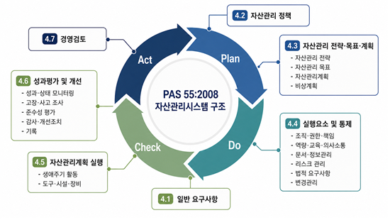
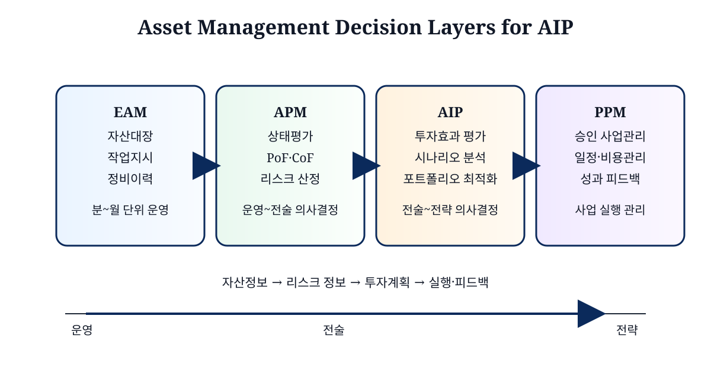
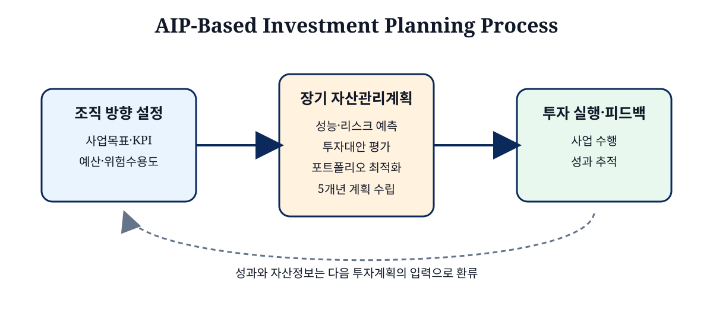
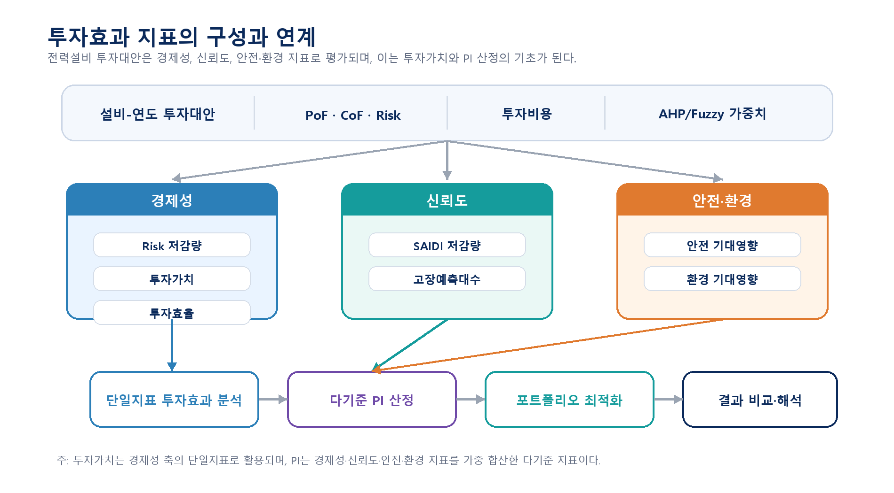
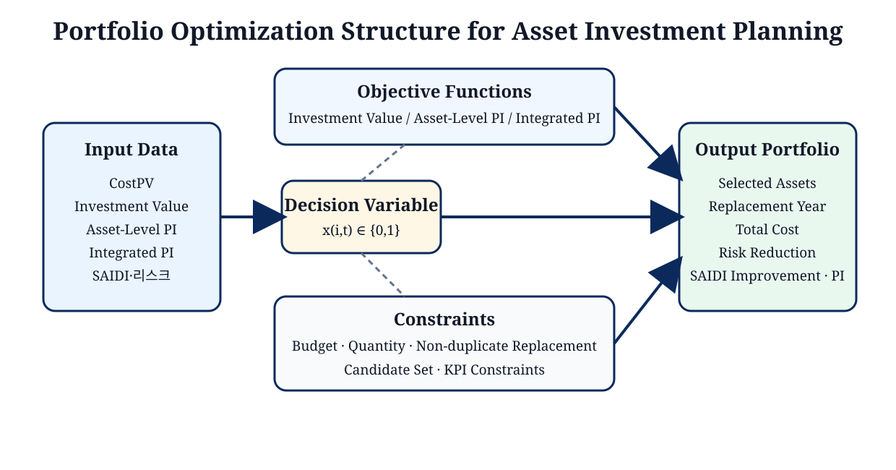

# 제2장 기술적 배경 및 선행연구 분석

본 장에서는 전력설비 투자계획 최적화 방법론을 구성하기 위한 기술적 배경과 선행연구를 검토한다. 먼저 전력설비 자산관리의 개념과 국제 표준의 관점을 정리하고, 자산관리시스템에서 APM과 AIP가 수행하는 역할을 살펴본다. 다음으로 리스크 기반 투자가치 평가와 투자효과 분석 방법론을 검토하고, 다기준 의사결정 및 포트폴리오 최적화 기법을 고찰한다. 마지막으로 기존 연구와 실무 방법론의 한계를 종합하여 본 연구의 차별성을 제시한다.

---

## 제1절 전력설비 자산관리 개요

### 1. 자산관리 정의 및 표준

자산관리(Asset Management)는 조직이 보유한 자산을 체계적으로 운영·관리하여 자산의 가치를 극대화하는 동시에, 리스크와 비용을 합리적인 수준으로 유지하기 위한 전략적 접근이다. 자산관리의 핵심은 개별 설비의 유지·보수에 국한되지 않고, 자산의 성능, 리스크, 비용을 조직의 목적과 연결하여 생애주기 관점에서 관리하는 데 있다.

전력설비는 전형적인 물리적 자산이다. 변압기, 개폐기, 선로, 케이블 등은 장기간 운용되며, 고장 발생 시 정전·복구비용·안전사고·환경피해 등 광범위한 파급영향으로 이어진다. 전력회사는 대규모 설비군을 보유하고 있어 모든 설비를 동일한 수준으로 관리하거나 동시에 교체하는 것이 불가능하다. 따라서 전력설비 자산관리는 투자 우선순위와 예산 배분의 정량적 근거를 제공하는 체계로 기능해야 한다.

물리적 자산관리 분야에서 초기 표준으로 자리잡은 것은 영국표준협회(BSI)의 PAS 55이다. PAS 55는 2004년 초판되고 2008년 개정된 물리적 자산관리 표준으로, 전력·가스·수도와 같은 사회기반시설 운영기관을 주요 적용 대상으로 하였다[8]. 이 표준은 조직이 자산과 자산시스템을 생애주기 동안 체계적이고 조정된 방식으로 관리하여 성능, 리스크, 비용을 조직의 전략적 계획에 맞게 최적화하도록 요구한다. PAS 55가 강조한 핵심은 자산을 개별 설비 단위로만 보지 않고 자산시스템 전체의 성능과 상호의존성을 고려해야 한다는 점이며, 계획(Plan)·실행(Do)·점검(Check)·개선(Act)의 지속적 개선 구조로 자산관리 활동을 배치함으로써 반복적 관리체계의 필요성을 제시하였다.



**그림 2.1  PAS 55:2008 Asset Management System Structure**  
자료: British Standards Institution[8]의 PAS 55:2008 체계를 바탕으로 본 연구 작성.

PAS 55를 기반으로 국제표준화기구(ISO)는 2014년 ISO 55000 시리즈를 제정하였다. ISO 55000은 자산관리의 개요·원칙·용어를 제시하고, ISO 55001은 자산관리시스템의 요구사항을 규정하며, ISO 55002는 ISO 55001의 적용 지침을 제공한다[5]. ISO 55000 시리즈는 조직의 목표와 자산관리 전략 간의 정렬, 생애주기 전 과정 관리, 위험 기반 의사결정, 리더십·성과평가·정보관리의 통합 운영을 핵심 요구사항으로 제시한다. 이 요건은 전력설비 투자계획이 단순한 예산 집행이 아니라 조직목표와 연결된 자산관리 의사결정임을 명확히 한다.

IAM은 ISO 55000의 개념을 실무적으로 해석하는 자산관리 모델을 제시한다[9]. IAM 모델은 자산관리 전략과 계획, 자산관리 의사결정, 생애주기 실행, 자산정보, 조직과 인력, 리스크와 검토의 여섯 영역으로 구성되며, 의사결정 영역에는 자본투자 의사결정과 생애주기 가치 실현이 포함된다. 어떤 설비를 어느 시점에 교체하고 그 결과 비용·리스크·성과가 어떻게 달라지는지를 평가하는 것이 자산관리 의사결정의 본질이다.


**그림 2.2  IAM Asset Management Model**  
자료: Institute of Asset Management[9]의 개념도를 본 연구에서 한글화.

IAM은 자산관리시스템과 자산관리 활동을 구분해야 한다고 강조한다[9]. 자산관리시스템은 조직이 자산관리 활동을 계획·실행·평가·개선하기 위한 관리체계이고, 자산관리 활동은 자산의 계획·취득·운전·유지보수·교체·폐기 등 생애주기 전반의 실행을 의미한다. 우수한 자산관리시스템은 데이터를 축적하는 것에 그치지 않고, 설비상태·고장이력·고장확률·고장영향·정전영향·교체비용 등의 정보를 의사결정에 활용할 수 있는 절차와 기준을 갖추어야 한다.

전력설비 자산관리에서 국제 표준과 IAM 모델이 제시하는 방향은 명확하다. 첫째, 전력설비는 개별 장치가 아니라 전력공급이라는 서비스를 제공하는 자산시스템으로 관리되어야 한다. 둘째, 자산관리 성과는 설비 상태 개선만이 아니라 비용·리스크·성능·안전·환경·서비스 수준을 함께 고려하여 평가해야 한다. 셋째, 자산관리 의사결정은 단년도 정비계획이 아니라 생애주기 투자계획과 연결되어야 한다. 본 연구에서 투자가치, 다기준 PI, 포트폴리오 최적화를 핵심 개념으로 설정한 것도 이 관점에 근거한다.

### 2. 전력설비 자산관리시스템 적용 사례

전력설비 자산관리시스템은 국가와 전력회사별로 적용 범위와 명칭이 다르지만, 공통적으로 자산정보·상태평가·리스크 산정·투자계획·성과평가를 연결하는 방향으로 구축되고 있다. 전력회사는 설비의 상태를 기록하는 수준을 넘어 자산의 현재 리스크 수준과 미래 투자 필요성을 정량적으로 설명할 수 있어야 하며, 해외 전력회사들은 규제 대응·투자정당성 확보·장기 자산군 관리를 목적으로 자산관리시스템을 도입해 왔다.

#### 가. 영국 Ofgem RIIO 규제체계와 NGET·DNO 사례

영국은 전력설비 자산관리와 투자규제 체계가 비교적 명확하게 제도화된 사례이다. Ofgem의 RIIO(Revenue = Incentives + Innovation + Outputs) 규제체계는 전력망 사업자가 일정 규제기간 동안 비용·산출물·혁신·성과목표를 함께 제시하도록 요구한다[10]. 이 체계에서 자산관리는 단순한 설비 정비활동이 아니라, 네트워크 사업자가 어떤 자산 리스크를 어느 수준으로 줄이고 그 결과 어떤 산출물을 달성할 것인지를 설명하는 핵심 근거가 된다.

송전 부문에서는 National Grid Electricity Transmission(NGET)의 NARA-T2(Network Asset Risk Annex for RIIO-T2)가 대표적인 사례이다[11]. NARA-T2는 RIIO-T2 규제기간에 사용되는 Network Asset Risk Metric(NARM)의 적용방식을 설명하는 문서로, 송전설비의 화폐화 리스크(Monetised Risk)를 산정하고 이를 투자계획과 규제 산출물에 연결하는 절차를 제시한다. NARA-T2의 목적은 세 가지이다. 첫째, 전력망 사업자의 데이터와 투자 의사결정 사이의 연결관계를 Ofgem과 이해관계자가 이해할 수 있도록 하는 것이다. 둘째, 현재와 미래의 자산 리스크를 화폐화하여 추정하고, 특정 개입 조치가 제공하는 리스크 저감 편익을 산정하는 것이다. 셋째, 산정된 리스크 저감 편익을 비용편익분석(CBA)의 입력으로 활용하여 투자계획의 최적성을 설명하는 것이다[11].


**그림 2.3  NGET NARA-T2 Purpose and Monetised Risk Framework**  
자료: National Grid Electricity Transmission[11].

NARA-T2에서 사용하는 화폐화 리스크는 설비 간 상대적 위험수준을 비교하기 위한 의사결정 지원도구이며, 실제 회계상 현금가치와 직접 동일시해서는 안 된다[11]. 법규 준수, 안전, 이해관계자 요구, 고영향·저확률(HILP) 사건 등은 단순 화폐화 리스크만으로 충분히 설명되지 않을 수 있다. 이는 본 연구에서 리스크 기반 우선순위, 투자가치 기반 우선순위, PI 기반 우선순위를 분리하여 비교하는 논거가 된다.


**그림 2.4  NARM Objectives and Investment Decision Support**  
자료: National Grid Electricity Transmission[11].

배전 부문에서는 DNO Common Network Asset Indices Methodology(CNAIM)가 대표적이다[7]. CNAIM은 영국 배전망 사업자(DNO)가 보유한 자산의 건강상태와 리스크를 공통 기준으로 산정하기 위한 표준 방법론으로, Ofgem이 배전망 사업자의 자산 리스크와 투자효과를 비교·검토할 수 있도록 만든 공통 기준이다. CNAIM의 기본 구조는 설비 연령·운전환경·부하 조건·결함 및 점검 이력을 반영한 Health Index에서 고장확률(PoF)로, 다시 고장영향(CoF)과 결합된 리스크로 이어진다. CoF는 안전·환경·신뢰도·재무 영향 등으로 구분하여 평가되며, PoF와 결합한 자산 리스크는 NARM 규제 성과지표로 연결된다[7].

RIIO-ED2에서는 단년도 리스크뿐 아니라 장기적 리스크(Long-term Risk)를 고려하는 방향이 강화되었다[10]. Health Score의 열화 모델을 이용하여 장래의 PoF 변화를 예측하고, 투자개입이 향후 기간 동안 제공하는 리스크 저감효과를 평가한다. 장기 리스크 관점은 본 연구의 5개년 투자계획과 직접적으로 연결된다. 특정 설비를 2026년에 교체하면 2027년 이후의 리스크와 SAIDI가 함께 낮아지므로, 투자효과는 당해연도 효과가 아니라 계획기간 전체의 누적효과로 평가되어야 한다.

본 연구에서는 CNAIM을 공개적으로 검토 가능한 배전설비 리스크 입력자료 구성 체계로 활용한다. 이를 통해 설비별 리스크가 투자가치, 다기준 투자우선순위 지수, 통합 PI 및 포트폴리오 최적화로 전환되는 과정을 동일한 기준 데이터 위에서 검토한다.

#### 나. 일본의 고경년화설비 교체 가이드라인

일본 전력광역적운영추진기관(OCCTO)은 「고경년화설비 갱신 가이드라인」을 통해 송배전설비의 리스크량 산정방법과 설비 갱신에 필요한 공사물량 산정의 기본방향을 제시하였다[12]. 이 가이드라인은 새로운 탁송요금제도 도입에 대응하여, 일반송배전사업자가 각 설비의 리스크량을 파악하고 합리적인 설비보전계획을 수립하도록 지원하는 것을 목적으로 한다.

일본 가이드라인의 특징은 리스크량과 공사물량을 명시적으로 연결한다는 점이다. 리스크량은 설비 고장확률과 설비 고장 시 영향도의 곱으로 산정되며, 이 값은 현재 리스크뿐 아니라 장래 리스크를 예측하는 데 활용된다[12]. 가이드라인은 리스크량 산정 대상설비와 고장의 정의, 고장확률 산출방법, 고장영향도 산출방법을 구분하여 제시하고, 이를 바탕으로 갱신공사 물량을 산정하는 기본방식을 설명한다. 또한 리스크량 및 공사물량 산정의 대상기간을 탁송요금제도의 규제기간인 5년으로 설정한다.


**그림 2.5  Risk-based Renewal Planning in Japanese Aging Equipment Guideline**  
자료: OCCTO[12].

일본 가이드라인은 리스크량을 설비 고장 시 영향도와 설비 고장확률의 곱으로 정의한다. 고장확률은 설비의 경년화와 상태정보를 반영하여 산정하고, 고장영향도는 정전영향도, 재해영향도, 사업운영영향도 등으로 구분된다. 정전영향도는 정전 1kWh당 영향액, 정전전력, 정전시간, 고장 시 정전발생확률 등을 이용하여 산정한다. 특히 배전계통에서는 설비 고장이 정전에 직접 연결되는 경우가 많기 때문에 정전발생확률을 100%로 설정하는 방식도 제시되어 있다. 이러한 구조는 본 연구의 SAIDI 산정과 연결된다. 본 연구 역시 설비별 고장확률, 정전시간, 연결고객수를 이용하여 설비별 신뢰도 기여도를 계산하고, 교체설비의 영향을 제거하여 투자 후 SAIDI를 산정한다.
재해영향도와 사업운영영향도는 전력설비 고장이 단순한 정전비용에 그치지 않는다는 점을 보여준다. 일본 가이드라인은 철탑·전주 붕괴, 전선 단선, 케이블 고장, 변압기 누유 등 설비별 고장사건이 사망사고, 구조물 손상, 화재, 감전, 환경오염 등 사회적 영향을 유발할 수 있다고 보며, 이를 금액으로 환산하는 방식을 제시한다. 또한 고장이나 재해 발생 후 긴급복구, 행정지도, 고객 민원, 업무중단 등 전력회사 운영에 추가적으로 발생하는 영향도 별도 항목으로 고려한다. 이러한 접근은 본 연구가 PI 산정 시 안전·환경 기준을 별도 평가축으로 둔 이유와 맞닿아 있다. 단일 재무 리스크 지표에 여러 영향이 포함되더라도, 현장 전문가가 중요하게 판단하는 안전·환경 요소가 의사결정 과정에서 희석될 수 있기 때문이다.
일본 사례의 시사점은 두 가지이다. 첫째, 고경년 설비 교체는 단순한 노후도 기준이 아니라 리스크량 기반으로 산정되어야 하며, 고장확률과 고장영향도를 함께 고려해야 한다. 둘째, 리스크량은 공사물량 산정과 연결되어야 하며, 투자시기와 시공능력, 국민부담, 레질리언스 확보와 같은 현실 조건을 함께 고려해야 한다. 본 연구에서 예산과 물량 제약을 연도별로 설정하고, 리스크 총량과 SAIDI 제약에 대한 민감도 분석을 수행하는 것은 이러한 해외 사례의 방향과도 부합한다.

#### 다. 한국전력공사의 자산관리시스템 구축 사례

국내에서도 전력설비의 노후화와 설비 투자 효율성 문제가 확대되면서 자산관리시스템 구축이 추진되고 있다. 한국전력공사는 1990년대 이후 급격히 확충된 설비들이 점차 교체 주기에 진입함에 따라, 기존의 정기점검 및 상태기반 관리만으로는 투자 우선순위를 합리적으로 결정하기 어려운 상황에 직면하고 있다. 이에 따라 전력설비를 생애주기 동안 리스크와 비용, 성능을 함께 관리해야 하는 자산으로 인식하고, 리스크 기반 자산관리체계로의 전환을 추진하고 있다[13], [27].

한국전력공사의 자산관리시스템(AMS)은 우선적으로 설비 상태와 리스크 평가를 수행하는 APM 기능을 중심으로 구축되고 있다. APM은 설비의 고장확률(PoF)과 고장영향(CoF)을 산정하여 리스크를 평가하는 기능이며, 여기서 산출되는 리스크 정보는 향후 투자 우선순위와 포트폴리오 판단으로 확장될 수 있는 핵심 입력자료가 된다[27]. 고장확률은 통계잔여수명·상태잔여수명·운전잔여수명 등을 이용하여 산정하고, 고장영향은 재무·신뢰도·안전·환경 영향을 비용 단위로 환산하여 평가한다.


**그림 2.6  KEPCO AMS Risk Evaluation Process**  
자료: 한국전력공사[13].

자산관리시스템의 신뢰도는 입력 데이터의 품질에 크게 좌우된다. 한국전력공사는 변전·송전·배전 및 공통 시스템 등 여러 레거시 시스템으로부터 설비정보·고장 이력·진단 데이터·운전 데이터를 수집·정제하여 리스크 평가에 활용하는 구조를 구축하고 있다[13]. 또한 전력연구원은 자산 데이터의 누락·오입력·이상값 문제를 줄이기 위해 전력설비 자산데이터 자동 정제 및 통합 시스템(ALICE)을 개발하였다[27].


**그림 2.7  KEPCO Asset Management System Development Status**  
자료: 한국전력공사[13].

한국전력공사 사례는 본 연구의 범위를 명확히 하는 근거가 된다. 국내 AMS는 고장확률과 고장영향을 결합하여 설비별 리스크를 산정하고 교체 우선순위 판단에 활용한다. 그러나 리스크 산정 결과를 제한된 예산과 시공능력 아래에서 다년간 투자 포트폴리오로 전환하기 위해서는 투자효과 평가와 최적화 절차가 추가로 필요하다. 본 연구는 이미 산정된 리스크 정보를 입력으로 하여 리스크 저감량·투자가치·SAIDI·PI를 산정하고, 5개년 투자 포트폴리오를 최적화하는 절차를 제안한다.

#### 라. 해외·국내 사례 검토의 시사점

영국, 일본, 한국 사례를 종합하면 전력설비 자산관리시스템은 공통적으로 리스크 기반 의사결정으로 수렴하고 있다. 영국은 RIIO 규제체계와 NARM/NARA·CNAIM을 통해 자산 리스크와 투자효과를 규제 산출물과 연결한다. 일본은 고경년화 설비의 리스크량을 산정하고 이를 5년 규제기간의 공사물량 산정에 연결한다. 한국은 AMS를 통해 고장확률과 고장영향을 종합 평가하고 교체 우선순위를 도출하는 체계를 구축하고 있다. 세 사례 모두 상태평가와 리스크 산정의 중요성을 보여주지만, 동시에 리스크 이후의 투자계획 의사결정이 별도로 필요하다는 점도 드러낸다.

이상의 사례는 상태평가와 리스크 산정 결과가 투자계획 의사결정으로 연결될 때 AIP의 실질적 의미가 커진다는 점을 보여준다. 본 연구는 이 연결 단계에 초점을 두고, 리스크 정보를 투자가치와 다기준 PI로 전환한 뒤 연도별 예산과 시공능력 제약 아래에서 5개년 투자 포트폴리오를 구성하는 절차를 제시한다.


---

## 제2절 자산투자계획(AIP) 기술 개요

제1절에서는 전력설비 자산관리의 국제표준과 국내외 적용 사례를 검토하였다. 이들 사례는 제도와 명칭은 다르지만, 공통적으로 설비의 상태와 리스크를 정량화하고 그 결과를 투자 의사결정으로 연결하려는 흐름을 보인다. 본 절은 그 흐름이 수렴하는 기술 영역으로서 자산투자계획(AIP: Asset Investment Planning)의 배경, 정의, 핵심 기능, 투자계획 프로세스를 정리한다. 즉, 제1절의 사례 검토가 자산관리 적용 현황을 제시하였다면, 본 절은 해당 적용 사례가 궁극적으로 요구하는 투자 의사결정 기술을 AIP 관점에서 정리하는 데 목적이 있다.

### 1. AIP 기술의 배경 및 정의

전 세계 전력설비는 20세기 전반부터 장기간에 걸쳐 집중적으로 확충되어 왔으며, 현재 다수의 설비가 대규모 교체주기에 진입하고 있다. 이에 따라 유지관리 비용과 노후설비 보강 수요는 증가하고 있으나, 전력회사가 활용할 수 있는 재무적 자원과 시공능력은 제한적이다. 동시에 탄소중립 정책, 재생에너지 확대, 전기화 진전, 전력수요 구조 변화는 송배전망의 보강과 유연성 확보를 요구하고 있다. 이런 조건에서는 과거와 같이 노후도나 단일 리스크만으로 투자대상을 정하는 방식만으로는 증가하는 투자수요를 합리적으로 조정하기 어렵다.

전력산업에 대한 규제와 사회적 요구도 AIP의 필요성을 확대하고 있다. 전력회사는 설비 투자에 대한 타당성을 정량적으로 제시해야 하며, 투자 효율성과 전기요금의 적정성을 동시에 설명해야 한다. 또한 전기품질이 일정 수준 이상에 도달한 이후에는 추가 개선을 위한 투자비가 급격히 증가할 수 있으므로, 제한된 재원 안에서 어느 수준의 성능, 리스크, 비용을 선택할 것인지가 중요한 의사결정 문제가 된다. 따라서 전력설비 투자계획은 단순한 유지보수 계획이 아니라, 비용과 리스크, 공급신뢰도, 안전·환경 영향을 함께 조정하는 자본투자 의사결정 문제로 이해되어야 한다.

환경 변화에 대응하기 위해 자산관리 기술은 자산의 성능(Performance), 리스크(Risk), 비용(Cost)을 종합적으로 고려하는 방향으로 발전하고 있다. ISO 55000 계열 표준은 자산관리를 조직의 목적 달성을 위해 자산으로부터 가치를 실현하는 조정된 활동으로 정의하며, 자산의 생애주기 동안 비용, 리스크, 성능의 균형을 요구한다[1]. 전력설비 분야에서 이 원칙은 설비의 상태와 고장위험을 평가하는 단계와, 그 결과를 투자 우선순위 및 자본배분으로 전환하는 단계로 구체화된다.

전력회사는 오랜 기간 CMMS(Computerized Maintenance Management System)와 EAM(Enterprise Asset Management)을 통해 설비 대장, 작업지시, 정비 이력, 자재, 운영정보를 관리해 왔다. 그러나 설비 규모와 복잡도가 증가하면서 운영·정비 이력관리만으로는 장기 투자계획의 타당성을 설명하기 어렵게 되었다. 이에 따라 자산관리 기술은 크게 두 영역으로 분화되어 발전하였다. 하나는 설비의 상태와 성능을 분석하여 고장 가능성과 영향을 정량화하는 APM(Asset Performance Management)이고, 다른 하나는 이 결과를 이용하여 투자대안의 효과를 비교하고 최적 투자 포트폴리오를 구성하는 AIP이다.

APM은 설비의 상태, 수명, 운전조건, 점검 및 고장이력 데이터를 활용하여 고장확률(PoF: Probability of Failure)과 고장영향(CoF: Consequence of Failure)을 산정하고, 이를 결합하여 리스크(Risk)를 정량화하는 기능을 수행한다[2]. 이 단계의 핵심 질문은 “어떤 설비가 얼마나 위험한가”이다. 반면 AIP의 핵심 질문은 “제한된 예산과 실행 제약 아래에서 어떤 설비를 언제 교체해야 투자성과가 가장 큰가”이다. 따라서 AIP는 APM에서 산출된 PoF·CoF·리스크를 입력으로 받아 투자대안별 경제성, 리스크 저감효과, 운영 KPI 영향을 비교하고, 제약조건을 만족하는 투자 조합을 도출하는 의사결정 지원 기술로 정의할 수 있다[14], [15], [23].

대규모 설비를 보유한 전력회사의 투자계획에서는 연간 수많은 투자 후보와 예산, 인력, 시공능력, 규제조건, 운영목표가 동시에 고려된다. 이 문제는 경험 기반 판단만으로 최적 투자 조합을 도출하기 어렵고, 단일 연도 또는 단일 설비군의 우선순위만으로도 충분히 설명되지 않는다. AIP가 필요한 이유는 여기에 있다. AIP는 리스크 평가 결과를 투자효과 지표로 전환하고, 다양한 투자대안을 동일한 기준에서 비교하며, 제한조건 아래에서 투자효과를 극대화하는 포트폴리오를 구성한다. 본 연구에서 다루는 AIP는 상태평가와 리스크 산정 이후의 단계에서 투자가치와 다기준 투자우선순위 지수를 산정하고, 다년간 투자 포트폴리오를 최적화하는 의사결정 절차에 해당한다.



**그림 2.8  Asset Management Decision Layers for AIP**  
자료: AMCL[15]의 의사결정 시간축과 Verdantix[23]의 산업 자산관리 경관을 참고하여 본 연구에서 재작도.

### 2. AIP의 핵심 기능

AIP는 하나의 단일 분석 기능이 아니라 투자 요구의 입력, 투자효과 산정, 시나리오 비교, 포트폴리오 최적화, 결과 보고까지 연결하는 의사결정 기능군으로 구성된다. AIP의 핵심 기능은 자산 등록, 투자 전주기 관리, 투자가치 모델링, What-if 시나리오 분석, 투자 포트폴리오 최적화, 보고 및 성과관리로 정리할 수 있다[14], [15], [23]. 이 기능들은 순차적으로 분리되어 작동한다기보다, 자산 데이터와 투자대안 정보를 공유하면서 하나의 투자계획 수립 절차를 형성한다.

첫째, 자산 등록 기능은 데이터 기반 투자 의사결정을 위한 기초 기능이다. 전력설비 투자계획에서는 설비유형, 설비번호, 설치연도, 운전기간, 설계수명, 교체비용, 고장확률, 상태정보와 같은 속성이 자산 단위로 관리되어야 한다. 또한 변전소, 변압기, 개폐기, 케이블, 선로 등 설비 간 계층구조와 연계관계가 정의되어야 한다. 자산 등록 기능은 단순한 설비대장 관리에 그치지 않고, 이후의 투자가치 평가와 포트폴리오 최적화에서 동일한 분석 단위를 유지하기 위한 기준정보 역할을 수행한다.

둘째, 투자 전주기 관리 기능은 투자 요구안의 생성, 수정, 취합, 검토 과정을 관리한다. 전력회사에서는 사업소, 설비부서, 투자부서 등 여러 주체가 투자 요구를 제기하므로, 투자명, 사업 목적, 대상 자산, 물량, 예산, 시행 시기, 제약사항이 일관된 형식으로 입력되어야 한다. 이 기능은 개별 투자 요구안을 중기투자계획의 후보군으로 전환하고, 동일한 기준으로 비교 가능한 투자대안 집합을 구성한다는 점에서 중요하다.

셋째, 투자가치 모델링 기능은 투자 전후의 효과를 정량적으로 비교하는 기능이다. 투자대안은 보강 또는 교체 이전의 기준상태(Baseline)와 투자 이후의 개선상태(Outcome)를 비교하여 평가된다. 이때 경제성, 리스크 저감, 신뢰도, 안전, 환경 등 복수의 평가항목이 반영될 수 있으며, 항목별 중요도나 고정값, 사업별 특성값이 함께 설정된다. 본 연구에서 제시하는 리스크 저감량, 투자가치, 투자효율, SAIDI, PI는 이 투자가치 모델링 기능을 연구모형으로 구체화한 것이다. 구체적 산식과 지표 정의는 제3절에서 상술한다.

넷째, What-if 시나리오 분석 기능은 투자 시기, 투자 방법, 예산, 물량, 운영목표, 제약조건이 달라질 때 투자성과가 어떻게 변하는지를 검토한다. 동일한 투자 후보군이라도 예산상한을 강화하거나, 시공능력을 제한하거나, 신뢰도 개선 목표를 높게 설정하면 선택되는 투자 조합은 달라질 수 있다. 따라서 AIP는 단일 최적안만을 제시하는 체계가 아니라, 의사결정자가 여러 시나리오를 비교하면서 성과와 비용의 균형점을 선택할 수 있도록 지원해야 한다.

다섯째, 투자 포트폴리오 최적화 기능은 제한된 자원 아래에서 투자효과를 극대화하는 투자 조합을 도출한다. 개별 투자대안의 가치가 높더라도 모든 대안을 동시에 시행할 수는 없으므로, 예산, 물량, 인력, 정책, 의무사업, 서비스 수준과 같은 제약조건을 반영하여 최적의 투자대상과 시행연도를 결정해야 한다. 이 기능은 AIP의 핵심 의사결정 단계에 해당하며, 본 연구에서는 리스크·투자가치·PI 기반의 포트폴리오 최적화로 구현된다. 최적화 모형의 수리적 구조와 알고리즘은 제4절에서 설명한다.

여섯째, 보고 및 성과관리 기능은 분석 결과를 의사결정과 사후관리로 연결한다. AIP 결과는 투자 리스트, 연도별 물량, 예산, 투자가치, 리스크, 고장률, SAIDI 등으로 제시될 수 있으며, 분야별·사업소별·투자유형별 비교가 가능해야 한다. 또한 계획된 투자효과와 실제 시행결과를 비교하여 평가모형과 투자계획을 보정하는 피드백 기능도 필요하다. 본 연구에서는 실제 투자 집행 이후의 성과관리까지 다루지는 않지만, 시뮬레이션 결과표와 민감도 분석을 통해 투자대안 간 비교 가능성과 설명 가능성을 확보하고자 한다.


**그림 2.9  AIP Detailed Function Framework**  
자료: AIP 기능체계 관련 문헌[14], [15], [23] 참고 본 연구 재구성.

**표 2.1  AIP Core Functions and Reflection Scope in This Study**

| AIP 기능 | 주요 내용 | 본 연구의 반영 |
|---|---|---|
| 자산 등록 | 설비유형, 설비번호, 상태정보, 비용, 고장확률 등 기준정보 관리 | CNAIM 기반 검증용 설비 데이터와 설비유형별 입력자료 구성 |
| 투자 전주기 관리 | 투자 요구안 생성, 대상 자산·물량·예산·시기·제약사항 관리 | 2026~2030년 투자 후보군과 연도별 선택 문제로 반영 |
| 투자가치 모델링 | Baseline과 Outcome 비교, 경제성·리스크·KPI 효과 산정 | 리스크 저감량, 투자가치, 투자효율, SAIDI, PI 산정 |
| What-if 시나리오 분석 | 예산, 물량, 투자시기, 운영목표 변화에 따른 성과 비교 | 예산·물량·SAIDI·리스크 총량·가중치 민감도 분석 |
| 투자 포트폴리오 최적화 | 제한조건 하에서 투자대상과 시행연도 조합 도출 | 리스크·투자가치·PI 기반 ILP·GA 시뮬레이션 |
| 보고 및 성과관리 | 투자 리스트, 예산, 물량, KPI, 리스크 결과 출력 및 피드백 | 결과표, 그래프, 민감도 및 강건성 분석 |

#### 가. AIP 기반 투자계획 프로세스와 성숙도

AIP 기반 투자계획은 조직 방향 설정, 장기 자산관리계획(AMP: Asset Management Plan) 수립, 투자 실행 및 피드백의 흐름으로 구성된다[15]. 조직 방향 설정 단계에서는 사업목표, 목표 서비스 수준, 위험수용도, 예산 전망, 시공능력, 규제 요구와 같은 상위 조건을 정의한다. 이 기준이 명확하지 않으면 동일한 자산 데이터와 동일한 리스크 정보를 사용하더라도 서로 다른 투자계획이 도출된다. 비용효율을 중시하는 조직과 공급신뢰도를 중시하는 조직은 같은 설비군에 대해 다른 우선순위를 가질 수 있다. 본 연구가 AHP를 통해 경제성·신뢰도·안전·환경 기준의 가중치를 산정하는 것은 이러한 운영목표의 차이를 정량적으로 반영하기 위한 것이다.

조직 방향이 정의되면 장기 자산관리계획 단계에서 구체적 투자대안이 구성된다. AMP는 현재와 미래의 설비 성능을 예측하고, 개입 옵션별 비용과 효과를 비교하여 장기 투자대안을 도출하는 단계이다. 여기에는 자산성능 모델링, 위험 및 서비스 수준 변화 예측, 경제성 평가, 포트폴리오 최적화가 포함된다. AIP의 투자계획은 일반적으로 전략적 투자계획과 전술적 투자계획으로 구분된다. 전략적 투자계획은 장기 시간축에서 자본배분 방향을 설정하고, 전술적 투자계획은 보다 구체적인 자산 또는 사업 단위에서 실행 가능한 투자대안을 구성한다[23]. 전력설비 투자계획에서는 장기 방향과 연도별 실행계획이 서로 정합성을 가져야 한다.

투자 실행 및 피드백 단계에서는 승인된 투자계획이 실제 사업으로 전환된다. 실행 과정에서 발생하는 비용, 일정, 성과의 차이는 다시 자산정보와 다음 투자계획에 반영되어야 한다. 이 피드백 구조가 작동할 때 AIP는 일회성 계획수립 도구가 아니라 계획, 실행, 평가, 갱신이 반복되는 의사결정 체계가 된다. 본 연구는 이 가운데 AMP 단계의 성능 모델링과 개입 옵션 최적화에 초점을 맞추어, 이를 2026~2030년 5개년 투자계획 문제로 구체화한다.

**표 2.2  AIP-Based Investment Planning Process and Implementation Scope in This Study**

| 단계 | AIP에서의 의미 | 본 연구의 구현 |
|---|---|---|
| 조직 방향 설정 | 사업목표, 서비스 수준, 위험수용도, 예산·시공능력 조건 정의 | 기준 시나리오와 민감도 조건, AHP 가중치로 반영 |
| 장기 자산관리계획(AMP) | 현재·미래 성능 예측과 개입 옵션 최적화 | 2026~2030년 5개년 설비-연도 최적화 |
| 투자 실행 및 피드백 | 승인 사업의 수행, 성과 추적, 자산정보 갱신 | 연구 범위 제외 |



**그림 2.10  AIP-Based Investment Planning Process**  
자료: AMCL[15]의 자산투자계획 프로세스를 참고하여 본 연구에서 재작도.

---

## 제3절 전력설비 투자가치 평가기술

### 1. 투자가치 평가 방법론

ISO 55000 계열 표준에서 자산관리는 자산 자체의 보유와 운영이 아니라, 자산이 조직의 목적 달성에 기여하는 가치(Value)를 실현하는 활동으로 이해된다[1]. 이는 자산관리의 초점이 설비의 물리적 상태나 연식 중심 관리에서 조직목표와 이해관계자 가치 중심 관리로 이동했음을 의미한다. 전력설비 투자계획에서도 동일한 관점이 필요하다. 전력회사가 보유한 설비는 단순히 교체 대상의 목록이 아니라, 공급신뢰도, 안전, 환경, 비용효율, 규제성과를 통해 조직에 가치를 제공하는 자산이기 때문이다.

다만 Value라는 용어는 경제적 가치, 서비스 가치, 위험저감 효과, 전략적 가치 등 다양한 의미로 사용될 수 있어 투자평가 과정에서 혼란이 발생할 수 있다. 이에 본 연구에서는 전력설비 보강 또는 교체투자가 제공하는 정량화된 효과를 “투자가치”라는 용어로 통일하여 사용한다. 투자가치는 서로 다른 보강투자를 동일한 기준에서 비교하기 위해 전력회사의 전략적 목표와 운영 KPI에 정합되도록 정의된 평가척도이다. 따라서 투자가치는 단순한 회계상 수익이 아니라, 투자로 인해 감소하는 위험, 개선되는 성능, 절감되는 비용, 달성되는 운영목표를 비교 가능한 형태로 전환한 의사결정 지표로 이해할 수 있다.

투자가치를 객관화하는 가장 직접적인 방법은 평가항목을 금액 또는 금액에 준하는 공통 단위로 환산하는 것이다. 그러나 전력설비 투자효과에는 재무비용뿐 아니라 정전시간, 고객영향, 안전, 환경, 사회적 파급효과와 같이 비금전적 요소가 포함된다. 이러한 요소를 화폐화하거나 공통 지표로 변환하기 위해서는 합리적 가정, 평가기준, 이해관계자 간 합의가 필요하다. 또한 일부 평가요소는 절대값으로 평가할 수 있지만, 일부 요소는 조직이 처한 상황이나 전략적 목표에 따라 상대적으로 평가되어야 한다. 예를 들어 동일한 설비투자라도 비용효율을 중시하는 시기와 공급신뢰도를 중시하는 시기에는 서로 다른 투자가치를 가질 수 있다.

본 연구에서 투자가치 산정은 보강 이전의 기준상태(Baseline)와 보강 이후의 개선상태(Outcome)를 비교하는 방식으로 구성된다. 먼저 현재 설비를 교체하지 않고 계속 운전할 경우의 미래 리스크를 계획기간 또는 설계수명 동안 산정한다. 다음으로 동일 설비를 특정 연도에 교체하거나 보강했을 때의 미래 리스크를 산정한다. 두 경로의 차이는 투자개입으로 인해 회피되는 기대손실이며, 이를 리스크 저감량으로 정의한다. 각 연도별 리스크 저감량은 할인율을 적용하여 현재가치로 환산한 뒤 합산한다. 이와 같이 산정된 현재가치화한 리스크 저감량에서 투자비용을 차감하면 투자가치가 된다[11], [14], [15].

이러한 접근은 영국 NARA-T2에서 제시하는 장기 편익 산정 논리와도 연결된다. NARA-T2는 현재 및 미래의 화폐화 리스크를 추정하고, 특정 개입 조치가 제공하는 리스크 저감 편익을 비용편익분석의 입력으로 활용한다[11]. 또한 RIIO-ED2의 NARM 체계와 CNAIM에서는 단년도 리스크뿐 아니라 장기 리스크(Long-term Risk)를 이용하여 투자개입의 누적효과를 평가한다[10]. 즉, 투자효과는 교체연도의 리스크 차이만으로 판단할 수 없으며, 개입 이후 여러 연도에 걸쳐 발생하는 리스크 저감 편익을 현재가치 기준으로 비교해야 한다.

본 연구의 투자가치 산정식은 다음과 같이 정리된다.

```text
연도별 리스크 저감량 = 기준상태 리스크 - 개선상태 리스크
현재가치화 리스크 저감량 = 연도별 리스크 저감량 / (1 + 할인율)^경과연수
누적 리스크 저감량 = 현재가치화 리스크 저감량의 합
투자가치 = 누적 리스크 저감량 - 투자비용
투자효율 = 누적 리스크 저감량 / 투자비용
```

투자가치는 투자대안의 절대적 순효과를 나타내며, 투자효율은 단위 비용당 리스크 저감효과를 나타낸다. 두 지표는 서로 다른 해석 목적을 가진다. 투자가치는 제한된 예산 안에서 전체 편익을 극대화하는 목적함수로 활용될 수 있고, 투자효율은 비용 대비 효과가 높은 투자대안을 설명하는 보조 지표로 활용될 수 있다. 본 연구에서는 투자가치를 단일지표 최적화의 기준으로 사용하되, 이후 다기준 PI 산정에서는 신뢰도, 안전, 환경 요소를 추가하여 경제성 중심 평가의 한계를 보완한다.

### 2. 전력설비 투자효과 분석

전력설비의 교체 또는 보강 투자가 제공하는 효과는 노후 설비의 물리적 갱신이나 비용 절감에 그치지 않는다. 국내외 자산관리 표준과 규제체계는 교체투자의 효과를 비용·리스크·성능의 균형 관점에서 다차원적으로 정의한다. ISO 55000 계열 표준은 자산투자를 비용, 리스크, 성능을 함께 고려하는 활동으로 규정하며[5], 영국의 NARM/NARA-T2 체계는 설비 개입이 제공하는 화폐화 리스크 저감 편익을 투자효과의 핵심으로 본다[11]. 일본의 고경년화설비 갱신 가이드라인은 교체효과를 정전영향·재해영향·사업운영영향으로 구분하여 평가하며[12], Brown은 배전계통에서 정전 지속시간과 고객영향을 결합한 신뢰도 지표가 설비 투자효과를 설명하는 데 중요하다고 보았다[18].

본 연구는 이러한 다차원 효과를 서로 다른 설비가 동일한 기준에서 비교될 수 있도록 경제성·신뢰도·안전·환경의 세 축으로 구분하여 정량화한다. 각 효과의 단위와 의미가 달라 단일 지표로 통합할 경우 특정 의사결정 요소가 가려질 수 있기 때문이며, 이 구분은 이후 제3장에서 설계하는 다기준 투자우선순위 지수(PI)의 평가기준 체계로 직접 연결된다. 구체적으로 경제성 측면에서는 리스크 저감량·투자가치·투자효율을, 신뢰도 측면에서는 SAIDI와 고장예측대수를, 안전·환경 측면에서는 고장확률과 안전·환경 CoF를 결합한 기대영향을 지표로 사용한다.

SAIDI(System Average Interruption Duration Index)는 고객이 평균적으로 경험하는 정전 지속시간을 나타내는 대표적 공급신뢰도 지표이다. Brown은 배전계통 신뢰도 평가에서 정전 지속시간과 고객영향을 결합한 지표가 설비 투자효과를 설명하는 데 중요하다고 설명한다[18]. 본 연구에서는 개별 설비의 고장확률·정전시간·연결고객수를 이용하여 설비별 SAIDI 기여도를 산정하고, 교체된 설비의 SAIDI 기여도를 제거하는 방식으로 투자 후 SAIDI를 계산한다.

투자효과 분석에서 중요한 점은 교체효과가 당해연도에만 발생하지 않는다는 것이다. 본 연구는 2026~2030년의 5개년 계획기간을 설정하고, 각 연도까지 누적 교체된 설비가 해당 연도 KPI에 미치는 영향을 반영한다. 따라서 본 연구에서 리스크 저감량과 SAIDI 저감량은 단순히 당해연도에 선택된 설비의 효과만을 의미하지 않고, 해당 연도까지 교체된 설비군이 누적적으로 제거한 리스크 및 정전시간 기여도를 의미한다.

전력설비 투자효과는 경제성 지표와 운영 KPI가 서로 다른 방향을 보일 수 있다는 점에서 해석에 주의가 필요하다. 경제성 중심의 투자대상은 투자비용 대비 리스크 저감효과가 우수할 수 있으나, 반드시 SAIDI 개선효과가 가장 큰 것은 아니다. 안전·환경 영향 역시 단일 화폐화 지표로 통합되는 과정에서 현장 전문가가 중요하게 판단하는 요소가 희석될 수 있다. 특히 HILP 특성을 갖는 설비는 고장확률이 낮기 때문에 기대값 기반 리스크 지표에서는 상대적으로 낮게 표현될 수 있다. 그러나 사고 발생 시 정전범위, 안전, 환경 또는 사회적 파급효과가 크다면 전력회사 의사결정에서는 별도의 검토가 필요하다. 이러한 이유로 본 연구는 투자가치 기반 분석과 다기준 PI 기반 분석을 구분하여 수행한다.

고장예측대수는 계획기간 중 발생할 것으로 예상되는 고장건수를 설비 단위에서 합산한 지표이다. 본 연구에서는 연도별 고장확률을 이용하여 고장예측대수를 계산하며, 해당 연도 이전에 교체된 설비는 산정에서 제외한다. 다만 고장예측대수는 고장의 영향 규모를 직접 반영하지 않으므로, SAIDI 및 리스크 저감량과 함께 해석해야 한다.

**표 2.3  Investment Effect Indicators Used in This Study**

| 구분 | 지표 | 의미 | 활용 |
|---|---|---|---|
| 경제성 | 리스크 저감량 | 교체 전후 누적 리스크 차이 | 투자가치 산정의 기초 |
| 경제성 | 투자가치 | 리스크 저감량에서 투자비용을 차감한 순효과 | 단일지표 최적화 목적함수 |
| 경제성 | 투자효율 | 단위 투자비용당 리스크 저감량 | 결과 해석 및 보조 비교 |
| 신뢰도 | SAIDI 저감량 | 교체설비의 정전시간 기대기여도 감소 | PI 산정 및 KPI 분석 |
| 신뢰도 | 고장예측대수 | 연간 고장확률의 합 | 고장발생 가능성 분석 |
| 안전·환경 | 안전·환경 기대영향 | 고장확률과 안전·환경 CoF를 결합한 기대 영향 규모 | PI 산정의 하위지표 |



**그림 2.11  Investment Effect Indicators for Power Asset Planning**  
자료: 본 연구 작성.

---

## 제4절 다기준 의사결정 및 최적화 방법론

### 1. MCDM(Multi-Criteria Decision Making) 기법

다기준 의사결정(MCDM)은 복수의 평가기준이 동시에 작용하는 의사결정 문제에서 대안의 우선순위를 도출하기 위한 방법론이다. 전력설비 투자계획은 단순한 비용 최소화 문제가 아니라 경제성, 공급신뢰도, 안전, 환경 영향, 현장 운용 여건이 함께 고려되는 의사결정 문제이다. 특히 투자대안별 효과는 금액, 정전시간, 고장확률, 안전·환경 영향처럼 서로 다른 단위로 나타나므로, 이를 동일한 판단체계 안에서 비교하기 위한 기준 정규화와 가중치 산정 절차가 필요하다.

MCDM의 핵심은 평가기준을 계층적으로 구성하고, 기준별 중요도를 명시적으로 부여한다는 점에 있다. 전력회사 관점에서 동일한 설비 데이터가 주어지더라도 비용효율을 중시하는 경우와 공급신뢰도를 중시하는 경우의 투자 우선순위는 달라질 수 있다. 따라서 다기준 의사결정은 정량자료만으로 설명하기 어려운 운영목표와 전문가 판단을 투자계획에 반영하는 수단으로 기능한다.

AHP는 Saaty가 제안한 대표적인 MCDM 기법으로, 의사결정 문제를 목표, 기준, 하위기준, 대안의 계층구조로 분해하고 쌍대비교를 통해 기준 간 상대적 중요도를 산정한다[19]. AHP의 장점은 전문가가 직접 판단하기 어려운 복합 문제를 비교 가능한 소단위 판단으로 나누고, 그 판단을 일관성 검토가 가능한 가중치로 전환할 수 있다는 데 있다. 본 연구에서는 경제성, 신뢰도, 안전·환경 기준과 그 하위지표의 상대적 중요도를 산정하기 위한 기본 가중치 산정방법으로 AHP를 사용한다.

다만 AHP의 쌍대비교는 전문가가 기준 간 중요도 차이를 명확한 수치 배수로 표현한다는 전제를 포함한다. 전력설비 투자기준에서는 “신뢰도가 경제성보다 정확히 몇 배 중요한가”와 같은 판단을 단정하기 어렵다. 전문가의 판단은 담당 업무, 사고 경험, 설비 운영환경, 조직의 KPI에 따라 일정한 폭을 가질 수 있다. 이러한 판단의 모호성을 처리하기 위해 Fuzzy 척도를 결합할 수 있다. Fuzzy 접근은 “약간 중요”, “중요”, “매우 중요”와 같은 언어적 판단을 삼각퍼지수로 변환하여 정성적 판단의 불확실성을 수치적으로 표현한다[20].

본 연구에서 Fuzzy 척도는 AHP를 대체하는 독립적 주 방법이 아니라, AHP 기반 가중치에 내재된 언어적 모호성을 보정하고 가중치 결과의 안정성을 확인하는 절차로 사용된다. 즉, AHP는 기준 간 상대가중치를 산정하는 기본 틀을 제공하고, Fuzzy 척도는 전문가 판단의 절대적 영향도와 모호성을 반영하여 PI 산정에 필요한 보정가중치를 구성한다. AHP 결과와 Fuzzy 보정 결과가 유사하게 나타나는 경우에는 전문가 판단이 특정 척도에 과도하게 의존하지 않고 비교적 안정적으로 형성되었다는 근거로 해석할 수 있다.

BWM(Best-Worst Method)은 Rezaei가 제안한 MCDM 기법으로, 최선 기준과 최악 기준을 먼저 선정하고 나머지 기준과의 비교를 통해 가중치를 산정한다[21]. BWM은 비교 횟수가 상대적으로 적고 일관성 검토가 용이하다는 장점이 있으나, 최선·최악 기준의 선정이 결과에 큰 영향을 미친다. 본 연구에서는 BWM을 주 가중치 산정방법으로 사용하지 않고, AHP와 Fuzzy 보정 방식의 해석력을 검토하기 위한 비교군으로 활용한다. 다만 BWM 비교는 별도의 BWM 전용 설문이 아니라 기존 AHP 응답을 기반으로 재구성한 비교이므로, 결과 해석에서는 보조 검증의 성격을 명확히 한다.

**표 2.4  Roles of MCDM Methods Reviewed in This Study**

| 기법 | 주요 역할 | 본 연구에서의 사용 |
|---|---|---|
| AHP | 기준 간 상대적 중요도 산정 | PI 가중치 산정의 기본 방법 |
| Fuzzy 보정 | 언어적 판단의 모호성 정량화 | AHP 기반 가중치 보정 및 강건성 확인 |
| BWM | 최선·최악 기준 기반 가중치 산정 | AHP/Fuzzy 보정 결과와 비교하는 보조 검증 |

PI는 단순한 순위표가 아니라 포트폴리오 최적화의 목적함수로 사용되는 다기준 투자우선순위 지수이다. 따라서 하위지표는 비교 가능한 척도로 정규화되어야 하며, 가중치는 평균값이 아니라 전문가 판단과 운영목표를 반영한 값이어야 한다. 이 구조를 통해 투자가치 단일지표가 설명하기 어려운 공급신뢰도, 안전·환경 영향, 운영 KPI를 투자대안 평가에 포함할 수 있다.

### 2. 포트폴리오 최적화

포트폴리오 최적화는 제한된 자원을 여러 투자대안에 배분하여 전체 성과를 극대화하는 방법론이다. 전력설비 투자계획에서는 개별 설비를 교체할 것인지뿐 아니라 어느 연도에 교체할 것인지도 함께 결정해야 한다. 따라서 각 설비와 연도의 조합이 하나의 투자대안이 되며, 예산, 시공능력, 정책 제약, 설비별 최대 교체 횟수와 같은 조건이 동시에 고려된다.

전력설비 투자계획은 자산군 내부의 단순 우선순위 문제와 다르다. 리스크가 높은 설비를 순서대로 선택하는 방식은 이해하기 쉽지만, 예산을 초과하지 않는 범위에서 총 투자효과가 가장 큰 조합을 보장하지는 않는다. 마찬가지로 투자가치가 높은 설비를 순서대로 선택하는 방식도 물량 제약이나 연도별 배분 조건이 결합되면 최적 조합과 달라질 수 있다. 이러한 이유로 우선순위 기반 그리디 방식은 비교 기준선으로 활용하고, 실제 포트폴리오 구성에는 수리최적화 또는 메타휴리스틱 접근이 필요하다.

정수선형계획법(ILP)은 선택 여부를 0 또는 1의 이진변수로 표현하는 투자대상 선정 문제에 적합하다. 설비를 특정 연도에 교체하는 선택을 이진변수로 정의하면, 목적함수는 투자가치, PI 또는 통합 PI의 합을 최대화하는 형태로 구성할 수 있다. 동시에 연도별 예산상한, 연도별 물량상한, 동일 설비의 계획기간 내 최대 1회 교체 조건을 선형 제약으로 표현할 수 있다. ILP는 목적함수와 제약조건이 선형으로 정리되는 경우 해석 가능성이 높고, 기준해를 제공한다는 점에서 AIP 포트폴리오 모형에 적합하다.

유전 알고리즘(GA)은 생물의 진화과정을 모방한 메타휴리스틱 최적화 기법으로, 해 공간이 크거나 제약조건이 복잡한 조합문제에서 활용될 수 있다[22]. GA는 항상 전역 최적해를 보장하는 방법은 아니지만, 대규모 자산군이나 비선형 제약조건이 포함되는 실제 운영환경에서 실행 가능한 우수해를 탐색하는 데 장점이 있다. 본 연구에서 GA는 동일한 투자계획 문제에서 메타휴리스틱 접근의 적용 가능성을 검토하기 위한 보조 비교군으로 사용된다.

전력설비 투자계획에서 포트폴리오 최적화가 중요한 이유는 설비유형 간 경쟁이 존재하기 때문이다. 예산이 고정되어 있을 때 한 설비유형에 대한 투자는 다른 설비유형의 교체를 지연시킨다. 설비군별 예산을 사전에 나누는 방식은 관리상 단순하지만, 시스템 전체의 성과를 기준으로 보면 투자효율을 낮출 수 있다. AIP 기술체계에서도 여러 설비유형을 동일한 가치체계에서 비교하고, 예산과 제약조건을 반영하여 투자 포트폴리오를 구성하는 기능이 핵심 역량으로 제시된다[14], [15], [23].

National Grid Electricity Transmission의 Circuit Optimisation 사례는 이러한 시스템 단위 최적화의 필요성을 잘 보여준다. 해당 사례에서는 먼저 자산 단위 가치모델을 통해 각 개입 대안의 화폐화 리스크 저감효과와 비용을 산정하고, 회로 단위에서 복수 자산의 작업 묶음효과를 고려한 최적화를 수행한 뒤, 정전시간 산정과 네트워크 전체 최적화를 순차적으로 수행하였다[25]. 특히 동일 회로에 속한 여러 자산을 같은 시점에 개입하면 정전비용과 정전시간을 줄일 수 있으므로, 개별 자산의 최적 시점만을 독립적으로 선택하는 방식으로는 전체 최적해를 얻기 어렵다. 또한 회로 정전 제약, 작업팀 및 자원 제약, 네트워크 신뢰도 제약이 함께 작용하므로, 투자계획은 자산 단위 가치평가와 시스템 단위 제약조건을 동시에 고려하는 포트폴리오 문제로 정식화될 필요가 있다.

본 연구는 이러한 포트폴리오 관점을 설비 단위 최적화와 시스템 단위 최적화로 구분하여 적용한다. 설비 단위 PI는 동일 설비유형 내부에서 경제성, 신뢰도, 안전·환경 기준을 반영한 우선순위를 산정하는 데 사용된다. 통합 PI는 설비 단위 PI에 설비유형 간 상대적 중요도를 결합하여, 이종 설비를 하나의 의사결정 공간에서 비교하기 위한 지표이다. 최종적으로 본 연구의 최적화 모형은 투자가치, 설비 단위 PI, 통합 PI를 각각 목적함수로 사용하여 동일한 예산·물량 제약 아래에서 투자 포트폴리오의 차이를 비교한다.



**그림 2.12  Portfolio Optimization Structure for Asset Investment Planning**  
자료: 본 연구 작성.

---

## 제5절 선행연구 분석

### 1. 선행연구 검토

전력설비 투자계획에 관한 선행연구는 크게 다섯 흐름으로 구분할 수 있다. 첫째는 설비의 열화상태와 고장위험을 정량화하는 상태평가 및 리스크 기반 자산관리 연구이고, 둘째는 산정된 위험정보를 투자계획으로 전환하는 AIP 기반 투자계획 연구이다. 셋째는 경제성, 신뢰도, 안전, 환경과 같이 성격이 다른 평가기준을 함께 고려하기 위한 다기준 의사결정 연구이며, 넷째는 제한된 예산과 물량 조건 아래에서 투자대상을 선택하는 포트폴리오 최적화 연구이다. 다섯째는 SAIDI, 리스크 총량, 서비스 수준과 같은 운영 KPI를 투자성과 평가 및 제약조건으로 활용하는 연구이다. 이들 연구 흐름은 전력설비 투자 의사결정의 각 구성요소를 발전시켜 왔으며, 본 연구는 그 요소들이 하나의 다년 투자계획 절차 안에서 어떻게 연결될 수 있는지를 검토한다.

#### 가. 상태평가 및 리스크 기반 자산관리 연구

전력설비 자산관리 연구의 출발점은 설비 상태를 정량화하고, 그 결과를 유지보수 또는 교체 의사결정에 반영하는 데 있다. 사후정비와 시간기반 정비가 설비 고장 이후의 대응 또는 일정 주기 중심의 관리에 머물렀다면, 상태기반 정비와 리스크 기반 정비는 설비의 열화상태, 고장확률, 고장영향을 함께 고려한다. 전력설비 유지보수 전략에 관한 연구에서는 설비 상태와 중요도를 함께 반영해야 유지보수 자원의 배분 효율을 높일 수 있음을 제시하였으며, 전력망 조직의 자산관리 연구에서도 위험수준과 조직의 위험수용도를 연결한 의사결정 구조가 강조되었다[16], [17], [26].

리스크 기반 자산관리의 핵심은 고장확률과 고장영향의 결합이다. 설비가 노후하였다는 사실만으로 투자 우선순위가 결정되는 것이 아니라, 해당 설비의 고장가능성과 고장 발생 시의 재무적·사회적·운영상 영향이 함께 고려되어야 한다. 이 관점은 영국 배전망 사업자의 CNAIM과 송전망 사업자의 NARA/NARM 체계에서 제도적으로 구체화되었다. CNAIM은 건강지수와 PoF를 연결하고, CoF를 결합하여 배전설비의 리스크를 산정하는 공통 방법론으로 활용된다[7], [10]. NARA-T2는 송전 자산의 장기 리스크와 개입효과를 평가하여 규제기간의 투자계획과 연결한다[11].

이들 연구와 사례는 전력설비의 상태와 위험수준을 정량화하는 데 중요한 기반을 제공한다. 그러나 리스크 산정 결과는 투자계획의 출발점일 뿐, 그 자체가 최종 투자계획은 아니다. 동일한 리스크 수준을 갖는 설비라도 교체비용, 정전영향, 연결고객 수, 안전·환경 영향, 시공 가능성에 따라 투자효과가 달라질 수 있다. 따라서 리스크 기반 자산관리 연구는 전력설비 투자계획의 기반을 제공하지만, 산정된 리스크를 다기준 투자효과와 다년 포트폴리오로 전환하는 절차가 추가로 요구된다.

#### 나. AIP 및 투자가치 기반 투자계획 연구

AIP는 상태평가와 리스크 산정 결과를 자본투자계획으로 연결하는 기술 분야이다. AIP는 자산 데이터와 위험정보를 이용하여 투자대안을 식별하고, 각 대안의 비용·편익·위험저감 효과를 산정한 뒤, 예산과 운영 제약 아래에서 투자 포트폴리오를 구성한다. 이러한 관점에서 AIP는 설비의 물리적 상태를 평가하는 APM과 구분되며, APM에서 생성된 정보를 중장기 자본투자 의사결정으로 전환하는 기능을 담당한다[14], [15], [23].

투자가치 평가는 AIP의 핵심 기능 중 하나이다. 전력설비 투자는 단순히 교체비용을 지출하는 행위가 아니라, 장래에 발생할 수 있는 위험비용과 서비스 저하를 회피하는 행위로 이해된다. 따라서 투자 전후의 리스크 경로를 비교하고, 그 차이를 현재가치로 환산하여 투자비용과 비교하는 접근이 필요하다. NARA-T2의 장기 리스크 평가와 투자효과 산정 구조는 설비 개입의 편익을 단년도 효과가 아니라 장기 누적효과로 해석한다는 점에서 AIP 기반 투자가치 평가와 연결된다[11].

다만 AIP 관련 연구와 기술문헌은 기능체계, 업무 프로세스, 시나리오 분석, 포트폴리오 관리 역량을 설명하는 데 중점을 두는 경우가 많다. 반면 특정 전력설비 데이터를 대상으로 투자가치 산정, 다기준 투자우선순위 지수 구성, 연도별 예산·물량 제약, 설비별 최대 1회 교체 조건을 함께 반영하여 5개년 투자 포트폴리오를 비교하는 연구는 상대적으로 제한적이다. 본 연구는 이 지점에서 AIP의 개념적 기능을 실제 시뮬레이션 가능한 수리 모형으로 구체화한다.

#### 다. 다기준 의사결정 기반 투자우선순위 연구

전력설비 투자계획은 단일 지표만으로 설명되기 어렵다. 경제성은 투자비용 대비 리스크 저감효과를 설명하지만, 공급신뢰도, 안전, 환경, 현장 운용 경험과 같은 기준은 별도의 판단구조를 필요로 한다. 다기준 의사결정(MCDM)은 이러한 복수 기준 문제에서 대안의 상대적 우선순위를 도출하기 위한 방법론으로 활용된다. AHP는 복잡한 의사결정 문제를 계층구조로 분해하고 쌍대비교를 통해 기준별 상대가중치를 산정한다[19]. Fuzzy 접근은 전문가가 언어적으로 표현한 판단의 모호성을 수치화하는 데 활용되며[20], BWM은 최선 기준과 최악 기준을 중심으로 비교 횟수를 줄이는 대안적 가중치 산정방법으로 제안되었다[21].

전력설비 투자계획에서 MCDM이 중요한 이유는 전문가의 판단이 단순한 보조의견이 아니라 투자기준을 형성하는 핵심 요소이기 때문이다. 동일한 설비 데이터가 주어지더라도 운영목표가 비용효율 중심인지, 공급신뢰도 중심인지, 안전·환경 중심인지에 따라 우선순위는 달라질 수 있다. 따라서 전문가가 기준체계와 가중치 형성에 참여하고, 그 결과가 정량적 PI와 최적화 모형으로 연결되는 구조가 필요하다. 이는 완전 자동화된 의사결정이라기보다 전문가 판단과 수리적 최적화가 결합된 Human-in-the-loop 의사결정 구조에 가깝다.

그러나 MCDM 연구는 가중치 산정 또는 대안 순위 도출 단계에서 마무리되는 경우가 많다. 가중치와 점수가 산정되더라도 연도별 예산, 물량, 동일 설비의 중복교체 방지, KPI 상한과 같은 제약조건이 함께 고려되지 않으면 실행 가능한 투자계획이라고 보기 어렵다. 따라서 전력설비 투자계획에서는 MCDM을 독립적인 순위 산정방법으로만 사용하는 것이 아니라, 포트폴리오 최적화의 목적함수 또는 투자우선순위 지수로 연결하는 절차가 필요하다.

#### 라. 포트폴리오 최적화 및 시스템 단위 자원배분 연구

포트폴리오 최적화는 제한된 자원을 여러 투자대안에 배분하여 전체 성과를 극대화하는 방법론이다. 전력설비 투자계획에서는 개별 설비의 교체 여부뿐 아니라 교체연도까지 함께 결정해야 하므로, 설비-연도 조합이 하나의 투자대안이 된다. 이러한 문제는 0-1 의사결정변수와 예산·물량 제약을 갖는 조합 최적화 문제로 표현할 수 있으며, 정수선형계획법(ILP)이나 유전 알고리즘(GA)과 같은 방법론이 적용될 수 있다[22].

전력회사 관점에서 포트폴리오 최적화가 중요한 이유는 설비유형 간 자원배분 문제가 존재하기 때문이다. 변압기, 개폐기, 배전선로, 지중케이블은 비용구조, 고장특성, 고객영향, 안전·환경 영향이 서로 다르다. 설비군별로 예산을 사전에 나누어 관리하면 행정적으로는 단순하지만, 전체 시스템 관점의 투자성과가 최적이라고 보장하기 어렵다. BPA의 자산관리 전략은 투자대안을 예산, 위험, 성능, 서비스 수준을 함께 고려하는 포트폴리오로 관리해야 함을 보여주며[24], National Grid의 회로 최적화 사례는 자산 단위 가치평가와 네트워크 단위 제약조건을 단계적으로 결합한 통합 최적화 구조를 제시한다[25].

National Grid 사례의 핵심은 개별 자산의 최적 개입시점 산정만으로는 네트워크 전체의 투자성과를 보장하기 어렵다는 점이다. 해당 사례에서는 자산 단위 가치모델, 회로 단위 최적화, 정전시간 산정, 네트워크 전체 최적화의 단계적 절차를 통해 60,000개 이상의 자산과 연간 5,000개 이상의 개입 대안을 고려하였다[25]. 이는 대규모 전력설비 투자계획에서 작업 묶음효과, 정전 제약, 자원 제약을 동시에 반영해야 함을 보여준다. 본 연구의 통합 PI 기반 최적화는 회로 정전 묶음효과를 직접 모형화하지는 않지만, 개별 설비유형 내부의 우선순위를 전체 시스템 관점의 공통 의사결정 공간으로 확장한다는 점에서 동일한 문제의식과 연결된다.

기존 포트폴리오 최적화 연구는 수리적 구조를 명확히 제시한다는 장점이 있으나, 적용 범위가 특정 설비군 또는 특정 목적함수에 한정되는 경우가 많다. 리스크 저감량을 극대화하는 모형은 리스크 관리에는 효과적이지만 비용효율과 공급신뢰도 효과를 충분히 설명하지 못할 수 있다. 반대로 경제성 중심 모형은 투자비용 대비 편익을 명확히 보여주지만, 안전·환경이나 운영 KPI를 별도 기준으로 다루지 않으면 공공적 성격의 투자효과가 축소될 수 있다. 이종 설비를 동일 의사결정 공간에서 비교하기 위해서는 설비유형별 특성을 반영하면서도 공통의 투자우선순위 지수로 환산하는 구조가 필요하다.

포트폴리오 최적화 결과는 목적함수의 최적값만으로 해석되기 어렵다. 전력회사의 투자계획에서는 예산과 물량 제약뿐 아니라 SAIDI, 리스크 총량, 안전·환경 영향과 같은 운영 KPI가 함께 고려되어야 하며, 이러한 조건은 최적해의 실무 적용 가능성을 판단하는 기준이 된다. 따라서 최적화 모형은 기준 시나리오의 성과를 제시하는 데 그치지 않고, 예산·물량·운영목표 가중치 변화에 따른 포트폴리오의 변동성을 함께 검토할 필요가 있다.

이상의 선행연구는 전력설비 투자계획이 상태평가, 리스크 산정, 투자가치 평가, 다기준 판단, 포트폴리오 최적화, 운영 KPI 관리를 통합하는 방향으로 발전하고 있음을 보여준다. 다만 각 요소는 상당한 수준으로 발전해 왔음에도, 산정된 리스크를 투자가치와 PI로 전환하고, 동일한 5개년 예산·물량·KPI 조건 아래에서 리스크 기반 방식, 투자가치 기반 방식, PI 기반 방식, 통합 PI 기반 방식을 비교하는 연구는 충분하지 않다.

**표 2.5  Key Implications from Prior Studies and Technical Documents**

| 구분 | 주요 내용 | 본 연구와의 관계 |
|---|---|---|
| ISO 55000·IAM | 자산 전 생애주기의 가치 실현, 비용·리스크·성능 균형 | 전력설비 투자계획의 자산관리적 근거 |
| CNAIM·NARM | PoF, CoF, 리스크 기반 자산 리스크 산정 | 검증용 리스크 데이터 구성의 공개 방법론 |
| AIP 기술체계 | 예산, 시나리오, 투자가치, 포트폴리오 기반 투자계획 | 투자가치 산정 및 포트폴리오 최적화 필요성 |
| MCDM 연구 | AHP, Fuzzy 보정, BWM 기반 가중치 산정 | 전문가 참여형 PI 설계의 방법론적 근거 |
| 최적화 사례 | 제한된 예산 하의 투자대상 선택 | ILP·GA 기반 포트폴리오 모형 근거 |
| KPI 기반 투자계획 | SAIDI, 리스크 총량, 서비스 수준 제약 | 민감도 및 강건성 분석 근거 |

### 2. 선행연구와의 차별성

기존 연구와 실무 방법론은 전력설비 투자계획의 주요 구성요소를 각각 발전시켜 왔다. 상태평가 및 리스크 기반 방법론은 설비의 리스크 수준을 정량화하고, AIP 기술체계는 투자 시나리오와 포트폴리오 관리의 필요성을 제시한다. MCDM 기법은 전문가 판단을 가중치로 반영하는 수단을 제공하고, 포트폴리오 최적화 연구는 제한된 예산에서 투자대상을 선택하는 수리적 틀을 제공한다. KPI 기반 투자계획은 투자성과를 서비스 수준과 운영목표로 확장한다. 그러나 전력회사 투자계획에서는 이들 요소가 개별적으로 존재하는 것만으로 충분하지 않다. 리스크 산정 결과를 투자효과로 전환하고, 전문가 판단을 반영한 다기준 투자우선순위 지수를 구성하며, 그 결과를 다년 포트폴리오 최적화로 연결해야 한다.

본 연구의 연구공백은 리스크 산정 방법의 부재가 아니라, 리스크 산정 이후의 투자 의사결정 구조가 충분히 통합되어 있지 않다는 데 있다. 전력회사에 필요한 것은 리스크가 높은 설비의 목록만이 아니라, 제한된 예산과 시공능력 아래에서 어느 설비를 어느 연도에 교체할 때 경제성, 신뢰도, 안전·환경 성과가 어떻게 달라지는지를 설명할 수 있는 포트폴리오이다. 따라서 산정된 리스크를 투자가치와 PI로 전환하고, 이종 설비를 동일한 투자 의사결정 공간에서 비교하는 절차가 필요하다.

본 연구의 차별성은 다음 두 가지로 정리된다.

첫째, AHP 기반 PI를 설계하여 경제성, 신뢰도, 안전·환경 기준을 하나의 다기준 투자우선순위 지수로 통합한다. AHP는 전문가 20명의 쌍대비교 설문을 통해 기준별 집단 상대가중치를 산정하는 데 사용하고, Fuzzy 척도는 전문가 판단에 내재된 언어적 모호성을 보정하여 PI 산정에 반영한다. AHP와 Fuzzy 보정 결과가 유사하게 나타나는 경우에는 가중치가 특정 척도에 민감하게 흔들리지 않는다는 점에서 강건성의 근거로 해석한다. BWM은 방법론 비교군으로 활용하여 AHP 기반 PI의 해석력을 검토한다. 이 과정은 정량자료와 전문가 판단을 분리하지 않고, 전문가가 기준 형성에 참여한 뒤 최적화 모형이 그 판단구조를 일관되게 전개하는 Human-in-the-loop 구조를 갖는다.

둘째, 개별 설비유형 내부 최적화에 머무르지 않고, 통합 PI를 이용하여 이종 설비가 혼재된 시스템 관점의 포트폴리오 최적화를 수행한다. 설비 단위 PI는 동일 설비유형 내부의 투자 우선순위를 설명하는 지표이며, 통합 PI는 설비유형 간 상대적 중요도를 결합하여 전체 설비군을 하나의 의사결정 공간에서 비교하기 위한 지표이다. 또한 예산, 물량, SAIDI, 리스크 총량, 운영목표 가중치에 대한 민감도 및 강건성 분석을 수행함으로써 제안 방법론이 특정 기준 시나리오에만 의존하지 않는지를 검토한다.

**표 2.6  Research Gaps and Contributions of This Study**

| 구분 | 선행연구의 주요 한계 | 본 연구의 대응 |
|---|---|---|
| 다기준 투자우선순위 지수 | 리스크 또는 경제성 중심 지표만으로는 신뢰도, 안전·환경, 현장 전문가 판단을 충분히 반영하기 어려움 | AHP 기반 PI를 설계하고 Fuzzy 척도로 판단 모호성을 보정하며 BWM 비교군으로 해석력 검토 |
| 시스템 단위 포트폴리오 | 특정 설비유형 내부 우선순위 또는 단년도 투자대상 선별에 머무르는 경우가 많음 | 통합 PI를 이용하여 이종 설비를 동일 의사결정 공간에서 비교하고 5개년 예산·물량·KPI 제약 하의 포트폴리오 최적화 수행 |

이상의 검토를 종합하면, 전력설비 투자계획의 핵심 쟁점은 리스크를 어떻게 산정할 것인가에 머무르지 않는다. 실제 투자 의사결정에서는 이미 산정된 리스크 정보를 투자비용, 공급신뢰도, 안전·환경 영향, 설비유형 간 상대적 중요도와 결합하여 실행 가능한 다년 포트폴리오로 전환해야 한다. 따라서 다음 장에서는 이러한 연구공백을 바탕으로 투자가치, 설비 단위 PI, 통합 PI, 포트폴리오 최적화가 하나의 절차 안에서 연결되는 다기준 투자우선순위 지수 기반 포트폴리오 최적화 방법론을 제안한다.

---
