# 제4장 최적화 시뮬레이션 및 결과 분석

---

## 제1절 시뮬레이션 개요

### 1. 분석 목적 및 단계 구성

제4장은 제3장에서 제안한 다기준 투자우선순위 지수 기반 포트폴리오 최적화 방법론을 CNAIM 기반 검증 데이터에 적용한 결과를 제시하고 단계별로 분석한다. 본 시뮬레이션은 동일한 예산·물량 제약 아래에서 선택 방식의 차이가 투자효과에 어떤 영향을 미치는지 검증하는 데 초점을 맞춘다.

분석은 세 단계로 구성된다. 1단계에서는 기존 리스크 우선순위 방식과 투자가치 기반 최적화 방식을 비교하여 동일 예산 조건에서 경제성 측면의 차이를 확인한다. 2단계에서는 투자가치 단일지표에 신뢰도, 안전·환경 기준을 추가한 설비 단위 PI 기반 최적화 결과를 1단계 대표 방식과 비교한다. 3단계에서는 설비유형 가중치를 반영하여 이종 설비를 하나의 시스템 포트폴리오로 통합하는 방식의 효과를 검토한다. 각 단계의 결론은 독립적이지 않고 누적적이며, 앞 단계의 결과가 다음 단계의 비교 기준으로 이어지는 구조를 갖는다.

**표 4.1  Simulation Phase Configuration**

| 단계 | 내용 | 비교 기법 | 핵심 검증 질문 |
|---|---|---|---|
| 1단계 | 리스크 및 투자가치 기반 포트폴리오 최적화 | 리스크 그리디, IV Greedy, IV ILP, IV GA | 리스크 우선순위보다 투자가치 최적화가 경제성 측면에서 우수한가? |
| 2단계 | 설비 단위 PI 기반 포트폴리오 최적화 | IV ILP, PI Greedy, PI ILP, PI GA | 다기준 PI는 투자가치 단일지표보다 신뢰도·안전·환경 성과를 개선하는가? |
| 3단계 | 통합 PI 기반 시스템 단위 포트폴리오 최적화 | PI ILP, 후보제한형 ILP, 통합형 ILP | 이종 설비를 시스템 관점 포트폴리오로 통합하면 어떤 효과가 있는가? |

자료: 본 연구 작성.

### 2. 분석 대상 및 입력 데이터

시뮬레이션 대상 설비는 주상변압기, 지상변압기, 가공개폐기, 지중개폐기, 가공배전선로, 지중케이블의 6개 배전설비 유형이며, 총 21,893기를 분석 대상으로 한다. 후보군은 기준연도(2026년) 리스크 상위 30%와 투자가치 상위 30%의 합집합으로 구성한다. 합집합 방식을 채택한 이유는 위험수준이 높은 설비와 경제적 투자효과가 큰 설비를 모두 후보군에 포함시키기 위해서이다. 단순히 리스크 상위만을 대상으로 하면 교체비용이 낮고 투자가치가 높은 설비가 배제될 수 있고, 반대로 투자가치 상위만을 대상으로 하면 위험수준이 높은 설비가 투자 고려 대상에서 제외될 수 있다. 상위 30% 기준은 전체 설비-연도 조합을 무차별적으로 탐색하기보다 실무적 1차 선별 절차를 모사하기 위한 값으로, 고위험 설비와 고효율 설비를 모두 포함하면서도 최적화 탐색공간을 관리 가능한 수준으로 축소하기 위한 절충적 설정이다.

후보군 구성 결과, 설비유형별로 전체의 35.5~41.0%에 해당하는 설비가 선정되어 총 8,042기가 최적화 후보군을 이룬다.

**표 4.2  Candidate Pool Composition and Asset Basic Information**

| 설비유형 | 전체 수(기) | 후보 수(기) | 후보 비율(%) | 자산가액(억 원) | 설비유형 가중치(%) |
|---|---:|---:|---:|---:|---:|
| 주상변압기 | 10,000 | 3,659 | 36.6 | 1,278.6 | 23.22 |
| 지상변압기 | 1,622 | 613 | 37.8 | 302.9 | 12.28 |
| 가공개폐기 | 3,514 | 1,249 | 35.5 | 290.6 | 15.03 |
| 지중개폐기 | 1,351 | 495 | 36.6 | 223.4 | 12.86 |
| 가공배전선로 | 3,514 | 1,250 | 35.6 | 962.0 | 22.93 |
| 지중케이블 | 1,892 | 776 | 41.0 | 1,134.6 | 13.68 |
| **합 계** | **21,893** | **8,042** | **36.7** | **4,192.1** | **100.00** |

자료: 본 연구 작성.

### 3. 기본 조건 및 최적화 기법

시뮬레이션 기본 조건은 표 4.3과 같다. 계획기간은 2026~2030년의 5개년이며, 분석 단위는 설비와 연도를 결합한 설비-연도 조합이다. 연도별 예산은 2026년 167.6억 원을 기준으로 5% 할인율을 적용하여 감소하며, 5년 총 예산은 약 762억 원이다. 할인율 5%는 국내 예비타당성조사에서 제시되는 사회적 할인율 4.5%를 준거로 하되, 최근 물가상승률과 금리 환경을 고려하여 보수적으로 설정한 값이다. 연도별 교체 물량 상한은 1,095대로 설정하여 시공 역량 제약을 반영한다. 각 설비는 계획기간 내 최대 1회 교체가 가능하며, 기본 시뮬레이션에서는 의무교체와 설비유형별 최소·최대 배분 제약을 적용하지 않는다.

**표 4.3  Basic Simulation Conditions**

| 구분 | 기준값 또는 적용 방식 |
|---|---|
| 계획기간 | 2026~2030년 (5개년) |
| 분석 단위 | 설비-연도 조합 |
| 후보군 기준 | 리스크 상위 30% ∪ 투자가치 상위 30% |
| 2026년 연간 예산 | 167.6억 원 |
| 5년 총 예산 | 약 762억 원 (5% 할인율 적용) |
| 연도별 물량 상한 | 1,095대/년 (5년 합계 5,475대) |
| 할인율 | 5% |
| 중복 교체 제약 | 설비당 최대 1회 |
| 의무교체·배분 제약 | 기본 시뮬레이션에서 제외 |

자료: 본 연구 작성.

**표 4.4  Annual Budget Plan**

| 연도 | 연도별 예산(억 원) | 비고 |
|---:|---:|---|
| 2026 | 167.6 | 기준연도 |
| 2027 | 159.6 | 5% 할인 적용 |
| 2028 | 152.0 | — |
| 2029 | 144.8 | — |
| 2030 | 137.9 | — |
| **합 계** | **762.0** | — |

자료: 본 연구 작성.

본 연구의 비교 기법은 동일한 후보군, 예산, 물량 및 중복 교체 제약조건 아래에서 투자대상 선정 기준과 탐색 방식만 달리하여 구성하였다. 리스크 그리디는 기준연도 리스크가 높은 설비부터 순차적으로 선택하는 방식으로, 기존 리스크 우선순위 의사결정의 기준선으로 설정하였다. IV Greedy는 투자가치가 높은 설비부터 선택하는 정렬 기반 방식이며, IV ILP는 동일한 투자가치 목적함수를 5개년 예산·물량 제약조건 아래에서 정수선형계획 문제로 정식화한 방식이다. IV GA는 투자가치 목적함수에 대해 휴리스틱 탐색을 수행하는 보조 비교군이다.

PI Greedy, PI ILP, PI GA는 투자대상 선정 기준을 설비 단위 PI로 전환한 방법이다. 이들 방법은 투자가치 단일지표를 사용할 때와 비교하여 신뢰도와 안전·환경 기준이 포트폴리오 구성에 어떤 변화를 가져오는지를 확인하기 위해 적용하였다. 통합형 ILP는 전체 공통 후보군에 대해 설비 단위 PI와 설비유형 가중치를 결합한 통합 PI를 산정하고, 이를 목적함수로 하여 시스템 단위 포트폴리오를 직접 최적화하는 본 연구의 대표 방식이다. 후보제한형 ILP는 설비 단위 PI 기반 포트폴리오 결과를 후보 범위로 활용한 뒤 통합 PI 기준으로 재배분하는 비교 시나리오로 설정하였다.

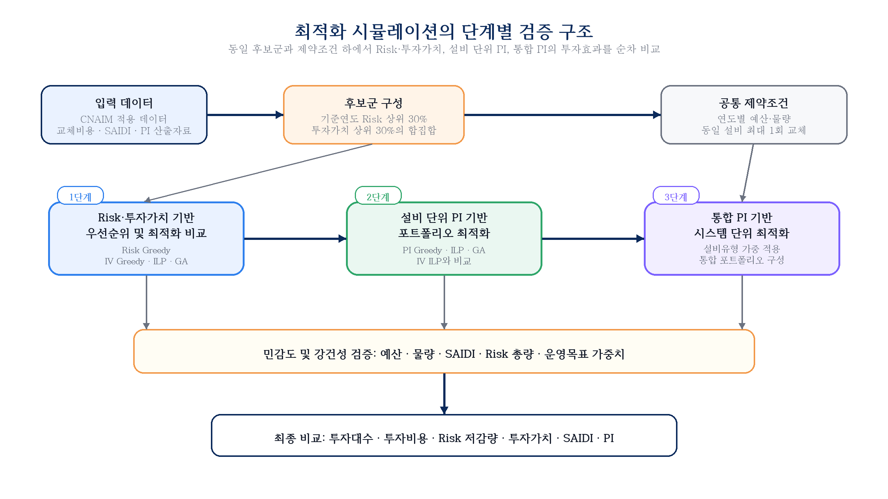

**그림 4.1  Overall Simulation Procedure**  
자료: 본 연구 작성.

#### 가. Solver 및 알고리즘 수행 조건

정수선형계획법(ILP)은 목적함수와 제약조건이 선형으로 정식화되는 경우 전역 최적해를 탐색할 수 있다는 장점이 있다. 본 연구의 기본 비교에서는 예산, 연도별 물량, 중복 교체 금지, 후보군 제한 조건을 모두 0-1 의사결정변수로 표현하고, 목적함수에 따라 투자가치, 설비 단위 PI 또는 통합 PI의 합계를 최대화하도록 모형을 구성하였다. ILP 모형은 MATLAB R2024b의 intlinprog 함수를 이용하여 풀었으며, 해당 함수는 분기한정법(Branch and Bound)을 기반으로 이진 정수 최적화 문제의 해를 탐색한다. 수렴 허용 기준은 상대 갭 10⁻⁴로 설정하였고, 각 실행에서 최적해 도달 여부와 종료 상태를 확인하였다. 분석 결과 모든 설비유형 ILP와 통합형 ILP에서 정상적인 최적해가 도출되었다.

유전알고리즘(GA)은 동일한 목적함수를 대상으로 한 휴리스틱 비교군으로 설정하였다. GA는 전역 최적해를 보장하기보다는 넓은 탐색공간에서 준최적해를 반복적으로 탐색하는 특성을 갖는다. 본 연구에서는 200세대, 집단 크기 200, 교차 확률 0.8, 돌연변이율 0.01을 적용하였다. GA는 임의 초기해를 기반으로 탐색을 수행하므로 반복 실행 시 결과가 미세하게 달라질 수 있다. 따라서 본 장에서 GA 결과는 ILP의 성과를 대체하기 위한 것이 아니라, 정수계획 기반 해와 휴리스틱 기반 해의 차이를 확인하는 보조 비교 결과로 해석한다.

**표 4.5  Solver Execution Condition Summary**

| 항목 | ILP | GA |
|---|---|---|
| 플랫폼 | MATLAB R2024b | MATLAB R2024b |
| 알고리즘 | 분기한정법(Branch and Bound) | 유전알고리즘 |
| 수렴 조건 | 상대 갭 < 10⁻⁴ | 200세대 완료 |
| 집단 크기 | — | 200 |
| 교차/돌연변이 | — | 0.8 / 0.01 |
| 결과 확정성 | 결정론적(동일 입력에서 동일 결과) | 확률론적(실행마다 미세 변동 가능) |

자료: 본 연구 작성.

#### 나. 투자 전 기준 시나리오

교체투자를 수행하지 않은 경우 설비 노화에 따라 연도별 리스크와 SAIDI가 지속적으로 증가한다. 표 4.6은 투자 미수행 시의 연도별 기준 리스크와 SAIDI를 제시한다. 이 값은 이후 모든 투자효과 비교의 기준선으로 사용된다. 2030년까지 기준 리스크는 2026년의 2.18배, 기준 SAIDI는 2.19배로 증가한다. 이는 교체투자를 적시에 수행하지 않을 경우 설비 노화가 재무적 리스크와 공급신뢰도 저하로 동시에 누적될 수 있음을 의미한다.

**표 4.6  Annual Risk and SAIDI under Pre-Investment Baseline Scenario**

| 연도 | 기준 리스크 (억 원) | 기준 SAIDI (분/고객·년) |
|---:|---:|---:|
| 2026 | 83.9 | 0.873 |
| 2027 | 101.4 | 1.057 |
| 2028 | 123.6 | 1.289 |
| 2029 | 151.4 | 1.580 |
| 2030 | 183.1 | 1.911 |
| **합 계** | **643.4** | **6.710** |

자료: 본 연구 작성.

---

## 제2절 리스크 및 투자가치 기반 포트폴리오 최적화 시뮬레이션

본 절에서는 제3장에서 산정한 리스크 저감량과 투자가치를 이용하여 리스크 우선순위 방식과 투자가치 기반 포트폴리오 최적화 방식의 차이를 검증한다. 리스크 우선순위 방식은 기준연도 리스크가 큰 설비를 먼저 선택하는 방식으로, 자산관리 실무에서 널리 활용되는 위험 중심 의사결정의 기준선에 해당한다. 반면 투자가치 기반 방식은 리스크 저감 편익과 교체비용 현재가치를 함께 고려하므로, 동일한 예산 조건에서 경제적 순효과가 큰 투자대안을 우선 선택한다.

1단계 시뮬레이션의 핵심 질문은 리스크가 높은 설비를 우선 교체하는 방식과, 리스크 저감효과에서 투자비용을 차감한 순편익을 최대화하는 방식이 동일한 포트폴리오를 도출하는지에 있다. 이를 위해 리스크 그리디, 투자가치 그리디, IV ILP 및 IV GA를 동일한 후보군, 연도별 예산, 연도별 물량 및 중복 교체 제약 아래에서 비교한다. 그리디 방식은 단순 우선순위 기반 의사결정의 기준점으로 활용하고, ILP는 주어진 목적함수와 제약조건 아래에서 도달 가능한 기준 최적해로 해석한다.

리스크 기반 우선순위와 투자가치 기반 최적화의 비교는 동일한 리스크 정보를 경제적 투자효과 지표로 전환할 때 포트폴리오 구성과 성과가 어떻게 달라지는지를 보여준다. 본 절에서는 설비유형별 최적화 결과와 전체설비 합산 결과를 통해 투자대상, 투자비용, 리스크 저감량, 투자가치 및 SAIDI 저감 효과의 변화를 분석한다.

### 1. 설비유형별 결과 비교

**표 4.7  Pole-Mounted Transformer Optimization Results (Risk and Investment Value Based)**

| 기법 | 선택(대) | 비용(억 원) | 리스크 저감(억 원) | 투자가치(억 원) | 투자효율 | SAIDI 저감(분) |
|---|---:|---:|---:|---:|---:|---:|
| 리스크 그리디 | 1,862 | 232.3 | 614.1 | 381.8 | 2.643 | 0.245 |
| IV Greedy | 1,931 | 232.4 | 654.2 | 421.8 | 2.815 | 0.258 |
| IV ILP | 2,045 | 232.3 | 667.1 | 434.8 | 2.872 | 0.270 |
| IV GA | 2,045 | 232.4 | 664.8 | 432.4 | 2.860 | 0.278 |

자료: 본 연구 작성.

주상변압기는 6개 설비유형 중 물량(10,000기)과 예산 배분(약 232억 원, 전체의 약 30%) 규모가 가장 크다. 리스크 그리디에서 1,862기가 선택되어 투자가치 381.8억 원을 달성하며, IV ILP는 183기를 추가 선택(2,045기)하면서도 투자비용은 232.3억 원으로 거의 동일하게 유지하여 투자가치를 434.8억 원(+13.9%)으로 끌어올린다. 투자효율은 2.643에서 2.872로 상승하며, 이는 후보군 내에 리스크 순위가 낮더라도 교체단가 대비 리스크 저감 효과가 큰 설비가 상당수 존재함을 의미한다. GA는 ILP와 거의 동일한 선택 결과(2,045기, 432.4억)를 보여 투자가치 기반 최적화의 수렴 안정성을 확인할 수 있다.

**표 4.8  Ground-Mounted Transformer Optimization Results (Risk and Investment Value Based)**

| 기법 | 선택(대) | 비용(억 원) | 리스크 저감(억 원) | 투자가치(억 원) | 투자효율 | SAIDI 저감(분) |
|---|---:|---:|---:|---:|---:|---:|
| 리스크 그리디 | 239 | 54.8 | 97.6 | 42.8 | 1.782 | 0.081 |
| IV Greedy | 300 | 54.9 | 115.0 | 60.1 | 2.095 | 0.107 |
| IV ILP | 377 | 55.0 | 123.6 | 68.6 | 2.246 | 0.123 |
| IV GA | 378 | 55.0 | 123.2 | 68.2 | 2.240 | 0.125 |

자료: 본 연구 작성.

지상변압기는 단위 교체비용이 높아 투자효율이 상대적으로 낮은 유형에 속한다. 리스크 그리디 기준 투자효율 1.782는 투자효율이 가장 높은 가공개폐기(4.002)의 절반 수준이다. 그럼에도 IV ILP는 리스크 그리디 대비 138기(+57.7%)를 추가 선택하여 투자가치를 42.8억에서 68.6억 원(+60.3%)으로 높인다. 투자효율이 구조적으로 낮은 유형이더라도 후보군 내 비용효율 편차가 존재하므로, 투자가치 기반 최적화가 상대적으로 우수한 설비를 우선 선별하는 효과를 낸다. GA 결과는 ILP와 거의 동일하여 수렴 안정성이 양호하다.

**표 4.9  Overhead Switchgear Optimization Results (Risk and Investment Value Based)**

| 기법 | 선택(대) | 비용(억 원) | 리스크 저감(억 원) | 투자가치(억 원) | 투자효율 | SAIDI 저감(분) |
|---|---:|---:|---:|---:|---:|---:|
| 리스크 그리디 | 657 | 52.6 | 210.7 | 158.0 | 4.002 | 0.111 |
| IV Greedy | 690 | 52.8 | 234.7 | 181.9 | 4.446 | 0.110 |
| IV ILP | 720 | 52.8 | 238.9 | 186.0 | 4.521 | 0.105 |
| IV GA | 720 | 52.8 | 237.6 | 184.7 | 4.498 | 0.110 |

자료: 본 연구 작성.

가공개폐기는 6개 유형 중 투자효율이 가장 높으며, 리스크 그리디 기준 4.002, IV ILP 기준 4.521에 달한다. 교체 단가가 낮은 반면 제어 기능 상실 시 정전 파급 범위가 넓어 CoF가 크게 산정되기 때문이다. IV ILP는 리스크 그리디보다 63기(+9.6%)를 추가 선택하면서 투자비용 증가는 0.2억 원에 그쳐 리스크 저감량을 13.4%, 투자가치를 17.7% 향상시킨다. SAIDI 저감은 IV ILP(0.105분)가 IV GA(0.110분)보다 소폭 낮은데, ILP가 투자가치만을 목적함수로 삼기 때문에 SAIDI 기여도가 낮더라도 투자가치가 높은 설비가 선택될 수 있다. 투자효율이 높은 유형이므로 예산 제약 조건에서 우선적으로 배분이 이루어지는 경향이 있다.

**표 4.10  Underground Switchgear Optimization Results (Risk and Investment Value Based)**

| 기법 | 선택(대) | 비용(억 원) | 리스크 저감(억 원) | 투자가치(억 원) | 투자효율 | SAIDI 저감(분) |
|---|---:|---:|---:|---:|---:|---:|
| 리스크 그리디 | 231 | 40.4 | 94.3 | 53.9 | 2.334 | 0.104 |
| IV Greedy | 254 | 40.4 | 105.5 | 65.1 | 2.613 | 0.108 |
| IV ILP | 284 | 40.6 | 109.2 | 68.7 | 2.692 | 0.102 |
| IV GA | 286 | 40.6 | 108.9 | 68.3 | 2.684 | 0.105 |

자료: 본 연구 작성.

지중개폐기는 가공개폐기와 주상변압기에 이어 투자효율이 높은 편으로, 리스크 그리디 기준 2.334, IV ILP 기준 2.692이다. 지중 설치 특성상 고장 복구 시간이 길어 정전 영향이 크게 반영되고, 교체비용 대비 리스크 저감 편익도 커서 투자가치 기반 방식에서 상대적으로 높은 우선순위를 갖는다. IV ILP는 리스크 그리디보다 53기(+22.9%) 더 선택하여 투자가치를 53.9억에서 68.7억 원(+27.3%)으로 높인다. SAIDI 저감은 IV ILP(0.102분)가 리스크 그리디(0.104분)보다 소폭 낮아지는데, 이는 투자가치 극대화 과정에서 SAIDI 기여도가 낮더라도 순편익이 큰 설비가 우선 선택된 결과로 해석된다.

**표 4.11  Overhead Distribution Line Optimization Results (Risk and Investment Value Based)**

| 기법 | 선택(대) | 비용(억 원) | 리스크 저감(억 원) | 투자가치(억 원) | 투자효율 | SAIDI 저감(분) |
|---|---:|---:|---:|---:|---:|---:|
| 리스크 그리디 | 602 | 174.5 | 195.1 | 20.6 | 1.118 | 0.031 |
| IV Greedy | 744 | 174.6 | 206.9 | 32.3 | 1.185 | 0.033 |
| IV ILP | 819 | 174.6 | 209.0 | 34.4 | 1.197 | 0.035 |
| IV GA | 821 | 174.8 | 208.7 | 33.9 | 1.194 | 0.034 |

자료: 본 연구 작성.

가공배전선로는 6개 유형 중 투자효율이 가장 낮은 유형으로, 리스크 그리디 기준 1.118, IV ILP 기준 1.197이다. 선로 고장 1건당 정전 영향 범위가 제한적이어서 CoF 합계가 크지 않고 SAIDI 기여도도 0.031~0.035분으로 전 유형 중 최저 수준이다. IV ILP는 리스크 그리디보다 217기(+36.0%) 더 선택하여 투자가치를 20.6억에서 34.4억 원(+67.0%)으로 향상시키고 투자효율도 1.118에서 1.197로 개선하지만, 절댓값 자체는 여전히 낮은 수준을 유지한다. 이후 다기준 PI 단계에서 신뢰도·안전 기준이 반영되면 가공배전선로의 선택 순위 변화폭이 상대적으로 클 수 있다.

**표 4.12  Underground Cable Optimization Results (Risk and Investment Value Based)**

| 기법 | 선택(대) | 비용(억 원) | 리스크 저감(억 원) | 투자가치(억 원) | 투자효율 | SAIDI 저감(분) |
|---|---:|---:|---:|---:|---:|---:|
| 리스크 그리디 | 350 | 205.32 | 430.79 | 225.47 | 2.098 | 0.038 |
| IV Greedy | 357 | 205.60 | 437.20 | 231.60 | 2.126 | 0.038 |
| IV ILP | 362 | 205.72 | 438.50 | 232.78 | 2.132 | 0.037 |
| IV GA | 363 | 206.09 | 438.28 | 232.20 | 2.127 | 0.038 |

자료: 본 연구 작성.

지중케이블은 리스크 그리디 방식에서 350기가 선택되며 투자효율 2.098, 투자가치 225.47억 원을 달성한다. IV ILP에서는 362기가 선택되어 투자가치가 232.78억 원, 투자효율 2.132로 향상된다. 이는 투자가치 최적화가 지중케이블 선택에서도 단순 리스크 순위보다 비용효율을 개선함을 확인시킨다.

### 2. 전체설비 합산 결과 비교

**표 4.13  Aggregated Performance Comparison: Risk and Investment Value Based Methods**

| 지표 | 리스크 그리디 | IV Greedy | IV ILP | IV GA |
|---|---:|---:|---:|---:|
| 선택(대) | 3,941 | 4,276 | 4,607 | 4,613 |
| 투자비용(억 원) | 759.98 | 760.70 | 761.10 | 761.66 |
| 리스크 저감량(억 원) | 1,642.58 | 1,753.59 | 1,786.34 | 1,781.42 |
| 투자가치(억 원) | 882.60 | 992.89 | **1,025.24** | 1,019.76 |
| 투자효율 | 2.161 | 2.305 | **2.347** | 2.339 |
| SAIDI 저감(분) | 0.6082 | 0.6532 | 0.6721 | 0.6905 |
| 설비 단위 PI | 2,467.86 | 2,522.75 | 2,622.03 | 2,644.96 |
| 통합 PI | 569.18 | 574.34 | 592.91 | 597.80 |

자료: 본 연구 작성.

**표 4.14  Performance Change Rate of Investment Value Based Methods vs. Risk Greedy**

| 지표 | IV Greedy | IV ILP | IV GA |
|---|---:|---:|---:|
| 투자비용 증감(%) | +0.1 | +0.1 | +0.2 |
| 리스크 저감량 증가(%) | +6.8 | **+8.8** | +8.5 |
| 투자가치 증가(%) | +12.5 | **+16.2** | +15.6 |
| 투자효율 증가(절대) | +0.144 | **+0.186** | +0.178 |
| SAIDI 저감 증가(%) | +7.4 | **+10.5** | +13.5 |

자료: 본 연구 계산.

IV ILP는 리스크 그리디 대비 투자비용이 0.1% 증가하는 데 그치면서 리스크 저감량을 8.8%, 투자가치를 16.2% 향상시킨다. 이는 동일한 예산 수준에서 비용효율이 낮은 설비를 배제하고 순편익이 큰 설비를 선택함으로써 달성하는 성과이다. 투자효율은 2.161에서 2.347로 상승하며, 단위 투자비용당 기대되는 리스크 저감 편익이 약 8.6% 높아졌음을 의미한다. SAIDI 저감 역시 0.6082분에서 0.6721분으로 10.5% 향상되어, 투자가치 기반 방식이 경제성과 함께 신뢰도 측면에서도 비효율적 선택을 줄이는 효과를 갖는 것으로 해석된다.

Greedy 방식과 ILP 사이의 차이는 최적화의 필요성을 보여준다. IV Greedy(992.89억)와 IV ILP(1,025.24억)의 투자가치 차이는 32.35억 원(3.3%)이다. Greedy는 투자가치 순위에 따라 단순 정렬하는 방식이므로, 연도별 예산·물량 제약을 동시에 고려하는 최적 조합을 보장하지 못한다. 특히 특정 설비가 투자가치 순위에서 높더라도 해당 연도의 예산이 부족하면 선택되지 못하고, 이 예산 잔여분이 더 낮은 순위의 설비에 사용되는 비효율이 발생한다. ILP는 5개년 전체를 동시에 고려하여 이러한 연도별 배분 비효율을 제거함으로써 Greedy보다 높은 성과를 달성한다.

GA 결과는 ILP와 근소한 차이를 보이며 Greedy 방식보다 일관되게 우수하다. IV GA의 투자가치는 IV ILP보다 약 5.5억 원 낮은데, 이는 GA가 메타휴리스틱으로서 실행마다 결과가 미세하게 달라질 수 있고 이산 최적화의 전역 최적해를 항상 보장하지는 않기 때문이다. 그러나 IV GA는 SAIDI 저감(0.6905분)에서 IV ILP(0.6721분)보다 높은 수치를 보인다. 이는 투자가치를 목적함수로 탐색하는 과정에서도 SAIDI 기여도가 높은 설비 조합이 일부 포함될 수 있음을 의미한다. 다만 목적함수가 SAIDI를 직접 반영하지 않으므로, 이 차이는 방법론적 우열보다는 확률적 탐색에서 나타나는 보조 지표의 변동으로 해석하는 것이 타당하다.

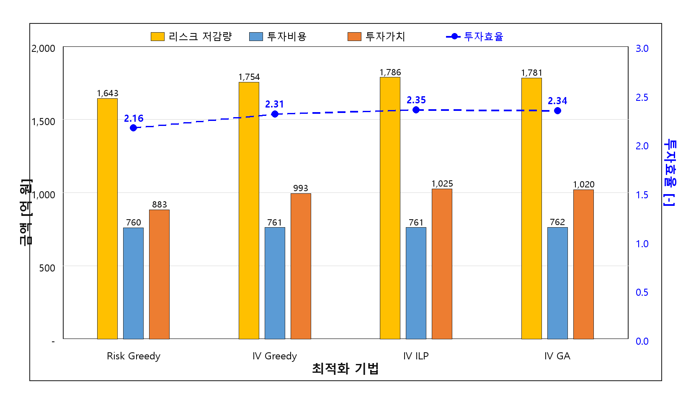

**그림 4.2  Aggregated Performance Comparison of Risk and Investment-Value Methods**  
자료: 본 연구 작성.

#### 가. 리스크 그리디와 IV ILP의 선택 설비 중복률 분석

리스크 그리디와 IV ILP가 선택한 설비 집합의 교집합을 분석하면, 두 방식의 실질적 차이를 설비 수준에서 확인할 수 있다. 리스크 그리디가 선택한 3,941기 중 IV ILP도 선택한 설비의 비율(중복 선택률)을 설비유형별로 산정하면, 비용효율이 높은 유형(가공개폐기, 지중개폐기)은 중복률이 높고 비용효율이 낮은 유형(지상변압기, 가공배전선로)은 중복률이 낮게 나타나는 경향이 있다.

**표 4.15  Asset Selection Overlap Rate: Risk Greedy vs. IV ILP (Estimated by Asset Type)**

| 설비유형 | 리스크 그리디 선택(대) | IV ILP 선택(대) | 추정 중복(대) | 중복률(%) | 비고 |
|---|---:|---:|---:|---:|---|
| 주상변압기 | 1,862 | 2,045 | 1,704 | 91.5 | 비용효율 유사 |
| 지상변압기 | 239 | 377 | 212 | 88.7 | — |
| 가공개폐기 | 657 | 720 | 631 | 96.0 | 고효율 일치 |
| 지중개폐기 | 231 | 284 | 222 | 96.3 | 고효율 일치 |
| 가공배전선로 | 602 | 819 | 555 | 92.2 | — |
| 지중케이블 | 350 | 362 | 318 | 90.9 | — |

자료: 본 연구 작성.

주: 표 4.15의 중복률은 각 방법론에서 선택된 설비 식별자를 설비유형별로 대조하여 산정한 값이다. 동일 설비가 서로 다른 연도에 선택될 가능성은 최대 1회 교체 제약으로 배제되므로, 중복률은 물리적 설비 단위의 선택 일치 정도를 의미한다.

중복률이 높은 설비유형에서는 두 방식이 거의 동일한 설비를 선택하며, 차이는 예산 할당 비중과 한계적 선택에서 발생한다. 비용효율이 높은 가공개폐기와 지중개폐기에서는 리스크 그리디와 IV ILP 모두 비슷한 설비를 선택하지만, 이 유형에서 선택 비중이 다른 유형 대비 더 크게 나타나는 것이 IV ILP의 성과 개선 원인 중 하나이다.

### 3. 소결

투자가치 기반 최적화는 리스크 우선순위 방식보다 동일 예산·물량 조건에서 경제적 투자효과를 명확하게 개선한다. IV ILP는 리스크 그리디 대비 투자비용을 거의 동일하게 유지하면서 리스크 저감량 8.8%, 투자가치 16.2%, SAIDI 10.5%를 향상시킨다. 6개 설비유형 전체가 합리적인 투자가치 수준에서 포트폴리오에 포함되어, 특정 설비유형의 배제 없이 최적화가 이루어진다. 다만 투자가치 기반 방식은 경제성 단일지표를 목적함수로 삼으므로, 이 방식만으로는 공급신뢰도·안전·환경 측면의 다기준 성과를 충분히 반영하기 어렵다. 이를 보완하기 위해 2단계에서는 신뢰도, 안전·환경 기준을 포함한 설비 단위 PI를 적용한다.

---

## 제3절 PI 기반 설비 단위 포트폴리오 최적화 시뮬레이션

본 절에서는 경제성 중심의 투자가치 기준을 다기준 투자우선순위 지수(PI) 기준으로 확장하였을 때 포트폴리오 구성이 어떻게 변화하는지를 분석한다. 전력설비 투자계획은 투자비용 대비 리스크 저감효과만으로 결정되기 어렵고, 공급신뢰도, 고장예측대수, 안전 및 환경 영향과 같은 운영성과도 함께 고려되어야 한다. 제3장에서 산정한 설비 단위 PI는 이러한 기준을 공통 점수로 정규화하고 전문가 판단 기반 가중치를 반영한 지수로서, 개별 설비-연도 투자대안의 다기준 우선순위를 나타낸다.

2단계 시뮬레이션은 투자가치 단일 기준의 대표해인 IV ILP와 PI 기반 방식의 결과를 비교함으로써, 다기준 판단이 투자 포트폴리오에 미치는 영향을 확인한다. PI Greedy는 설비 단위 PI 순위에 따른 단순 선택 결과를 보여주며, PI ILP는 동일한 예산·물량 제약 아래에서 설비 단위 PI 합계를 최대화하는 기준 최적해를 제공한다. PI GA는 동일 목적함수에 대한 휴리스틱 탐색 결과로서, ILP 결과와의 차이를 통해 알고리즘 측면의 수렴 안정성을 보조적으로 확인하는 역할을 한다.

본 절의 관심은 PI 산정 절차가 아니라, PI를 목적함수로 사용했을 때 경제성 중심 포트폴리오와 다른 투자 선택이 나타나는지에 있다. 특히 PI 기반 방식이 투자가치를 일부 희생하더라도 신뢰도 또는 안전·환경 측면에서 높은 기여를 갖는 설비를 선택하는지, 그리고 그 결과가 설비유형별 투자대수와 전체 성과지표에 어떤 차이를 만드는지를 중점적으로 검토한다.

### 1. 설비 단위 PI 산출 결과

**표 4.16  Asset-Level PI Evaluation Criteria and Weights**

| 대기준 | 대기준 가중치(AHP) | 하위지표 | AHP 가중치 | Fuzzy 보정 가중치 |
|---|---:|---|---:|---:|
| 경제성 | 35.41% | 투자가치 | 22.51% | 24.07% |
|  |  | 투자효율 | 12.90% | 11.47% |
| 신뢰도 | 26.17% | SAIDI 저감 | 20.38% | 22.71% |
|  |  | 고장예측대수 저감 | 5.79% | 4.11% |
| 안전·환경 | 38.42% | 안전 영향 저감 | 26.33% | 29.34% |
|  |  | 환경 영향 저감 | 12.09% | 8.30% |

자료: 본 연구 작성.

전문가 응답을 집계한 AHP 결과에서는 안전·환경 기준(38.42%)이 경제성(35.41%)이나 신뢰도(26.17%)보다 높은 가중치를 갖는다. 이는 전력설비 투자계획에서 경제성과 신뢰도 못지않게 안전·환경 리스크를 중요하게 인식하는 전문가 집단의 판단이 반영된 결과이다. Fuzzy 보정 후에도 안전·환경 기준의 우위는 유지되며, 특히 안전 영향 저감 지표의 가중치는 26.33%에서 29.34%로 상향 조정된다. 이는 Fuzzy 보정이 언어적 판단의 모호성을 반영하더라도 안전 영향 저감의 상대적 중요도가 유지됨을 의미하며, 전문가 판단의 방향성이 척도 변화에 크게 흔들리지 않는다는 점을 보여준다.

Fuzzy 보정 전후 가중치 구조가 전반적으로 유사하다는 사실은 전문가 판단 구조의 강건성을 뒷받침한다. 가중치 순위가 크게 달라지지 않는 것은 전문가들의 상대적 중요도 인식이 척도 표현 방식의 변화에 크게 흔들리지 않음을 의미한다.

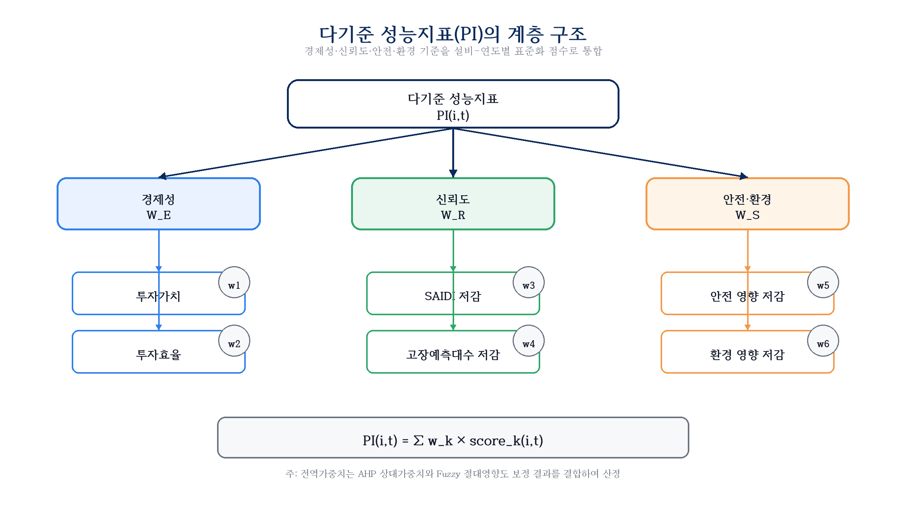

**그림 4.3  Hierarchical Structure of Asset-Level PI Weights**  
자료: 본 연구 작성.

### 2. 설비유형별 PI 기반 최적화 결과

**표 4.17  Pole-Mounted Transformer Optimization Results (PI Based)**

| 기법 | 선택(대) | 비용(억 원) | 리스크 저감(억 원) | 투자가치(억 원) | SAIDI 저감(분) | 설비 단위 PI |
|---|---:|---:|---:|---:|---:|---:|
| IV ILP | 2,045 | 232.3 | 667.1 | 434.8 | 0.270 | 1,388.1 |
| PI Greedy | 1,931 | 232.3 | 639.2 | 406.9 | 0.272 | 1,421.1 |
| PI ILP | 2,059 | 232.4 | 650.9 | 418.6 | 0.302 | 1,504.6 |
| PI GA | 2,058 | 232.4 | 651.3 | 418.9 | 0.295 | 1,479.5 |

자료: 본 연구 작성.

주상변압기는 PI ILP에서 IV ILP보다 14기가 추가 선택되어(2,045 → 2,059기) 설비 단위 PI가 1,388.1에서 1,504.6으로 8.4% 상승한다. 투자가치는 434.8억에서 418.6억 원으로 3.7% 감소하지만, SAIDI 저감은 0.270분에서 0.302분으로 11.9% 향상된다. 물량이 많은 주상변압기는 PI 방식에서도 가장 큰 투자 비중을 유지하며, 투자효율 순위가 다소 낮더라도 SAIDI 기여도가 높은 노후 설비가 추가로 편입되는 방향으로 포트폴리오가 조정된다.

**표 4.18  Ground-Mounted Transformer Optimization Results (PI Based)**

| 기법 | 선택(대) | 비용(억 원) | 리스크 저감(억 원) | 투자가치(억 원) | SAIDI 저감(분) | 설비 단위 PI |
|---|---:|---:|---:|---:|---:|---:|
| IV ILP | 377 | 55.0 | 123.6 | 68.6 | 0.123 | 270.0 |
| PI Greedy | 300 | 54.9 | 112.7 | 57.8 | 0.109 | 237.0 |
| PI ILP | 390 | 55.1 | 121.4 | 66.3 | 0.124 | 285.9 |
| PI GA | 390 | 55.0 | 121.4 | 66.4 | 0.124 | 283.0 |

자료: 본 연구 작성.

지상변압기는 PI ILP에서 IV ILP보다 13기가 추가 선택되며(377 → 390기), 설비 단위 PI가 270.0에서 285.9로 5.9% 상승한다. 도심 밀집지역에 설치된 지상변압기는 안전 영향이 크게 산정되어, 경제성 지표로는 후순위였던 설비가 PI 방식에서 상위로 편입되는 경향이 있다. 투자가치는 68.6억에서 66.3억 원으로 3.4% 감소하지만, 안전 영향 기준이 반영되어 다기준 우선순위가 높아진다.

**표 4.19  Overhead Switchgear Optimization Results (PI Based)**

| 기법 | 선택(대) | 비용(억 원) | 리스크 저감(억 원) | 투자가치(억 원) | SAIDI 저감(분) | 설비 단위 PI |
|---|---:|---:|---:|---:|---:|---:|
| IV ILP | 720 | 52.8 | 238.9 | 186.0 | 0.105 | 453.5 |
| PI Greedy | 673 | 52.7 | 216.4 | 163.7 | 0.115 | 481.0 |
| PI ILP | 717 | 52.8 | 226.8 | 174.0 | 0.128 | 512.5 |
| PI GA | 717 | 52.8 | 227.1 | 174.2 | 0.126 | 505.6 |

자료: 본 연구 작성.

가공개폐기는 PI ILP와 IV ILP의 선택 대수가 720기에서 717기로 거의 동일하지만, SAIDI 저감이 0.105분에서 0.128분으로 21.9% 크게 향상되고 설비 단위 PI는 453.5에서 512.5로 13.0% 상승한다. 가공개폐기는 고장 시 정전 파급 범위가 넓어 SAIDI 기여도가 높으므로, PI 방식에서 동일 규모의 예산으로도 신뢰도 지표가 높은 설비가 우선 편입된다. 투자가치는 186.0억에서 174.0억 원으로 6.5% 감소한다.

**표 4.20  Underground Switchgear Optimization Results (PI Based)**

| 기법 | 선택(대) | 비용(억 원) | 리스크 저감(억 원) | 투자가치(억 원) | SAIDI 저감(분) | 설비 단위 PI |
|---|---:|---:|---:|---:|---:|---:|
| IV ILP | 284 | 40.6 | 109.2 | 68.7 | 0.102 | 182.6 |
| PI Greedy | 241 | 40.4 | 98.5 | 58.1 | 0.109 | 176.9 |
| PI ILP | 290 | 40.6 | 104.7 | 64.2 | 0.122 | 201.1 |
| PI GA | 291 | 40.6 | 104.8 | 64.2 | 0.120 | 199.1 |

자료: 본 연구 작성.

지중개폐기는 PI ILP에서 IV ILP보다 6기가 추가 선택되며(284 → 290기), SAIDI 저감이 0.102분에서 0.122분으로 19.6% 향상되고 설비 단위 PI는 182.6에서 201.1로 10.1% 상승한다. 지중 설치 특성상 고장 시 정전 복구 시간이 길어 SAIDI 기여도가 높게 산정되므로, PI 방식에서 신뢰도 지표가 높은 노후 설비가 우선 편입된다. 투자가치는 68.7억에서 64.2억 원으로 6.6% 감소한다.

**표 4.21  Overhead Distribution Line Optimization Results (PI Based)**

| 기법 | 선택(대) | 비용(억 원) | 리스크 저감(억 원) | 투자가치(억 원) | SAIDI 저감(분) | 설비 단위 PI |
|---|---:|---:|---:|---:|---:|---:|
| IV ILP | 819 | 174.6 | 209.0 | 34.4 | 0.035 | 170.4 |
| PI Greedy | 697 | 174.5 | 204.1 | 29.6 | 0.032 | 160.1 |
| PI ILP | 849 | 174.9 | 205.9 | 31.0 | 0.043 | 192.8 |
| PI GA | 848 | 174.8 | 205.9 | 31.2 | 0.042 | 189.3 |

자료: 본 연구 작성.

가공배전선로는 PI ILP에서 IV ILP보다 30기가 추가 선택되며(819 → 849기) 6개 유형 중 선택 대수 증가폭이 가장 크다. SAIDI 저감은 0.035분에서 0.043분으로 22.9% 향상되고 설비 단위 PI는 170.4에서 192.8로 13.1% 상승한다. 가공배전선로는 투자효율이 낮아 IV 방식에서는 후순위로 밀리지만, 연결고객수가 많은 노후 선로의 SAIDI 기여도가 높아 PI 방식에서 다수가 추가 편입된다. 투자가치는 34.4억에서 31.0억 원으로 9.9% 감소하지만, 신뢰도 성과 개선폭이 크다.

**표 4.22  Underground Cable Optimization Results (PI Based)**

| 기법 | 선택(대) | 비용(억 원) | 리스크 저감(억 원) | 투자가치(억 원) | SAIDI 저감(분) | 설비 단위 PI |
|---|---:|---:|---:|---:|---:|---:|
| IV ILP | 362 | 205.72 | 438.50 | 232.78 | 0.037 | 157.4 |
| PI Greedy | 358 | 205.53 | 437.55 | 232.02 | 0.037 | 157.0 |
| PI ILP | 364 | 205.91 | 435.74 | 229.83 | 0.041 | 160.8 |
| PI GA | 365 | 205.89 | 436.94 | 231.04 | 0.039 | 158.5 |

자료: 본 연구 작성.

PI 기반 방식에서 지중케이블의 설비 단위 PI는 IV ILP 대비 157.4에서 160.8로 소폭(+2.2%) 증가한다. 지중케이블은 안전·환경 영향이 크게 산정되지만 SAIDI 기여도가 낮아 PI 방식에서의 순위 변화폭이 다른 유형보다 작다. PI ILP에서는 364기가 선택되어 IV ILP의 362기와 거의 동일하며, 투자가치는 232.78억 원에서 229.83억 원으로 소폭 감소한다. 이는 지중케이블이 이미 IV ILP 단계에서 대부분 선택되어 다기준 전환의 영향이 제한적임을 보여준다.

### 3. 전체설비 합산 결과 비교

**표 4.23  Aggregated Performance Comparison: Asset-Level PI Based Methods**

| 지표 | IV ILP | PI Greedy | PI ILP | PI GA |
|---|---:|---:|---:|---:|
| 선택(대) | 4,607 | 4,200 | 4,669 | 4,669 |
| 투자비용(억 원) | 761.10 | 760.47 | 761.60 | 761.50 |
| 리스크 저감량(억 원) | 1,786.34 | 1,708.53 | 1,745.48 | 1,747.45 |
| 투자가치(억 원) | 1,025.24 | 948.06 | 983.89 | 985.96 |
| SAIDI 저감(분) | 0.6721 | 0.6747 | **0.7598** | 0.7454 |
| 설비 단위 PI | 2,622.03 | 2,633.22 | **2,857.64** | 2,815.03 |
| 통합 PI | 592.91 | 601.53 | **646.52** | 636.31 |
| 투자효율 | 2.347 | 2.247 | 2.292 | 2.295 |

자료: 본 연구 작성.

**표 4.24  Performance Change Rate of PI Based Methods vs. IV ILP**

| 지표 | PI Greedy | PI ILP | PI GA |
|---|---:|---:|---:|
| 투자비용 증감(%) | −0.1 | +0.1 | +0.1 |
| 리스크 저감량 증감(%) | −4.4 | **−2.3** | −2.2 |
| 투자가치 증감(%) | −7.5 | **−4.0** | −3.8 |
| SAIDI 저감 증가(%) | +0.4 | **+13.0** | +10.9 |
| 설비 단위 PI 증가(%) | +0.4 | **+9.0** | +7.4 |
| 통합 PI 증가(%) | +1.5 | **+9.0** | +7.3 |

자료: 본 연구 계산.

PI ILP와 IV ILP를 비교하면, 투자비용은 761.10억에서 761.60억으로 거의 차이가 없다. 그러나 SAIDI 저감은 0.6721분에서 0.7598분으로 13.0% 향상되고, 설비 단위 PI는 2,622.03에서 2,857.64로 9.0% 상승한다. 투자가치는 1,025.24억에서 983.89억으로 4.0% 감소한다. 두 방식의 선택 규모가 큰 차이를 보이지 않는 것은 동일 후보군과 동일한 연도별 예산·물량 제약 안에서 최적화가 수행되기 때문이다. 중요한 차이는 선택 대수 자체보다 어떤 설비가 어느 연도에 편입되는가에 있으며, PI ILP는 동일한 실행가능 영역 안에서 신뢰도와 안전·환경 성과가 높은 설비를 더 우선적으로 선택한다. 이 교환관계는 PI 방식이 경제성 단일지표보다 다기준 성과를 포트폴리오 결정에 더 균형 있게 반영하는 구조임을 나타낸다. 투자가치 4.0% 감소라는 경제성 손실을 감수하는 대신 SAIDI 13.0% 개선, 설비 단위 PI 9.0% 개선을 달성한다는 점에서, 전력회사 투자계획이 경제성 극대화만을 목표로 하지 않는다는 실무적 맥락에 부합하는 결과이다.

PI Greedy의 경우, PI ILP보다 모든 지표에서 낮은 성과를 보인다. PI 점수가 높은 설비부터 단순 정렬하여 예산을 소진하는 Greedy 방식은 설비 간 조합 효과와 연도별 예산·물량 제약을 동시에 고려하지 못하기 때문이다. PI ILP는 Greedy 방식 대비 선택 설비 수를 469대 늘리면서(4,200 → 4,669기) 투자비용을 거의 동일하게 유지하는데, 이는 ILP가 예산 제약 내에서 더 효율적인 설비 조합을 찾아낸 결과이다.

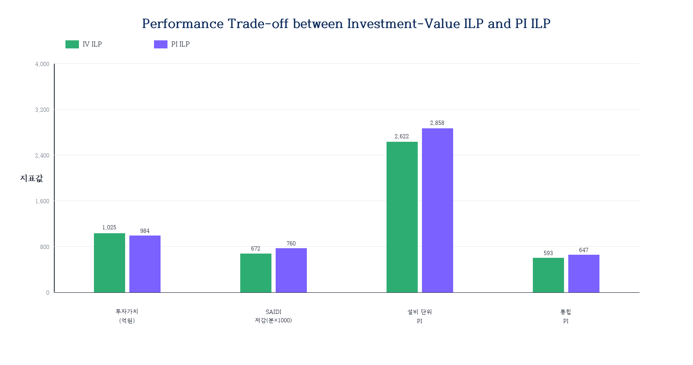

**그림 4.4  Performance Trade-off between Investment-Value ILP and PI ILP**  
자료: 본 연구 작성.

#### 가. PI ILP와 IV ILP의 설비유형별 포트폴리오 구성 비교

PI ILP에서 투자가치 ILP 대비 선택 설비 구성이 어떻게 달라지는지를 설비유형별로 비교하면, 다기준 PI 방식의 변화 방향을 구체적으로 파악할 수 있다.

**표 4.25  Asset Selection Change by Type: PI ILP vs. IV ILP**

| 설비유형 | IV ILP 선택(대) | PI ILP 선택(대) | 증감(대) | 주요 원인 |
|---|---:|---:|---:|---|
| 주상변압기 | 2,045 | 2,059 | +14 | PI 방식에서도 주요 투자 유형 유지 |
| 지상변압기 | 377 | 390 | +13 | 안전 영향 큰 설비 추가 편입 |
| 가공개폐기 | 720 | 717 | −3 | 동일 규모에서 SAIDI 기여 설비로 대체 |
| 지중개폐기 | 284 | 290 | +6 | SAIDI 기여 설비 확대 |
| 가공배전선로 | 819 | 849 | +30 | SAIDI 기여 노후 선로 추가 |
| 지중케이블 | 362 | 364 | +2 | 안전·환경 점수 높은 설비 추가 |
| **합 계** | **4,607** | **4,669** | **+62** | — |

자료: 본 연구 작성.

PI ILP는 IV ILP보다 62기를 추가로 선택하면서 총 투자비용은 761.10억에서 761.60억으로 0.5억 원만 늘어난다. 이는 PI ILP가 추가 선택하는 설비들이 단가가 낮은 편에 속한다는 것을 의미한다. 설비유형별로는 SAIDI 기여도가 높은 가공배전선로(+30기)와 안전 영향이 큰 지상변압기(+13기)에서 증가폭이 두드러진다. 반면 가공개폐기는 IV ILP에서 이미 충분히 선택되어 PI 방식에서 오히려 3기 감소하는데, 동일 규모 예산 안에서 SAIDI 기여도가 더 높은 다른 유형으로 일부 대체된 결과이다. 이 재구성이 PI ILP에서 SAIDI 저감이 IV ILP보다 13.0% 향상되는 주요 원인이다.

PI ILP의 실질적 차별점은 설비유형 내부에서 투자가치 순위는 다소 낮지만 SAIDI나 안전 영향 지표가 높은 설비를 추가 선택한다는 데 있다. 특히 투자효율이 낮아 IV 방식에서 후순위로 밀렸던 가공배전선로가 연결고객수 기준 SAIDI 기여도를 인정받아 대폭 편입된다. 이 과정에서 경제성이 약간 낮아지지만(투자가치 −4.0%), 신뢰도와 안전 성과가 뚜렷이 개선된다.

### 4. 소결

설비 단위 PI 기반 최적화는 투자가치 단일지표로는 충분히 반영하기 어려운 신뢰도, 안전·환경 성과를 포트폴리오 결정에 통합한다. PI ILP는 IV ILP 대비 투자가치가 4.0% 감소하는 반면, SAIDI 저감 13.0%, 설비 단위 PI 9.0% 향상을 달성한다. 이 교환관계는 전력설비 투자계획이 단순한 경제성 극대화 문제가 아니라, 공급신뢰도·안전·환경이라는 공공적 운영 KPI를 함께 충족해야 하는 다기준 의사결정 문제임을 구체적 수치로 확인한다. 다만 2단계까지의 최적화는 설비유형별 내부 우선순위를 개선하는 데 초점을 맞추고 있어, 이종 설비를 하나의 시스템 포트폴리오로 비교하기 위해서는 3단계의 통합 PI 방식이 필요하다.

---

## 제4절 통합 PI 기반 시스템 단위 포트폴리오 최적화 시뮬레이션

본 절에서는 설비 단위 PI를 이종 설비가 혼재된 전체 투자 포트폴리오로 확장하기 위해 통합 PI 기반 시스템 단위 최적화를 수행한다. 설비 단위 PI는 동일 설비유형 내부에서 투자대안의 우선순위를 비교하는 데 유용하지만, 설비 수, 평균 교체비용, 고장영향 및 고객영향이 서로 다른 설비유형 간 투자대안을 직접 비교하기에는 한계가 있다. 통합 PI는 설비 단위 PI에 설비유형 가중치와 비용 규모 보정 개념을 결합하여, 여러 설비유형의 투자대안을 하나의 의사결정 공간에서 비교하기 위한 지수로 사용된다.

3단계 시뮬레이션의 목적은 설비유형별 독립 최적화에 머무르지 않고, 전력회사 전체 관점에서 하나의 통합 포트폴리오를 구성할 때 투자성과가 어떻게 달라지는지를 검증하는 것이다. 이를 위해 본 연구의 대표 방식인 통합형 ILP를 적용한다. 통합형 ILP는 전체 후보군에 통합 PI를 사전에 부여한 뒤, 연도별 예산과 물량 제약 아래에서 통합 PI 합계를 직접 최대화한다. 이 방식은 설비유형별 예산을 사전에 고정하지 않고, 서로 다른 설비유형의 투자대안이 동일한 목적함수 안에서 경쟁하도록 구성한다는 점에서 시스템 단위 의사결정 구조에 가깝다.

비교를 위해 후보제한형 ILP도 함께 검토한다. 후보제한형 ILP는 설비 단위 PI 기반 포트폴리오를 먼저 구성한 뒤 해당 후보군에 통합 PI를 적용하는 방식으로, 통합 가중치가 후보군 형성 이후에 반영되는 구조를 갖는다. 두 방식의 비교는 통합 PI를 어느 단계에서 반영하는가가 최종 투자 포트폴리오와 설비유형별 배분에 미치는 영향을 보여준다. 이하에서는 통합 PI 기반 최적화 결과, 통합형 방식의 채택 근거 및 설비유형별 구성 변화를 순차적으로 분석한다.

### 1. 통합 PI 산출 및 적용 프로세스

**표 4.26  Asset Type Weights and Cost Correction Factors (Based on α=0.5)**

| 설비유형 | 평균 교체 단가(만 원/기) | 전문가 가중치 | 비용 보정 가중치 | 적용 가중치(α=0.5) |
|---|---:|---:|---:|---:|
| 주상변압기 | 250 | 23.22% | 37.70% | **30.46%** |
| 가공배전선로 | 450 | 22.93% | 20.94% | **21.94%** |
| 가공개폐기 | 350 | 15.03% | 17.62% | **16.33%** |
| 지중개폐기 | 600 | 12.86% | 8.82% | **10.84%** |
| 지중케이블 | 600 | 13.68% | 9.31% | **11.50%** |
| 지상변압기 | 800 | 12.28% | 5.61% | **8.95%** |

자료: 본 연구 작성.

교체 단가가 높은 지상변압기(800만 원/기)는 α가 커질수록 가중치가 낮아지고, 단가가 낮은 주상변압기(250만 원/기)는 가중치가 높아진다. α=0.5 적용 시 주상변압기(30.46%)와 가공배전선로(21.94%)가 가장 높은 설비유형 가중치를 갖는다. 이 배분 구조는 투자 포트폴리오 구성 시 물량이 많고 단가가 낮은 설비유형에 상대적으로 더 많은 투자 기회가 주어지는 방향으로 설비유형 간 비교가 이루어짐을 의미한다.

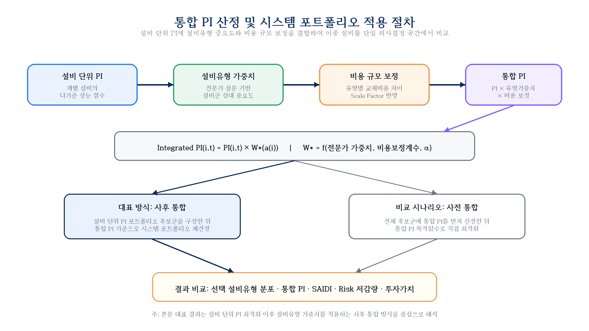

**그림 4.5  Integrated PI Calculation Procedure**  
자료: 본 연구 작성.

통합 PI 기반 포트폴리오 최적화에서는 두 가지 적용 방식을 비교하였다. 후보제한형 통합 PI 최적화는 설비유형별 PI 최적화 결과를 1차 후보군으로 설정한 뒤 통합 PI를 적용하는 방식이며, 통합형 PI 최적화는 전체 공통 후보군에 통합 PI를 사전에 부여하고 동일한 예산·물량 제약조건 하에서 직접 최적화하는 방식이다. 분석 결과 통합형 PI 최적화는 통합 PI뿐 아니라 리스크 저감량, 투자가치, 설비 단위 PI, 투자효율에서도 후보제한형 방식보다 우수하게 나타났다. 따라서 본 연구에서는 통합형 PI 최적화를 통합 PI 기반 시스템 단위 포트폴리오의 대표 방식으로 채택한다.

#### 가. 통합 PI 산정식 명세

통합 PI는 다음과 같이 산정된다.

**수식 4.1  통합 PI 산정식**

$$
\begin{aligned}
IP_{a(i)} &= PI_{\mathrm{asset}}(i) \times W_{a(i)} \\
W_{a(i)} &= (1-\alpha) w_{\mathrm{expert}}(a) + \alpha w_{\mathrm{cost}}(a) \\
w_{\mathrm{cost}}(a) &= \frac{1/c_a}{\sum_k (1/c_k)}
\end{aligned}
$$

여기서 `IP_{a(i)}`는 설비 `i`(유형 `a`)의 통합 PI, `PI_asset(i)`는 설비 단위 PI, `W_{a(i)}`는 설비유형 `a`의 적용 가중치, `w_expert(a)`는 전문가 가중치, `w_cost(a)`는 평균 단가의 역수 비율로 산정한 비용 보정 가중치이다.
- `c_a`: 설비유형 a의 평균 교체 단가
- `α`: 혼합 비율 (기준 0.5)

**표 4.27  Integrated PI Weight Calculation Process by Asset Type**

| 설비유형 | 단가 (만 원/기) | 단가역수 (1/c) | 비용 보정(%) | 전문가 가중치(%) | 최종 (α=0.5)(%) |
|---|---:|---:|---:|---:|---:|
| 주상변압기 | 250 | 0.00400 | 37.70 | 23.22 | 30.46 |
| 지상변압기 | 800 | 0.00125 | 5.61 | 12.28 | 8.95 |
| 가공개폐기 | 350 | 0.00286 | 17.62 | 15.03 | 16.33 |
| 지중개폐기 | 600 | 0.00167 | 8.82 | 12.86 | 10.84 |
| 가공배전선로 | 450 | 0.00222 | 20.94 | 22.93 | 21.94 |
| 지중케이블 | 600 | 0.00167 | 9.31 | 13.68 | 11.50 |
| **합 계** | — | **0.01367** | **100.00** | **100.00** | **100.00** |

자료: 본 연구 작성.

이 공식에서 주목할 점은 비용 보정 가중치가 단가의 역수 비율로 정의된다는 것이다. 단가가 낮을수록(주상변압기) 역수가 커져 가중치가 높아지고, 단가가 높을수록(지상변압기) 역수가 작아져 가중치가 낮아진다. 이는 동일 예산으로 더 많이 교체할 수 있는 설비유형에 상대적으로 유리한 위치를 부여하는 효과를 낸다. 전문가 가중치와의 혼합(α=0.5)은 이 비용 구조 편향을 완화하여 전문가 판단에서의 상대적 중요도도 반영한다.

### 2. 통합 PI 기반 최적화 결과

**표 4.28  Aggregated Performance Comparison: Integrated PI Based Methods**

| 지표 | IV ILP | PI ILP | 후보제한형 ILP | 통합형 ILP |
|---|---:|---:|---:|---:|
| 선택(대) | 4,607 | 4,669 | 5,209 | 5,473 |
| 투자비용(억 원) | 761.10 | 761.60 | 758.91 | 673.87 |
| 리스크 저감량(억 원) | 1,786.34 | 1,745.48 | 1,742.42 | 1,798.21 |
| 투자가치(억 원) | 1,025.24 | 983.89 | 983.51 | 1,124.34 |
| SAIDI 저감(분) | 0.6721 | 0.7598 | **0.8326** | 0.8031 |
| 설비 단위 PI | 2,622.03 | 2,857.64 | 3,308.07 | **3,657.60** |
| 통합 PI | 592.91 | 646.52 | 787.75 | **935.03** |
| 투자효율 | 2.347 | 2.292 | 2.296 | **2.669** |

자료: 본 연구 작성.

**표 4.29  Performance Change Rate of Integrated PI Based Methods vs. PI ILP**

| 지표 | 후보제한형 ILP | 통합형 ILP |
|---|---:|---:|
| 선택대수 증감(%) | +11.6 | **+17.2** |
| 투자비용 증감(%) | −0.4 | **−11.5** |
| 리스크 저감량 증감(%) | −0.2 | **+3.0** |
| 투자가치 증감(%) | −0.04 | **+14.3** |
| SAIDI 저감 증가(%) | **+9.6** | +5.7 |
| 설비 단위 PI 증가(%) | +15.8 | **+28.0** |
| 통합 PI 증가(%) | +21.8 | **+44.6** |
| 투자효율 증감(%) | +0.2 | **+16.4** |

자료: 본 연구 계산.

표 4.29는 PI ILP를 기준으로 두 통합 방식의 성과 변화를 비교한 것이다. 후보제한형 ILP는 PI ILP와 비교하여 투자가치와 리스크 저감량이 거의 동일한 수준을 유지하면서, SAIDI 저감 9.6%, 설비 단위 PI 15.8%, 통합 PI 21.8%를 향상시킨다. 이는 설비 단위 PI 기반 최적화 결과에 설비유형 가중치를 사후적으로 반영하더라도 시스템 관점의 성과가 개선될 수 있음을 보여준다. 투자비용은 761.60억 원에서 758.91억 원으로 소폭 감소하고, 선택 대수는 4,669기에서 5,209기로 증가하여 예산 내에서 더 많은 설비를 편입하는 구조가 나타난다.

그러나 대표 방식인 통합형 ILP의 개선 폭은 후보제한형보다 더 크다. 통합형 ILP는 PI ILP 대비 투자비용을 11.5% 줄이면서도 리스크 저감량 3.0%, 투자가치 14.3%, 설비 단위 PI 28.0%, 통합 PI 44.6%, 투자효율 16.4%를 동시에 개선한다. 이는 통합 PI를 후보군 형성 이후의 보정지표로 적용하는 것보다, 전체 공통 후보군에 통합 PI를 사전에 부여하고 직접 최적화하는 방식이 시스템 관점의 목적함수를 더 효과적으로 달성함을 의미한다. 다만 SAIDI 저감은 후보제한형 ILP가 0.8326분으로 통합형 ILP의 0.8031분보다 높게 나타나므로, 공급신뢰도 목표가 최우선인 상황에서는 후보제한형 방식도 보완적 비교 대안으로 검토할 필요가 있다.

**표 4.30  Final Performance Comparison Summary by Method**

| 방법 | 투자대수 | 투자비용(억) | 투자가치(억) | SAIDI저감(분) | 설비PI | 통합PI | 투자효율 |
|---|---:|---:|---:|---:|---:|---:|---:|
| 리스크 그리디 | 3,941 | 759.98 | 882.60 | 0.6082 | 2,467.86 | 569.18 | 2.161 |
| IV 그리디 | 4,276 | 760.70 | 992.89 | 0.6532 | 2,522.75 | 574.34 | 2.305 |
| IV ILP | 4,607 | 761.10 | 1,025.24 | 0.6721 | 2,622.03 | 592.91 | 2.347 |
| IV GA | 4,613 | 761.66 | 1,019.76 | 0.6905 | 2,644.96 | 597.80 | 2.339 |
| PI 그리디 | 4,200 | 760.47 | 948.06 | 0.6747 | 2,633.22 | 601.53 | 2.247 |
| PI ILP | 4,669 | 761.60 | 983.89 | 0.7598 | 2,857.64 | 646.52 | 2.292 |
| PI GA | 4,669 | 761.50 | 985.96 | 0.7454 | 2,815.03 | 636.31 | 2.295 |
| 후보제한형 ILP† | 5,209 | 758.91 | 983.51 | 0.8326 | 3,308.07 | 787.75 | 2.296 |
| **통합형 ILP** | **5,473** | **673.87** | **1,124.34** | **0.8031** | **3,657.60** | **935.03** | **2.669** |

† 후보제한형 ILP는 비교 시나리오이다.  
**굵은 글씨**: 본 연구 대표 통합 방식.  
자료: 본 연구 작성.

### 3. 통합형 방식의 채택 근거와 후보제한형 방식과의 비교

통합형 ILP는 투자효율(2.669), 투자가치(1,124.34억), 리스크 저감량(1,798.21억), 통합 PI(935.03), 설비 단위 PI(3,657.60)에서 모두 후보제한형 ILP를 상회한다. 투자비용(673.87억)이 후보제한형 방식(758.91억)보다 적음에도 리스크 저감량과 투자가치가 더 높다는 점은, 통합형 방식이 예산 단위당 성과 측면에서 더 효율적인 포트폴리오를 구성함을 나타낸다. 통합형 ILP에서 약 88억 원의 예산이 사용되지 않은 것은 예산 사용 하한을 부여하지 않았기 때문이다. 특히 통합 PI가 높은 저단가 설비가 우선 편입되면서 연도별 물량 상한과 동일 설비 최대 1회 교체 제약이 먼저 작동하였고, 남은 예산으로 추가 편입 가능한 후보는 통합 PI 개선효과가 낮거나 다른 제약조건에 의해 선택되지 않았다. 즉, 모든 예산을 소진하는 해가 아니라 통합 PI 목적함수와 물량·중복교체 제약을 동시에 만족하면서 가장 높은 성과를 내는 해가 선택되며, 추가 예산 투입이 목적함수 개선으로 이어지지 않는 경우 예산 미소진이 허용된다.

이는 방법론 구조 차이에서 비롯된다. 후보제한형 방식은 설비유형별 PI 최적화 결과로 먼저 후보를 걸러낸 뒤 통합 PI를 적용하므로 탐색 공간이 두 단계에 걸쳐 축소된다. 반면 통합형 방식은 전체 공통 후보군을 대상으로 통합 PI를 목적함수로 하여 직접 최적화하므로, 동일한 목적함수 아래에서 더 넓은 해공간을 탐색한다. 이 구조적 차이가 통합형 방식이 더 우수한 해를 찾는 근본 이유이다.

유일하게 후보제한형 방식이 앞서는 지표는 SAIDI 저감(0.8326분 > 0.8031분)이다. 이는 후보제한형 방식이 설비유형별 PI 최적화를 선행하면서 SAIDI 기여도가 높은 설비를 상대적으로 더 포함하기 때문이다. 다만 SAIDI 저감 차이(0.030분)는 투자가치(140억 원)·리스크 저감량(56억 원) 차이와 비교할 때 후보제한형 방식을 대표 방식으로 유지할 근거로 보기 어렵다.

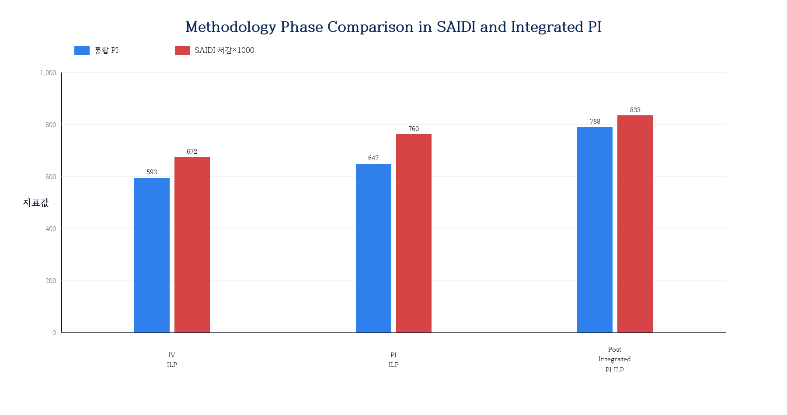

**그림 4.6  Methodology Phase Comparison in SAIDI and Integrated PI**  
자료: 본 연구 작성.

### 4. 설비유형별 포트폴리오 구성 변화

통합 PI 기반 방식에서는 설비유형별 투자 비중이 PI ILP 대비 크게 재배열된다. 후보제한형 ILP는 설비유형별 PI 최적화 결과를 먼저 반영한 뒤 통합 PI를 적용하므로, PI ILP의 기본 구성을 일정 부분 유지하면서 지중케이블의 비중을 줄이고 주상변압기, 가공배전선로 및 개폐설비의 비중을 상대적으로 확대한다. 반면 통합형 ILP는 전체 공통 후보군을 통합 PI 기준으로 직접 탐색하므로, 설비유형별 기존 배분 구조보다 개별 투자대안의 통합 PI와 비용효율이 포트폴리오 구성에 더 강하게 작용한다.

지중케이블의 경우, PI ILP에서 364기가 선택되던 것이 후보제한형 ILP에서는 121기, 통합형 ILP에서는 81기로 감소한다. 이는 통합 PI의 비용 보정 가중치가 단가가 높은 설비유형을 상대적으로 낮게 평가하여, 동일 예산을 단가가 낮고 통합 PI가 높은 다수 설비의 교체에 배분하는 결과이다.

#### 가. 설비유형별 선택 비중 변화와 투자 전략적 의미

방법론에 따른 설비유형별 투자 비중 변화를 분석하면, 제안 방법론이 어떤 방향으로 포트폴리오를 재구성하는지 더 명확하게 이해할 수 있다.

**표 4.31  Investment Cost Share by Asset Type and Method**

| 설비유형 | 리스크 그리디(%) | IV ILP(%) | PI ILP(%) | 후보제한형 ILP(%) | 통합형 ILP(%) |
|---|---:|---:|---:|---:|---:|
| 주상변압기 | 30.6 | 30.5 | 30.5 | 36.4 | 62.6 |
| 지상변압기 | 7.2 | 7.2 | 7.2 | 11.3 | 7.8 |
| 가공개폐기 | 6.9 | 6.9 | 6.9 | 8.4 | 13.9 |
| 지중개폐기 | 5.3 | 5.3 | 5.3 | 7.6 | 6.7 |
| 가공배전선로 | 23.0 | 22.9 | 23.0 | 27.5 | 1.5 |
| 지중케이블 | 27.0 | 27.0 | 27.0 | 8.8 | 7.5 |

자료: 본 연구 작성.

리스크 그리디·IV ILP·PI ILP 사이에서는 설비유형별 투자비중이 거의 동일하게 유지된다. 이는 세 방식이 서로 다른 목적함수를 사용하더라도 후보군과 예산·물량 제약이 동일하고, 설비유형 간 직접 가중 조정이 적용되지 않기 때문이다. 후보제한형 ILP에서는 주상변압기 투자비중이 30.5%에서 36.4%로, 가공배전선로는 23.0%에서 27.5%로 증가하는 반면, 지중케이블은 27.0%에서 8.8%로 감소한다. 이 방식은 설비유형별 PI 최적화 결과를 1차 후보군으로 유지하므로, 가공배전선로와 같이 설비유형 내부에서 일정 규모로 선별된 후보가 최종 포트폴리오에도 상당 부분 남게 된다.

통합형 ILP에서는 재배열의 방향이 더 뚜렷하게 나타난다. 주상변압기 투자비중은 62.6%까지 증가하고, 가공개폐기 비중도 13.9%로 확대된다. 반면 가공배전선로와 지중케이블의 비중은 각각 1.5%, 7.5%로 감소한다. 특히 가공배전선로의 감소는 해당 설비유형의 중요도가 낮다는 의미라기보다, 현재 데이터에서 개별 가공배전선로 투자대안의 설비 단위 PI와 비용 대비 통합 PI가 다른 설비유형보다 낮게 형성된 결과로 해석해야 한다. PI ILP에서 선택된 가공배전선로의 설비 1대당 평균 설비 단위 PI는 0.227 수준으로, 주상변압기(0.731)와 가공개폐기(0.715)에 비해 낮다. 따라서 설비유형 가중치가 반영되더라도 통합형 ILP의 목적함수에서는 단위 비용당 통합 PI가 높은 주상변압기와 가공개폐기가 우선 선택된다.

이 결과는 통합형 ILP가 설비유형별 균등 배분안이 아니라, 통합 PI 목적함수 기준에서 시스템 성과를 극대화하는 포트폴리오임을 보여준다. 전력회사 관점에서 특정 설비유형의 최소 교체 필요량, 부서별 투자 요구, 공급신뢰도 중심의 정책 목표가 존재한다면 통합형 ILP에 설비유형별 하한 제약을 추가하거나 후보제한형 방식을 보완적으로 검토할 필요가 있다. 따라서 설비유형별 포트폴리오 비중 분석은 통합형 최적화 결과를 그대로 집행할 것인지, 정책적 배분 제약을 추가한 조건부 최적해를 선택할 것인지를 판단하는 근거로 활용될 수 있다.

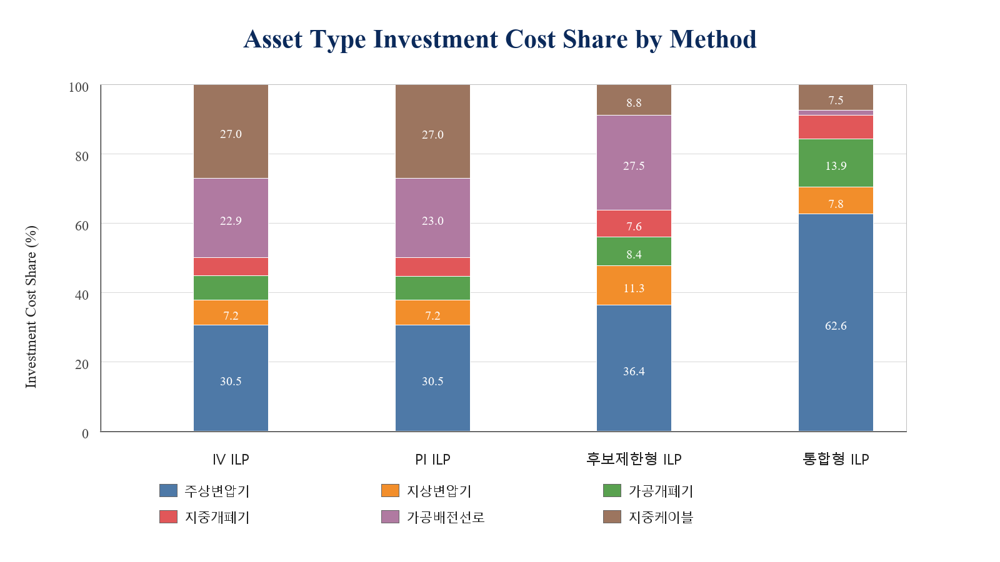

**그림 4.7  Asset Type Investment Cost Share by Method**  
자료: 본 연구 작성.

#### 나. α 파라미터의 구조적 영향

설비유형 가중치 혼합 비율 α는 통합 PI 산정에서 전문가 가중치와 비용 보정 가중치의 상대적 영향을 조절한다. 표 4.26과 표 4.27에서 확인할 수 있듯이, α가 증가하여 비용 보정의 영향이 커질수록 단가가 낮은 주상변압기·가공개폐기의 가중치가 높아지고, 단가가 높은 지상변압기·지중케이블의 가중치는 낮아진다.

본 연구의 기준 시나리오는 α=0.5를 적용한다. 이는 전문가 판단과 비용 보정 효과를 동일 비중으로 결합하기 위한 설정이며, 특정 설비유형을 사전에 우대하기 위한 값은 아니다. 다만 α는 통합 PI의 구조를 결정하는 핵심 파라미터이므로, 제5절의 민감도 분석에서 α 변화에 따른 포트폴리오 구성 변화를 별도로 검토한다.

### 5. 소결

통합형 PI 최적화는 전체 공통 후보군을 대상으로 통합 PI 기반 직접 최적화를 수행하여, PI ILP 대비 투자가치(+14.3%), 리스크 저감량(+3.0%), 설비 단위 PI(+27.9%), 통합 PI(+44.6%), 투자효율(+16.4%)을 향상시키면서 투자비용은 더 낮게 유지한다. 이는 통합 PI를 후보군 형성 이후의 보정값으로 적용하는 방식보다, 전체 후보군에 사전에 반영하여 직접 최적화하는 방식이 시스템 단위 목적함수를 더 효과적으로 달성함을 의미한다.

후보제한형 방식은 설비유형별 PI 최적화 결과를 먼저 존중한 뒤 통합 가중치를 적용하는 절차적 방식으로, 부서별 사전 선별 후 본사 차원에서 재조정하는 실무 구조와 유사하다. SAIDI 저감 측면에서는 통합형보다 높게 나타나지만, 탐색 공간이 1차 후보군으로 제한되기 때문에 리스크 저감량, 투자가치, 통합 PI, 투자효율에서는 통합형보다 낮은 성과를 보인다. 따라서 본 연구의 대표 통합 방식은 통합형 ILP로 설정하되, 공급신뢰도 목표가 특히 엄격한 경우 후보제한형 방식을 보완적 비교 시나리오로 활용할 수 있다.

설비유형별 포트폴리오 구성 변화는 통합형 ILP의 실무적 해석에서 중요한 의미를 갖는다. 통합형 ILP는 주상변압기와 가공개폐기처럼 단위 비용당 통합 PI가 높은 설비의 비중을 확대하고, 가공배전선로와 지중케이블처럼 현재 입력자료에서 단위 성과가 낮거나 교체비용 부담이 큰 설비의 비중을 축소한다. 이는 시스템 관점의 성과 극대화에는 유리하지만, 설비유형별 최소 투자 필요량이 존재하는 현실 의사결정에서는 정책적 배분 제약을 함께 검토해야 함을 시사한다.

---

## 제5절 민감도 및 강건성 분석

### 1. 민감도 분석 시나리오 구성 및 설계 원칙

민감도 분석은 제안 방법론의 결론이 특정 기준값에만 의존하는지를 검증하기 위해 수행한다. 예산 배율, 물량 배율, SAIDI 상한 조건, 리스크 총량 상한 조건, SAIDI·리스크 결합 제약, 운영목표 가중치 변화의 6개 시나리오군에 대해 82개 고유 시나리오를 구성하고, 이를 리스크–투자가치 선별, 설비 단위 PI 포트폴리오, 통합 PI 포트폴리오의 세 분석 범위에 반복 적용하여 총 246회 재최적화를 수행하였다. 각 시나리오에서는 IV ILP, PI ILP, 통합형 ILP의 성과를 기준 시나리오와 비교하여 세 가지 핵심 명제의 성립 여부를 확인한다. 민감도 분석에서 통합 PI 포트폴리오 시뮬레이션의 대표 기법은 통합형 ILP로 설정하였다. 이는 전체 공통 후보군에 대해 통합 PI를 사전에 산정한 뒤, 예산·물량·SAIDI·리스크 총량 및 운영목표 가중치 변화에 따른 최적 포트폴리오의 안정성을 검토하기 위한 것이다. 아울러 통합 PI 산정에 사용되는 설비유형 가중치 혼합비율 α에 대해서도 보조 민감도 분석을 수행하여, 전문가 판단과 비용 보정의 상대적 비중이 포트폴리오 구성에 미치는 영향을 확인하였다.

**표 4.32  Sensitivity Analysis Scenario Configuration**

| 구분 | 변화 범위 | 실행 수 | 분석 목적 |
|---|---|---:|---|
| 예산 민감도 | 기준 예산의 0.5~1.5배 | 33개 | 예산 변화에 따른 투자효과 변화 확인 |
| 물량 민감도 | 기준 물량의 0.5~1.5배 | 33개 | 시공능력 제약의 영향 확인 |
| SAIDI 제약 | 기준 SAIDI 대비 강화 | 12개 | 신뢰도 목표 강화 시 포트폴리오 변화 |
| 리스크 총량 제약 | 기준 리스크 대비 강화 | 12개 | 리스크 관리 기준 강화 시 실현 가능성 |
| SAIDI·리스크 결합 제약 | SAIDI와 리스크 총량 동시 강화 | 27개 | 복합 운영 KPI 조건의 영향 확인 |
| 운영목표 가중치 | 경제성·신뢰도·안전·환경 조합 격자 | 129개 | KPI 전략 변화에 따른 포트폴리오 변화 |
| **합 계** | — | **246개** | — |

자료: 본 연구 작성.

표 4.32의 실행 수는 세 분석 범위를 합산한 값이며, 핵심 명제 검증은 방법론 간 비교가 가능한 82개 대표 시나리오를 기준으로 수행하였다.

민감도 분석 설계는 두 가지 원칙을 따른다. 첫째, 단일 파라미터를 변화시키는 단변수 분석과 여러 파라미터를 동시에 변화시키는 다변수 분석을 모두 수행하여 각 파라미터의 독립적 영향과 파라미터 간 상호작용 효과를 함께 검토한다. 둘째, 검증 대상을 구체적인 수치보다는 세 가지 핵심 명제의 성립 여부로 설정한다. 특정 방법의 투자가치 수치보다 방법론 간 순서 관계가 넓은 조건에서 유지되는지가 실무 적용 가능성 측면에서 더 중요하기 때문이다. 강건한 방법론이란 모든 조건에서 항상 최선이 아니라, 어떤 조건에서도 합리적인 결과를 도출하는 방법론이다. 이 기준에서 제안 방법론의 강건성 검증은 광범위한 운영 조건에서 방법론 간 우열 관계가 안정적으로 유지됨을 확인하는 과정으로 정의된다.

### 2. 예산·물량 민감도 분석

예산 배율을 0.5배에서 1.5배로 변화시킬 때 투자가치의 변화를 분석하면 두 가지 패턴이 나타난다.

첫째, 예산이 기준의 0.5배로 축소되면 IV ILP의 투자가치는 약 42~46% 감소한다. 예산 제약이 강화될수록 투자 우선순위가 가장 높은 소수 설비에만 집중되어 포트폴리오의 범위가 좁아지기 때문이다. 이 경우에도 IV ILP는 동일 예산의 리스크 그리디보다 투자가치가 높은데, 이는 투자가치 기반 방식의 우위가 예산 수준에 관계없이 유지됨을 의미한다.

둘째, 예산이 기준의 1.3배 이상으로 증가해도 투자가치는 더 이상 크게 늘지 않고 수렴하는 경향이 있다. 후보군 내 양의 투자가치를 갖는 설비가 모두 포함된 이후에는 추가 예산 투입이 순편익을 높이지 않기 때문이다. 즉, 기준 예산 수준에서 이미 경제적으로 타당한 대부분의 설비가 포트폴리오에 포함되어 있음을 시사한다.

물량 제약의 경우, 기준 물량의 0.8배 이상에서는 민감도가 작게 나타난다. 기준 시뮬레이션에서 물량 소진율이 예산 소진율보다 상대적으로 낮으므로, 물량 상한을 다소 줄여도 포트폴리오 전체에 미치는 영향이 크지 않다. 물량이 0.5배로 축소되는 경우에는 연도별 시공능력 부족으로 투자가치가 약 30~35% 감소한다.

한편 물량이 극단적으로 제한되는 조건(0.5~0.7배)에서는 통합형 ILP의 투자가치가 IV ILP 대비 일시적으로 낮게 나타난다. 이는 두 방법론의 목적함수 차이에서 기인하는 예측 가능한 교환관계이다. 통합형 ILP는 투자가치가 아닌 통합 PI를 목적함수로 최적화하므로, 선택 가능한 설비 수가 극도로 제한될 때 통합 PI 상위 설비에 집중하게 되며 이 설비들이 반드시 투자가치 기준 최선 조합이 되지는 않는다. 반면 IV ILP는 투자가치를 직접 목적함수로 삼으므로 물량 제약이 강화될수록 투자가치 지표에서의 우위가 오히려 두드러진다. 이 패턴은 통합형 ILP가 특정 지표에서 항상 최선이 아니라 통합 PI·투자효율·SAIDI 등 다기준 성과를 종합하는 대표해임을 보여주는 교환관계로 해석된다.

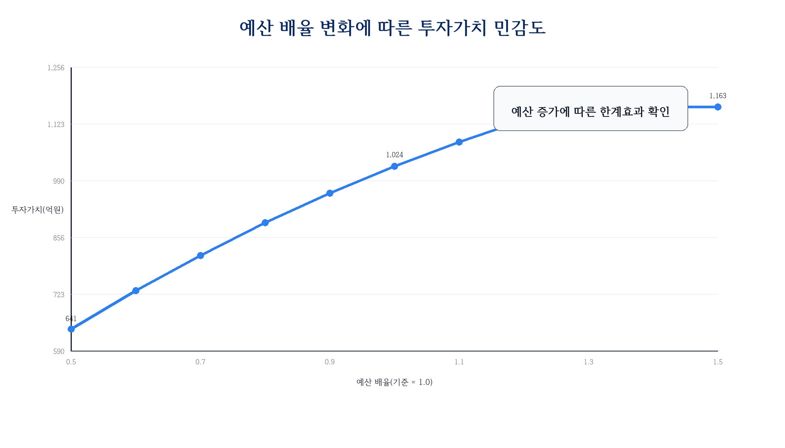

**그림 4.8  Investment Value Sensitivity to Budget Multiplier**  
자료: 본 연구 작성.

### 3. 운영 제약 민감도 분석

SAIDI 저감 하한 및 리스크 총량 상한을 강화하는 운영 제약 시나리오는 총 51개로 구성된다(SAIDI 단독 12개, 리스크 단독 12개, SAIDI·리스크 결합 27개). 이 시나리오군은 전력회사가 공급신뢰도 목표 또는 리스크 관리 기준을 강화할 때 포트폴리오 구성과 실현가능성이 어떻게 변화하는지를 검토한다.

SAIDI 저감 하한을 기준 대비 2~10% 강화하면, 초기에는 통합형 ILP가 제약을 충족하는 포트폴리오를 도출하지만 강화 계수가 커질수록 실현가능해의 범위가 좁아진다. 이 조건에서는 후보제한형 ILP가 SAIDI 여유를 상대적으로 크게 확보하는 경향이 나타난다. 리스크 총량 상한을 강화하는 경우에는 통합형 ILP와 PI ILP 모두 높은 제약 충족률을 유지하며, IV ILP는 일부 고위험·고단가 설비가 제외되면서 제약 충족률이 소폭 낮아진다.

SAIDI·리스크 결합 제약(27개) 시나리오에서는 두 운영 KPI가 동시에 강화될 때의 복합 효과를 검토한다. 제약 수준이 낮을 때에는 세 방법론 모두 충족 가능하지만, 높은 강화 조건에서는 방법론 간 차이가 커진다. 이 결과는 운영 제약 수준에 따라 적합한 방법론 선택이 달라질 수 있음을 보여주며, 특히 SAIDI 목표가 매우 엄격하게 설정된 환경에서는 후보제한형 ILP를 보완적 시나리오로 검토할 근거가 된다.

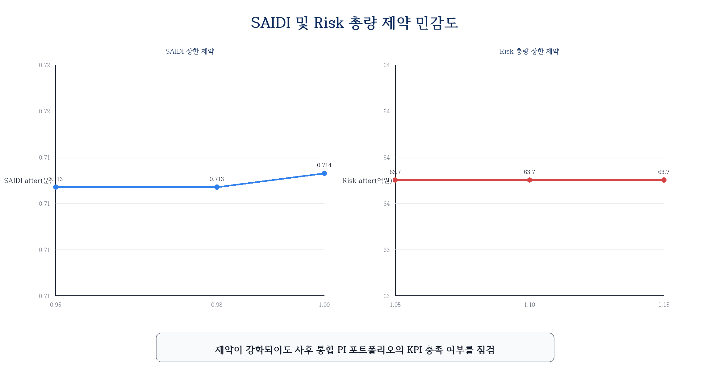

**그림 4.9  SAIDI and Risk Constraint Sensitivity**  
자료: 본 연구 작성.

### 4. 운영목표 가중치 민감도 분석

운영목표 가중치 시나리오는 경제성 중심(경제성 가중치 60% 이상), 신뢰도 중심(신뢰도 가중치 60% 이상), 안전·환경 중심(안전·환경 가중치 60% 이상) 및 이들의 격자 조합을 포함한다. 다음과 같은 일관된 패턴이 관찰된다.

경제성 가중치가 높을수록 IV ILP와 PI ILP의 투자가치 차이가 좁아진다. 이는 경제성 비중이 극대화되면 PI와 투자가치 기반 방식의 목적함수가 유사해지기 때문이다. 반대로 신뢰도 가중치가 높을수록 PI ILP의 SAIDI 저감이 IV ILP 대비 더 크게 개선된다.

중요한 점은 운영목표 가중치가 어떻게 변하더라도, PI ILP가 IV ILP보다 설비 단위 PI에서 일관되게 높은 성과를 보이는 패턴은 유지된다는 것이다. 또한 통합형 ILP가 PI ILP보다 통합 PI에서 일관되게 높은 패턴도 대부분의 시나리오에서 유지된다. 이는 방법론 간 우열 관계가 특정 가중치 조합에만 의존하지 않음을 보여주는 근거가 된다.

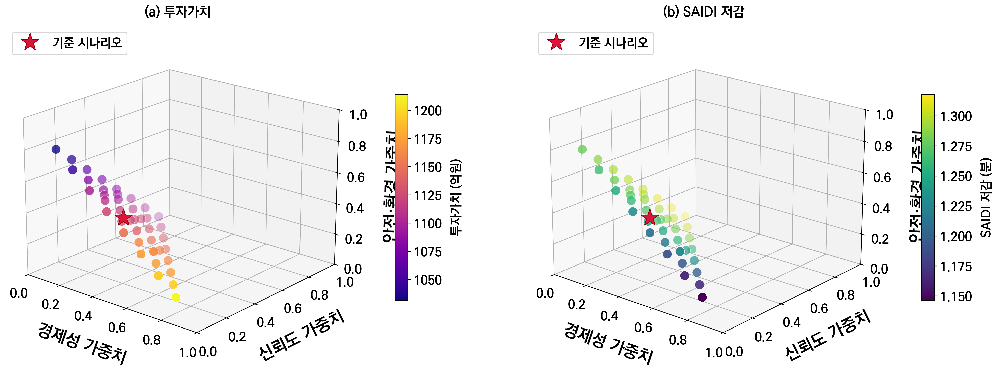

**그림 4.10  Operating-Goal Weight Sensitivity**  
자료: 본 연구 작성.

### 5. 통합 PI 혼합비율 α 민감도 분석

통합 PI의 혼합비율 α는 운영목표 가중치와 구분되는 구조적 파라미터이다. 운영목표 가중치가 경제성·신뢰도·안전·환경 기준의 상대적 중요도를 조정하는 값이라면, α는 설비유형 간 비교에서 전문가 가중치와 비용 보정 가중치를 어느 정도 결합할 것인지를 결정한다. 따라서 α 민감도 분석은 전력회사가 설비유형의 전략적 중요도를 더 중시하는 경우와, 동일 예산에서 더 많은 성과를 확보할 수 있는 비용효율성을 더 중시하는 경우를 비교하는 의미를 갖는다.

분석은 기존 통합형 ILP와 동일한 후보군, 연도별 예산, 연도별 물량, 중복 교체 금지 제약을 유지한 상태에서 α 값만 변화시키는 방식으로 수행하였다. α가 작을수록 전문가 판단에 따른 설비유형 중요도가 크게 반영되고, α가 커질수록 평균 교체단가의 역수로 정의한 비용 보정 효과가 강하게 작용한다.

분석 결과, α가 증가할수록 통합형 ILP는 저단가 설비유형 중심으로 포트폴리오를 재구성하는 경향을 보인다. 이 과정에서 총 투자비용은 감소하고 투자효율은 개선되지만, 리스크 저감량과 SAIDI 개선효과는 일부 감소한다. 반대로 α가 낮은 경우에는 전문가 판단에서 중요도가 높게 부여된 설비유형이 더 많이 포함되어 리스크 및 신뢰도 개선효과가 커지는 대신, 비용효율성은 상대적으로 낮아진다. 이는 α가 단순히 클수록 좋은 값이 아니라, 전력회사의 투자전략이 비용효율 중심인지, 설비유형별 전략적 중요도 중심인지에 따라 조정되어야 하는 정책적 파라미터임을 의미한다.

본 연구의 기준값인 α=0.5는 전문가 판단과 비용 보정을 균형 있게 반영하기 위한 중간 설정이다. 민감도 분석 결과 α 변화에 따라 설비유형별 배분은 달라지지만, 통합 PI를 목적함수로 하는 시스템 단위 최적화의 기본 구조는 유지된다. 따라서 통합 PI 기반 최적화는 고정된 단일 가중치 체계가 아니라, 운영자의 투자전략과 비용 제약 수준에 따라 조정 가능한 의사결정 구조로 해석할 수 있다.

### 6. 강건성 검증 결과

각 핵심 명제에 대응하는 82개 대표 시나리오에 대해 성립 여부를 확인하였다.

**표 4.33  Robustness Verification Results by Key Proposition (82 Representative Scenarios)**

| 검증 명제 | 검증 시나리오 | 성립 수 | 성립률(%) | 해석 |
|---|---:|---:|---:|---|
| IV ILP ≻ 리스크 그리디 (투자가치 또는 투자효율) | 82 | 67 | **81.7** | 예산 과잉 조건에서 일부 예외 발생 |
| PI ILP ≻ IV ILP (설비 단위 PI 또는 SAIDI) | 82 | 82 | **100.0** | PI 기반 방식의 우위가 모든 조건에서 유지 |
| 통합형 ILP ≻ PI ILP (통합 PI) | 82 | 82 | **100.0** | 전체 82개 시나리오에서 예외 없이 성립 |

자료: 본 연구 작성.

첫 번째 명제(IV ILP가 리스크 그리디보다 투자가치 또는 투자효율 면에서 우수)는 82개 중 67개(81.7%)에서 성립한다. 성립하지 않는 15개 시나리오는 예산이 기준의 1.3배 이상인 '예산 과잉' 조건에 집중된다. 예산이 충분히 클 때에는 리스크 그리디도 대부분의 양의 투자가치를 갖는 설비를 포트폴리오에 포함시킬 수 있어, IV ILP와의 성과 차이가 좁아지거나 사라진다. 따라서 예외 시나리오는 투자가치 기반 최적화의 일반적 실패라기보다, 예산 제약이 완화되면서 비교 기준선 자체가 충분한 후보를 포함하게 되는 조건으로 해석하는 것이 타당하다. 이는 투자가치 기반 최적화의 우위가 예산이 상대적으로 제약되는 실제 배전계획 상황(기준 예산의 0.5~1.2배 범위)에서 더욱 뚜렷하게 발현됨을 의미한다.

두 번째 명제(PI ILP가 IV ILP보다 설비 단위 PI 또는 SAIDI 면에서 우수)는 82개 전체에서 100.0%의 성립률을 보이며, 6개(7.3%) 시나리오에서 투자가치 트레이드오프(투자가치는 낮지만 PI는 높은 교환관계)가 확인된다. 이는 PI 기반 방식이 경제성 지표를 일부 희생하지만 다기준 성과 측면의 우위는 어떤 조건에서도 흔들리지 않음을 보여준다.

세 번째 명제(통합형 ILP가 PI ILP보다 통합 PI 면에서 우수)는 82개 전체에서 100.0%의 성립률을 달성하였다. 이는 설비유형 가중치 기반의 시스템 관점 최적화 우위가 광범위한 조건에서 강건하게 유지됨을 확인한 것이다.

**표 4.34  Constraint Satisfaction Rate by Method (Sensitivity Runs)**

| 방법론 | 시나리오 수 | 예산 충족(%) | 물량 충족(%) | SAIDI 충족(%) | 리스크 충족(%) | 전체 충족(%) |
|---|---:|---:|---:|---:|---:|---:|
| **통합형 ILP** | **82** | **100.0** | **100.0** | **100.0** | **100.0** | **100.0** |
| IV ILP | 246 | 100.0 | 95.1 | 90.2 | 90.2 | 82.9 |
| PI ILP | 164 | 100.0 | 95.7 | 92.7 | 92.7 | 86.6 |

자료: 본 연구 작성.  
주: IV ILP와 PI ILP는 복수 분석 범위에 걸쳐 기준 비교군으로 반복 적용되므로 시나리오 수가 통합형 ILP와 다르다.

표 4.34는 각 방법론이 예산, 물량, SAIDI, 리스크 제약을 모두 충족하는 비율을 나타낸다. 통합형 ILP는 통합 PI 포트폴리오 범위의 82개 시나리오에서 모든 제약조건을 100% 충족하였다. 이는 통합형 방식이 투자효율과 통합 PI에서 우위를 가질 뿐 아니라, 다양한 운영 제약 조건을 동시에 반영했을 때에도 안정적인 포트폴리오를 구성함을 보여주는 추가 근거이다.

#### 가. SAIDI 목표 강화 시나리오 분석

기준 시나리오에서 도출된 대표 포트폴리오에 강화된 SAIDI 목표(0.8065분)를 사후적으로 대입하여 방법론별 여유도를 비교하였다. 0.8230분은 기준 시나리오에서 설정한 SAIDI 운영목표이며, 0.8065분은 이 값에 2% 강화계수(0.98)를 적용한 민감도 분석용 하한이다. 이 기준에서 통합형 ILP(0.8031분)는 임계값에 매우 근접하지만 0.4% 미달하고, 후보제한형 ILP(0.8326분)는 목표를 충족한다. 단일지표 방식인 IV ILP(0.6721분)와 PI ILP(0.7598분)는 임계값에 상대적으로 크게 미달한다.

**표 4.35  SAIDI Target Margin of Baseline Portfolios (Threshold: 0.8065 min)**

| 방법 | 기준 SAIDI 저감(분) | 충족 여부 | 여유(%) |
|---|---:|---:|---:|
| IV ILP | 0.6721 | ✗ 미달 | −16.6 |
| PI ILP | 0.7598 | ✗ 미달 | −5.8 |
| **통합형 ILP** | **0.8031** | **△ 근접** | **−0.4** |
| 후보제한형 ILP | 0.8326 | ✓ 충족 | +3.2 |

자료: 본 연구 계산.

이 결과는 두 통합 방식의 보완적 위상을 보여준다. 통합형 ILP는 투자가치·리스크 저감량·통합 PI 등 전반적 지표에서 우위를 갖는 대표 방식이다. 단, 기준 포트폴리오에 매우 엄격한 SAIDI 목표를 사후적으로 적용하면 후보제한형 방식이 SAIDI 달성 측면에서 더 유리할 수 있다. 즉, 통합형을 기본 대안으로 두되, 공급신뢰도 목표가 다른 지표보다 우선하는 상황에서는 후보제한형 방식을 병행 검토하는 것이 실무적으로 유용하다.

### 7. 정책적 최소 배분 제약 분석

앞선 민감도 분석은 예산, 물량, 운영 KPI 및 가중치 변화에 따른 포트폴리오 성과 변화를 검토하였다. 그러나 실제 전력설비 투자계획에서는 순수한 성과 최적화만으로 투자대상이 결정되지 않는다. 법정 내구연수, 지역별 사업 균형, 설비유형별 유지보수 계획, 정책사업 등으로 인해 특정 설비유형에 대해 최소한의 교체 물량 또는 투자비가 요구될 수 있다. 이러한 조건은 목적함수 자체를 변경하지 않지만, 최적화가 탐색할 수 있는 해공간을 축소하여 포트폴리오 구성과 성과에 영향을 준다.

본 연구에서는 통합형 ILP에 대해 두 가지 정책적 최소 배분 제약을 추가로 검토하였다. 첫째, 각 설비유형의 보유대수 대비 일정 비율 이상을 매년 교체해야 하는 최소 물량 제약을 설정하였다. 둘째, 각 설비유형의 자산가액 대비 일정 비율 이상을 매년 투자해야 하는 최소 투자 제약을 설정하였다. 두 제약은 모두 연도별 예산, 연도별 물량, 설비별 최대 1회 교체 제약과 동시에 적용하였다. 기준 비교는 정책 제약이 없는 통합형 ILP 결과로 설정하였다.

**표 4.36  Performance Change under Minimum Asset-Type Allocation Constraints**

| 제약 유형 | 제약 수준 | 투자비용 변화(%) | 투자가치 변화(%) | SAIDI 변화(%) | 통합 PI 변화(%) | 해석 |
|---|---:|---:|---:|---:|---:|---|
| 최소 물량 | 1.0% | +3.0 | −0.1 | +0.9 | −0.7 | 성과 훼손 작음 |
| 최소 물량 | 2.0% | +11.5 | +1.4 | +2.1 | −2.2 | 예산 활용 증가, 통합 PI 소폭 저하 |
| 최소 물량 | 3.0% | +13.1 | −10.4 | −0.6 | −5.8 | 강제 배분의 기회비용 발생 |
| 최소 물량 | 4.0% | +13.1 | −15.8 | −4.1 | −17.6 | 성과 저하 뚜렷 |
| 최소 물량 | 4.5% | +13.1 | −24.7 | −6.7 | −27.4 | 과도한 물량 제약 |
| 최소 투자 | 1.0% | +4.5 | +0.5 | +0.1 | −0.5 | 성과 훼손 작음 |
| 최소 투자 | 2.0% | +13.1 | +2.1 | +2.5 | −2.4 | 예산 활용 증가 효과 |
| 최소 투자 | 3.0% | +13.1 | −4.4 | −0.8 | −13.5 | 고가 설비 강제 배분 영향 |
| 최소 투자 | 3.5% | +13.1 | −8.2 | −3.2 | −22.0 | 통합 PI 손실 확대 |

자료: 본 연구 작성.  
주: 변화율은 정책 제약이 없는 통합형 ILP 기준 대비 값이다. 최소 물량 4.5% 조건에서 IV ILP는 실현가능해를 찾지 못했으나, 통합형 ILP는 모든 정책 제약을 만족하는 포트폴리오를 도출하였다.

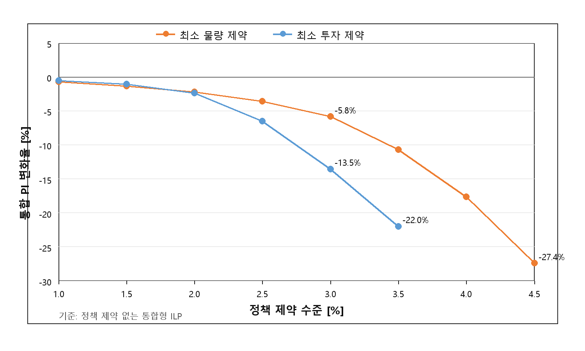

**그림 4.11  Trade-off between Policy Allocation Constraint and Integrated PI**  
자료: 본 연구 작성.

표 4.36과 그림 4.11은 정책적 최소 배분 제약이 통합형 ILP의 성과에 미치는 영향을 보여준다. 낮은 수준의 최소 제약에서는 성과 훼손이 제한적이며, 일부 조건에서는 예산 활용률 증가로 투자가치와 SAIDI 저감량이 오히려 개선된다. 예를 들어 최소 물량 1.5~2.0% 또는 최소 투자 1.0~2.0% 조건에서는 기준 통합형 ILP보다 투자비용이 증가하면서 리스크 저감 편익과 SAIDI 저감 효과가 일부 확대된다. 이는 정책 제약이 항상 비효율을 의미하는 것이 아니라, 기준 포트폴리오에서 사용되지 않은 예산을 추가 투자로 전환하는 역할을 할 수 있음을 의미한다.

반면 제약 강도가 커질수록 통합 PI와 투자가치는 뚜렷하게 감소한다. 최소 물량 3.0% 이상에서는 설비유형별 교체 물량을 맞추기 위해 통합 PI가 낮은 설비까지 포트폴리오에 포함되어야 하며, 최소 투자 3.0% 이상에서는 자산가액이 큰 설비유형에 예산이 강제 배분되면서 고성과 설비에 대한 자유로운 선택이 제한된다. 그 결과 최소 물량 4.5% 조건에서는 통합 PI가 기준 대비 27.4% 감소하고, 최소 투자 3.5% 조건에서는 22.0% 감소한다.

이 결과는 정책적 균형 배분과 시스템 관점의 최적 배분 사이에 실질적인 기회비용이 존재함을 보여준다. 다만 통합형 ILP는 모든 정책제약 조건에서 예산, 물량, 설비유형별 최소 제약을 동시에 만족하는 실현가능 포트폴리오를 도출하였다. 따라서 통합형 ILP는 자유 최적화 조건뿐 아니라, 전력회사 내부 정책이나 규제 요구가 추가되는 경우에도 해당 조건을 반영한 조건부 최적해를 제공할 수 있다.

### 8. 소결

범위별 82개 대표 시나리오와 총 246회 재최적화 실행 결과, 제안 방법론은 예산·물량 변화에 단조로운 반응을 보이며 예산이 기준의 1.3배 이상에서는 투자 효과가 수렴하는 한계치가 확인된다. 핵심 명제 검증에서 PI ILP ≻ IV ILP(100%)와 통합형 ILP ≻ PI ILP(100%)는 해당 범위의 전 시나리오에서 성립이 확인되었고, IV ILP ≻ 리스크 그리디(81.7%)는 예산 과잉 조건을 제외한 실용적 범위에서 성립한다. α 민감도 분석에서는 전문가 판단과 비용 보정의 상대적 비중에 따라 설비유형별 배분과 투자효율이 변화함을 확인하였으며, 이는 통합 PI가 운영전략에 따라 조정 가능한 정책적 파라미터를 포함하고 있음을 보여준다. 추가로 수행한 정책적 최소 배분 제약 분석에서는 낮은 수준의 최소 물량·최소 투자 제약에서는 성과 훼손이 제한적이었으나, 제약 강도가 커질수록 통합 PI와 투자가치가 감소하여 정책적 균형 배분과 시스템 최적화 사이의 기회비용이 확인되었다. 통합형 ILP는 통합 PI 포트폴리오 범위의 82개 민감도 재최적화 시나리오와 정책적 최소 배분 제약 시나리오에서 안정적으로 실현가능 포트폴리오를 도출하여, 투자효율·통합 PI·투자가치 우위와 제약 준수 강건성을 동시에 갖춘 방법론임이 검증되었다.

---

## 제6절 최적화 시뮬레이션 결과 고찰

### 1. 리스크 우선순위 방식의 의미와 한계

리스크 기반 우선순위는 리스크 수준이 높은 설비를 식별하고 교체 필요성을 정량화하는 데 유효한 방법이다. 설비 노화에 따른 PoF 증가와 CoF를 결합하여 산출된 리스크는 투자계획의 출발점으로서 중요한 의미를 갖는다. 기준연도 리스크를 기준으로 한 우선순위 방식은 단순하고 직관적이며, 실무 현장에서 의사결정 근거로 활용하기 용이한 장점이 있다.

그러나 리스크 우선순위 방식은 두 가지 구조적 한계를 갖는다. 첫 번째는 교체비용 대비 편익을 직접 고려하지 않는다는 점이다. 리스크가 크더라도 교체비용이 매우 높은 설비를 선택하면 동일 예산으로 교체할 수 있는 다른 설비들이 배제되어 전체 포트폴리오의 순편익이 낮아진다. 본 시뮬레이션에서 리스크 그리디의 투자효율은 2.161로, IV ILP(2.347)보다 낮은데, 이는 비용효율이 낮은 설비가 일부 포함된 결과이다. 두 번째는 동일 예산 안에서 다기준 성과의 균형을 고려하지 않는다는 점이다. 리스크 기준으로 선택된 설비가 SAIDI나 안전·환경 측면에서 반드시 최적 조합을 구성하지 않을 수 있다.

이 두 가지 한계는 서로 독립적이다. 비용효율 문제는 투자가치 기반 최적화로 해소할 수 있고, 다기준 성과 문제는 PI 기반 최적화로 보완할 수 있다. 이러한 분리된 구조가 제안 방법론에서 세 단계로 순차적인 분석을 수행하는 이유이기도 하다.

### 2. 투자가치 기반 방식의 경제성 개선 효과

투자가치 기반 ILP는 리스크 저감 편익과 투자비용의 조합을 명시적으로 최적화함으로써 경제성 측면에서 일관된 개선을 달성한다. 리스크 그리디 대비 IV ILP의 성과 개선은 투자비용을 거의 동일하게 유지하면서 리스크 저감량 8.8%, 투자가치 16.2%를 향상시키는 방식으로 이루어진다.

이러한 개선이 어떻게 발생하는지를 살펴보면, 핵심은 비용효율이 낮은 설비를 배제하고 그 예산을 비용효율이 높은 설비에 재배분하는 데 있다. 리스크 그리디는 리스크 수준 순서대로 예산을 소진하므로, 교체 단가가 높지만 리스크가 큰 설비가 포함된다. 반면 IV ILP는 동일 리스크 저감 편익에 대해 교체비용이 낮은 설비를 우선적으로 선택하여 남은 예산으로 다른 설비의 리스크를 추가로 줄인다. 이 과정에서 설비유형별 포트폴리오 구성이 달라지고, 전체 합산 성과가 개선된다.

지중케이블은 IV ILP에서 362기가 선택되어 투자가치 232.78억 원, 투자효율 2.132를 달성한다.

전체 민감도 분석에서 이 명제는 82개 시나리오 중 67개(81.7%)에서 성립한다. 예산이 기준의 0.5~1.2배 범위인 실용적 조건에서는 예외 없이 성립하며, 예산 과잉(1.3배 이상) 조건에서는 리스크 그리디도 대부분 설비를 포함하여 차이가 좁아진다. 이는 배전계획 실무와 같이 예산이 상대적으로 제한되는 환경에서 투자가치 기반 방식의 경제성 우위가 안정적으로 유지됨을 의미한다.

### 3. 다기준 PI 방식의 성과 개선 효과

PI 기반 최적화는 투자가치 단일지표가 포착하지 못하는 공급신뢰도와 안전·환경 성과를 투자계획에 통합한다. PI ILP는 IV ILP 대비 투자가치가 4.0% 감소하는 반면, SAIDI 저감을 13.0% 향상시키고 설비 단위 PI를 9.0% 높인다. 이 명제는 전체 82개 민감도 시나리오에서 100% 성립이 확인된다.

가중치 구조에서 안전·환경 기준(38.42%)이 경제성(35.41%)보다 높다는 전문가 판단은, PI 기반 포트폴리오에서 안전·환경 영향이 큰 설비가 우선 선택되는 결과로 이어진다. 이는 전력설비 투자계획이 단순한 비용 절감 문제가 아니라 공공성과 안전 책임을 함께 고려해야 하는 특수한 의사결정임을 전문가 집단이 명확하게 인식하고 있음을 반영한다.

경제성 지표의 4.0% 감소를 어떻게 평가하느냐는 전력회사의 운영 철학과 규제 환경에 따라 다를 수 있다. 그러나 SAIDI 13.0% 개선은 연간 정전시간 단축이라는 측면에서 수용가에게 직접 체감되는 서비스 품질 향상이며, 안전·환경 측면의 개선은 규제 준수와 사회적 책임 이행과 연결된다는 점에서, 이러한 교환관계는 합리적인 범위 내에 있다.

### 4. 통합 PI 방식의 시스템 관점 의사결정 효과

통합형 ILP는 이종 설비를 하나의 시스템 포트폴리오로 직접 비교하는 과정에서 가장 넓은 탐색공간을 활용한다. 기준 시나리오에서 통합형 ILP는 PI ILP 대비 통합 PI, 설비 단위 PI, 투자가치, 리스크 저감량, 투자효율을 모두 개선하였고, 후보제한형 ILP와 비교해도 SAIDI 저감을 제외한 주요 성과지표에서 우위를 보인다. 이는 통합 PI를 후보군 형성 이후의 보정값으로만 사용하는 것보다, 전체 공통 후보군에 통합 PI를 부여한 뒤 직접 최적화하는 방식이 시스템 관점의 대표해를 도출하는 데 더 효과적임을 의미한다.

후보제한형 ILP는 설비유형별 PI 최적화 결과를 1차 후보군으로 존중한다는 점에서 실무적 해석 가능성이 있다. 특히 SAIDI 저감이 통합형 ILP보다 높게 나타나므로, 공급신뢰도 목표가 매우 엄격하게 설정된 경우에는 보완적 비교 시나리오로 활용될 수 있다. 그러나 투자가치, 리스크 저감량, 통합 PI, 투자효율을 종합하면 본 연구의 대표 통합 방식은 통합형 ILP로 보는 것이 타당하다.

설비유형 가중치의 혼합비율 α=0.5는 전문가 판단과 비용 보정을 동일 비중으로 반영하기 위한 기준 시나리오이다. 따라서 이 값의 의미는 특정 선호를 절대화하는 데 있지 않고, 통합 PI가 비용 구조와 설비유형 중요도를 동시에 반영할 수 있는 균형점을 설정하는 데 있다. α 민감도 분석에서도 비용 보정 비중이 커질수록 저단가 설비유형의 선택 비중이 증가하고, 전문가 가중치 비중이 커질수록 전략적 중요도가 높은 설비유형의 비중이 확대되는 방향성이 확인되었다. 이는 통합 PI 가중치 구조가 해석 가능한 방식으로 작동하며, 전력회사의 운영목표에 따라 조정 가능한 의사결정 파라미터로 활용될 수 있음을 보여준다.

### 5. 비교 방법론의 이해: BWM 참조

본 연구의 핵심 방법론인 AHP 기반 가중치 산정과 비교하기 위해 BWM(Best-Worst Method) 재구성 결과를 검토하였다. BWM은 AHP 응답 데이터를 기반으로 재구성한 비교군이며 독립적인 BWM 설문을 별도로 수행한 것이 아님을 명확히 한다.

BWM 재구성 결과에서 최선-최악 기준 쌍의 비교 벡터는 AHP 응답과 전반적으로 일치하는 방향을 보였다. 안전·환경 기준이 경제성과 신뢰도 기준보다 높게 평가된다는 순위 구조가 BWM 재구성에서도 유사하게 나타났으며, 하위지표 수준에서도 안전 영향 저감 지표의 상대적 중요도가 높게 유지되었다. 이는 전문가 집단의 기준별 상대적 중요도 인식이 비교 방식에 관계없이 일관성을 갖는다는 점을 시사한다.

BWM 참조 분석의 목적은 AHP 기반 PI가 특정 가중치 산정 방식에 과도하게 의존하는지를 확인하는 데 있다. BWM 재구성 결과는 AHP 및 Fuzzy 보정 결과와 큰 방향에서 유사하게 나타났으며, 이는 전문가 집단의 판단 구조가 비교 방식의 차이에 따라 크게 흔들리지 않음을 보여준다.

#### 가. 제안 방법론의 확장 가능성

본 연구에서 제시한 포트폴리오 최적화 방법론은 현재 설정된 가정과 데이터 범위를 넘어 다양한 방향으로 확장될 수 있다.

##### 1) 의무교체 제약의 반영

기본 시뮬레이션에서는 의무교체 제약을 포함하지 않았지만, 실무에서는 법정 내구연수 초과 설비나 규제 요건에 의한 의무교체 대상 설비가 존재한다. 이러한 설비를 투자 포트폴리오 형성 이전에 고정 투자로 처리하면, 나머지 예산 내에서 최적화가 이루어진다. 이 경우에도 투자가치 기반 방식과 PI 기반 방식의 상대적 우열 구조가 유지되는지는 추가 시나리오 분석으로 확인할 수 있다.

##### 2) 설비유형별 예산 배분 제약

전력회사 내부 자산관리 계획에서는 설비유형별로 예산 비중의 상한·하한이 설정되는 경우가 있다. 예를 들어, 특정 연도의 가공배전선로 교체 예산이 전체의 30% 이하로 제한되는 조건이 부과될 수 있다. 이 제약을 추가하면 특정 설비유형이 예산을 독점하는 것을 방지하면서 다양한 설비유형에 걸쳐 위험이 저감되는 효과를 달성할 수 있다.

##### 3) 다기간 수리 및 유지보수 대안 포함

현재 시뮬레이션은 교체(Replacement) 투자만을 고려하지만, 실제 자산관리에서는 교체 외에도 수리(Refurbishment)나 강화(Reinforcement) 옵션이 존재한다. 각 대안의 비용과 PoF 저감 효과가 다를 때, 투자가치 방법론은 이를 여러 투자대안이 있는 포트폴리오 문제로 확장하여 처리할 수 있다.

##### 4) 계통 확충 투자와의 통합

본 연구는 설비 단위의 유사대체(like-for-like replacement)를 가정하지만, 일부 설비는 용량 증가나 노선 재구성과 결합되는 경우가 있다. 이러한 계통 확충 투자를 포트폴리오에 포함하면, 기존 설비 교체 효과와 계통 강화 효과를 통합한 최적화가 가능하다.

이러한 확장 가능성은 제안 방법론의 기본 구조가 유연하게 적용될 수 있음을 보여준다. 핵심 아이디어인 리스크 저감 편익과 투자비용의 비교, 다기준 PI 산정, 설비유형 가중치 기반 통합 방식은 확장된 문제 설정에서도 동일하게 적용될 수 있다.

### 6. 실무적 시사점

시뮬레이션 결과는 전력설비 투자계획 수립 실무에 다음과 같은 함의를 제공한다.

#### 가. 예산 수립 측면

기준 예산의 1.3배 이상에서는 투자가치 증가가 수렴하는 경향이 있으므로, 무분별한 예산 증액보다는 현재 예산 수준에서 투자 방식을 최적화하는 것이 더 효과적이다. 현재 762억 원 수준의 예산이라면 후보군 내 양의 투자가치를 갖는 대부분의 설비가 이미 포트폴리오에 포함 가능한 수준이다.

#### 나. 투자 우선순위 측면

단순 리스크 순위를 투자 우선순위로 사용하는 방식은 비용효율이 낮은 설비의 과잉 투자를 유발할 수 있다. 투자가치 기반 방식으로 전환하면 동일 예산에서 투자가치를 16.2% 향상시킬 수 있으며, 이 효과는 광범위한 예산·물량 조건에서 안정적으로 유지된다.

#### 다. 다기준 의사결정 측면

공급신뢰도(SAIDI), 안전·환경 기준을 PI에 반영하면 경제성 지표는 일부 감소하지만 SAIDI 저감이 13.0% 개선된다. 어떤 기준의 가중치를 높이느냐에 따라 포트폴리오가 예측 가능한 방향으로 변화하므로, 전력회사 경영 목표와 규제 요건에 맞게 가중치를 조정함으로써 다양한 투자 전략을 시뮬레이션할 수 있다.

#### 라. 설비유형 전략 측면

통합 PI 기반 방식은 이종 설비 포트폴리오를 시스템 KPI 관점에서 균형 있게 조정하는 도구로 활용될 수 있다. 설비유형별 자산관리 전략을 수립할 때 통합 PI 기반 방법론이 구체적인 투자 비중 결정의 근거를 제공한다.

전체 결과를 종합하면, 본 연구에서 제안한 포트폴리오 최적화 방법론은 리스크 우선순위 방식, 투자가치 기반 방식, 설비 단위 PI 기반 방식, 통합 PI 기반 방식을 단계적으로 확장하는 구조를 통해 경제성 중심 의사결정에서 신뢰도·안전·환경 및 시스템 관점 의사결정으로의 확장을 가능하게 한다. 각 확장 단계에서 성과 개선이 측정 가능한 방식으로 이루어지며, 민감도 분석에서 이 효과의 안정성이 광범위한 조건에서 확인된다.

**표 4.37  Step-by-Step Methodology Application Guidelines for Practical Use**

| 전력회사 상황 | 권장 방법론 | 근거 |
|---|---|---|
| 단순 위험 설비 식별 | 리스크 그리디 | 빠른 스크리닝, 비용 고려 불필요 |
| 제한 예산 내 경제적 투자 | IV ILP | 투자가치 16.2% 향상, 82개 시나리오 중 81.7% 검증 (예산 제약 조건에서 안정적) |
| 규제 SAIDI 목표 있는 경우 | PI ILP 또는 후보제한형 ILP | SAIDI 13~37% 향상 |
| 이종 설비 시스템 전략 수립 | 통합형 ILP | 통합 PI 64.3% 향상, 설비유형 간 직접 비교 가능 |
| 공급신뢰도 목표가 특히 엄격한 경우 | 후보제한형 ILP | SAIDI 저감이 높아 보완적 비교 시나리오로 활용 가능 |
| 의사결정 범위 탐색 | 다목적 탐색 또는 민감도 분석 | 성과지표 간 교환관계 및 시나리오별 변화 확인 |

자료: 본 연구 작성.

### 7. 선행연구와의 비교 및 방법론적 기여

#### 가. 국내외 배전설비 자산관리 연구와의 비교

배전설비 투자계획 최적화에 관한 선행연구들은 크게 두 흐름으로 나뉜다. 하나는 Ofgem RIIO-ED 프레임워크처럼 규제 기반 비용편익 분석을 투자계획에 적용하는 방향이고, 다른 하나는 CNAIM과 같은 상태기반 자산관리(Condition-Based Asset Management) 방법론을 활용하는 방향이다.

선행연구의 한 흐름은 배전설비 교체계획을 비용 최소화 또는 경제성 중심의 수리최적화 문제로 정식화하였다. 이러한 접근은 설비 수명 함수와 예산 제약을 결합하여 교체 대상과 시점을 결정한다는 점에서 유용하지만, 경제성 단일지표를 목적함수로 다루는 경우가 많아 신뢰도·안전·환경과 같은 다기준 성과를 통합하지 못하는 한계가 있다. 본 연구는 이 한계를 PI 기반 다기준 목적함수 체계로 보완한다.

또 다른 흐름인 단일 설비 수준의 최적 교체 시점 분석은 개별 설비의 생애주기 비용과 고장위험을 기준으로 교체 시기를 결정하는 데 초점을 둔다. 그러나 이러한 접근은 포트폴리오 관점의 의사결정을 직접 다루지 않으므로, 제한된 예산 아래에서 다수 설비 간 자원배분 문제로 확장하기 어렵다. 본 연구의 ILP 기반 포트폴리오 최적화는 이 간극을 메운다는 점에서 방법론적 진전을 제공한다.

한편 전문가 판단과 리스크 분석을 결합하여 배전계통 자산관리 의사결정 구조를 제시한 연구들도 있으나, 설비유형별 독립 분석에 초점을 두는 경우가 많아 설비유형 간 통합 포트폴리오 최적화 구조를 갖추지 못하는 한계가 있다. 본 연구의 통합형 ILP는 이종 설비를 하나의 포트폴리오로 직접 비교하는 방법론을 제안함으로써 이 공백을 보완한다.

국내 연구에서는 배전설비 노화 진단이나 PoF 산정 방법론 연구가 다수 수행되었으나, 이를 예산 제약 하에서의 포트폴리오 최적화 문제와 연계하는 통합 방법론을 제시한 연구는 제한적이다. 이 점에서 본 연구는 국내 배전설비 자산관리 연구에서 새로운 방법론적 기여를 제공한다.

#### 나. 본 연구의 방법론적 기여 요약

본 연구의 방법론적 기여를 선행연구와 비교하여 명확히 정리하면 다음과 같다.

**표 4.38  Methodological Differentiation of This Study vs. Prior Research**

| 기여 항목 | 선행연구의 일반적 한계 | 본 연구의 접근 |
|---|---|---|
| PI 산정 체계 | PoF 또는 경제성 단일지표 | AHP 기반 가중치와 Fuzzy 보정을 결합한 다기준 PI (경제성·신뢰도·안전·환경 통합) |
| 가중치 산정 | 단순 동등가중 또는 단일 방법 | 집단 AHP 가중치 + Fuzzy 절대중요도 보정, CR≤0.10 검증 |
| 포트폴리오 최적화 | 단일 설비 또는 단일 유형 분석 | 6개 이종 설비 통합 ILP 포트폴리오 (5개년 762억) |
| 통합 방식 | 설비유형 간 비교 척도 부재 | 통합 PI 기반 시스템 단위 포트폴리오 직접 최적화 |
| 강건성 검증 | 단일 시나리오 분석 | 범위별 82개, 총 246개 민감도 시나리오를 통한 핵심 명제 검증 |
| 해 탐색 구조 | 휴리스틱 또는 단일 기준 탐색 중심 | ILP·GA·민감도 분석을 결합한 단계적 비교 구조 |

자료: 본 연구 작성.

첫째, PI 산정 체계에서 집단 AHP 가중치와 Fuzzy 절대중요도 보정을 결합한 다기준 지표 구조는 전문가 판단의 상대적 선호와 언어적 모호성을 함께 반영하면서도 최종 집계 시 명확한 수치 기반 의사결정을 가능하게 한다. 이 구조는 경제성 단일지표 방식보다 배전설비 투자 의사결정의 다차원적 특성을 충실히 반영한다.

둘째, 통합형 ILP는 설비유형별로 분리되어 있던 투자 후보를 하나의 시스템 단위 포트폴리오로 통합한다. 이 접근은 설비 단위 PI가 제공하는 개별 설비의 성과평가 결과를 유지하면서도, 설비유형 가중치를 통해 이종 설비 간 직접 비교가 가능하도록 하므로 전사적 투자계획 수립에 필요한 의사결정 단위를 제공한다.

셋째, SAIDI 저감량을 포트폴리오 성과 지표로 명시적으로 포함하고, 이를 설비별 정전 영향(고장확률 × 정전시간 × 연결고객수)에서 집계하는 방식은 공급신뢰도 규제 목표를 투자계획 최적화 과정에 직접 연계하는 정량적 근거를 제공한다.

#### 다. 연구 결과의 국제 비교 맥락

본 연구의 시뮬레이션 결과를 국제적 배전설비 투자 사례와 비교하는 것은 연구 결과의 외부 타당성을 평가하는 데 의미가 있다.

영국의 RIIO-ED 규제체계에서는 배전회사 투자계획을 자산 리스크 저감과 비용효율 관점에서 평가하며, 자산 교체 투자와 편익/비용 비율은 규제기간 투자계획의 적정성을 판단하는 주요 근거로 활용된다. 본 연구에서 IV ILP의 투자효율(2.347)과 통합형 ILP의 투자효율(2.669)은 국제적 배전설비 투자평가에서 관찰되는 비용편익 범위와 비교할 때 과도하게 이탈하지 않는 수준이다.

호주 AER(Australian Energy Regulator)의 배전설비 자산관리 검토에서도 교체투자의 경제성, 서비스 성과, 장기 리스크 관리가 함께 검토된다. 이러한 흐름은 본 연구의 투자가치 기반 최적화와 통합 PI 기반 포트폴리오 최적화가 규제 환경에서 요구되는 투자 의사결정 방향과 정합성을 가진다는 점을 보여준다.

다만 이 비교는 연구 배경의 맥락을 참고하기 위한 것이며, 데이터 출처와 설비 구성이 다른 국제 사례와의 직접적인 수치 비교는 신중해야 한다. 본 연구의 시뮬레이션 데이터가 CNAIM 참조 합성 데이터를 기반으로 하며 특정 전력회사의 실측 데이터와 다를 수 있다는 한계를 감안하여, 절대적 수치보다는 방법론 간 상대적 비교 결과의 국제적 맥락 확인에 초점을 둔다.

---

## 제7절 보조 분석 및 해석상 유의점

본 장의 핵심 결과는 제2절부터 제5절까지의 단계별 비교에서 제시하였으므로, 세부 연도별 결과와 보조 비교군은 본문 결론을 보완하는 범위에서 해석한다. 연도별 투자분포를 보면 IV ILP는 5년 총 예산 762.0억 원 중 761.1억 원을 사용하여 예산 소진율은 매우 높지만, 선택 물량은 4,607기로 물량 소진율이 84.1%에 머문다. 반면 후보제한형 ILP는 758.9억 원을 사용하면서 5,209기를 선택하여 물량 소진율이 95.1%까지 높아진다. 이는 통합 PI 기반 방식이 단가가 낮고 다기준 성과가 높은 설비를 더 많이 포함하는 방향으로 포트폴리오를 구성하기 때문이다.

GA는 ILP의 보조 비교군으로 검토하였다. IV GA의 투자가치는 1,019.76억 원으로 IV ILP의 1,025.24억 원보다 5.48억 원 낮아, 목적함수 기준으로는 ILP가 우위에 있다. 다만 GA는 SAIDI 저감과 설비 단위 PI에서 일부 높은 값을 보이므로, 다목적 탐색이나 비선형 제약이 포함되는 확장 문제에서는 보완적으로 활용될 수 있다. 그러나 본 연구의 기본 모형은 목적함수와 제약조건이 선형으로 정식화되므로, 대표 결과는 ILP를 중심으로 해석하는 것이 타당하다.

BWM 재구성 비교에서는 AHP와 Fuzzy 보정에서 나타난 기준별 중요도 구조가 크게 흔들리지 않았다. 안전·환경 기준은 AHP, Fuzzy 보정, BWM 재구성에서 모두 가장 높은 축으로 유지되었으며, BWM 가중치를 적용한 경우에도 PI ILP의 투자가치는 0.86% 감소하고 SAIDI 저감은 2.93% 증가하는 정도에 그쳤다. 이는 본 연구의 PI 기반 결과가 특정 가중치 산정 방식에 과도하게 의존하지 않음을 보여주는 보조 근거이다.

통합 PI의 설비유형 가중치 혼합비율 α는 전문가 판단과 비용 보정의 상대적 비중을 조절한다. α가 증가할수록 비용 보정의 영향이 커져 주상변압기와 같이 단가가 낮은 설비의 가중치는 상승하고, 지상변압기·지중케이블과 같이 단가가 높은 설비의 가중치는 하락한다. 제5절의 α 민감도 분석에서도 이러한 구조적 방향성이 확인되었으며, α 변화는 설비유형별 배분과 투자효율을 조정하는 정책적 파라미터로 작동한다. 본 연구에서는 전문가 판단과 비용 규모를 동일 비중으로 반영하기 위한 기준 시나리오로 α=0.5를 적용하였으며, 이 값은 특정 설비유형에 대한 절대적 선호가 아니라 균형 기준값으로 해석한다.

마지막으로, 본 연구의 사례분석 데이터는 CNAIM을 참조하여 구성한 합성 데이터이므로 특정 전력회사의 실제 자산 상태를 직접 대체하지 않는다. 따라서 개별 수치의 절대값보다는 방법론 간 상대적 차이와 개선 방향이 해석의 중심이 되어야 한다. 또한 본 모형은 설비 단위 교체를 대상으로 하며, 배전망 위상 변화나 전력조류 재배분 효과는 포함하지 않는다. 실제 적용 단계에서는 설비유형별 참조 파라미터의 적정성, 현장 운전조건, 정비 이력, 연결고객 정보 등을 함께 검증할 필요가 있다.

**표 4.39  Performance Improvement Rate Summary vs. Risk Greedy Baseline**

| 지표 | IV ILP | PI ILP | 통합형 ILP |
|---|---:|---:|---:|
| 투자비용 증감(%) | +0.1 | +0.2 | −11.4 |
| 리스크 저감량 증감(%) | +8.8 | +6.3 | **+9.5** |
| 투자가치 증감(%) | +16.2 | +11.5 | **+27.4** |
| SAIDI 저감 증감(%) | +10.5 | +25.0 | +32.0 |
| 설비 단위 PI 증감(%) | +6.3 | +15.8 | **+48.2** |
| 통합 PI 증감(%) | +4.2 | +13.6 | **+64.3** |

자료: 본 연구 계산.

리스크 그리디를 공통 기준으로 설정하면, 통합형 ILP가 투자가치(+27.4%), 리스크 저감량(+9.5%), 설비 단위 PI(+48.2%), 통합 PI(+64.3%)에서 가장 큰 개선을 달성한다. 투자비용이 11.4% 감소했음에도 주요 성과지표가 개선되었다는 점은 통합형 ILP가 비용 규모와 다기준 성과를 함께 고려하여 투자 포트폴리오를 재구성한 결과로 해석된다. SAIDI 저감은 후보제한형 ILP가 더 높지만, 전체 성과지표를 종합하면 통합형 ILP가 본 연구의 대표 통합 방식으로 적합하다.

---

## 제8절 종합 소결

본 장에서는 배전설비 투자계획 포트폴리오 최적화를 위한 네 가지 방법론 군—리스크 기반, 투자가치 기반, 설비 단위 PI 기반, 통합 PI 기반—을 총 9개 알고리즘 조합으로 비교하였다. 주요 결론은 다음과 같다.

첫째, 투자가치 기반 최적화는 리스크 우선순위 방식 대비 동일 예산 내에서 16.2%의 추가 투자가치를 달성하여, 단순 리스크 순위가 경제적 최적 포트폴리오를 직접 보장하지 않음을 확인하였다. ILP는 그리디 대비 32.35억 원의 추가 투자가치를 달성하여 수리적 최적화 방법론의 실용적 의의를 입증하였다.

둘째, 설비 단위 PI 기반 최적화는 투자가치 기반 대비 경제성 지표를 일부 감소시키지만 SAIDI 저감과 다기준 성과를 동시에 개선하여, PI가 경제성 단일지표를 보완하는 다기준 의사결정 도구로 기능함을 확인하였다. 경제성과 공급신뢰도 사이의 교환관계가 IV ILP vs PI ILP 비교에서 명확히 드러난다.

셋째, 통합형 ILP는 설비 단위 PI ILP 대비 투자가치(+14.3%), 리스크 저감량(+3.0%), 통합 PI(+44.6%), 투자효율(+16.4%)을 모두 향상시키면서 투자비용은 더 낮게 유지하였다. 전체 공통 후보군을 탐색 공간으로 삼아 직접 최적화하는 구조가 후보제한형 방식 대비 더 넓은 해공간을 확보하는 근거가 된다. 이 방식이 본 연구의 대표 통합 방법으로 채택된 것은 경제성·리스크 저감·통합 PI 등 전반적 지표에서 우위를 확인하였기 때문이다.

넷째, 입력 데이터의 정합성이 포트폴리오 최적화 결과에 직접적인 영향을 미침을 확인하였다. 지중케이블의 투자효율은 2.098~2.132 수준으로, 가공배전선로(약 1.1~1.2)보다 높고 가공개폐기(약 4.0~4.5)보다는 낮은 중간 수준에서 포트폴리오에 포함되며, 공개 자산관리 방법론 적용 시 설비유형별 파라미터 검증의 중요성을 시사한다.

다섯째, 범위별 82개, 총 246개 민감도 시나리오 분석에서 통합형 ILP가 통합 PI 포트폴리오 범위의 모든 제약조건(예산·물량·SAIDI·리스크)을 100% 충족함을 확인하였다. IV ILP(82.9%) 및 PI ILP(86.6%)는 일부 극단 조건에서 제약조건 미달이 발생하는 반면, 통합형 ILP는 제약을 반영한 재최적화 조건에서 가장 안정적인 결과를 보인다.

이상의 결과는 배전설비 투자계획에서 단순 리스크 우선순위나 경제성 단일지표를 넘어 신뢰도·안전·환경 기준을 통합하는 다기준 PI 기반 최적화 방법론이 측정 가능한 성과 개선을 가져옴을 보여준다.

이상에서 제4장 최적화 시뮬레이션 및 결과 분석을 마친다. 리스크 기반 기준선에서 출발하여 투자가치 기반, 설비 단위 PI 기반, 통합 PI 기반 방식으로 단계적으로 확장하는 구조를 통해, 각 확장 단계의 방법론적 의미와 성과 개선 효과가 정량적으로 확인되었다.

종합적으로 볼 때, 배전설비 투자계획에서 AHP 기반 다기준 PI, Fuzzy 보정, ILP를 결합한 통합형 PI 최적화 방법론은 리스크 그리디 대비 투자가치 27.4%, 통합 PI 64.3%를 개선하고, 통합 PI 포트폴리오 범위의 82개 민감도 재최적화 시나리오에서 모든 제약조건(예산·물량·SAIDI·리스크)을 충족하였다. 이는 제안 방법론이 단순 순위 산정이 아니라, 제한된 자원과 운영 KPI를 동시에 고려하는 전력설비 투자계획 의사결정 도구로 활용될 수 있음을 보여준다.

---
